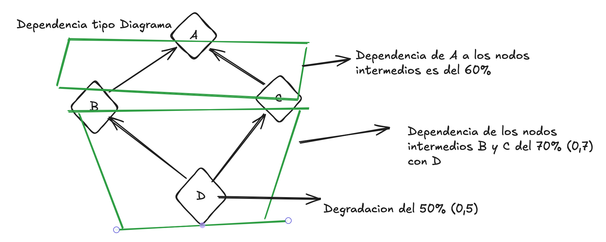
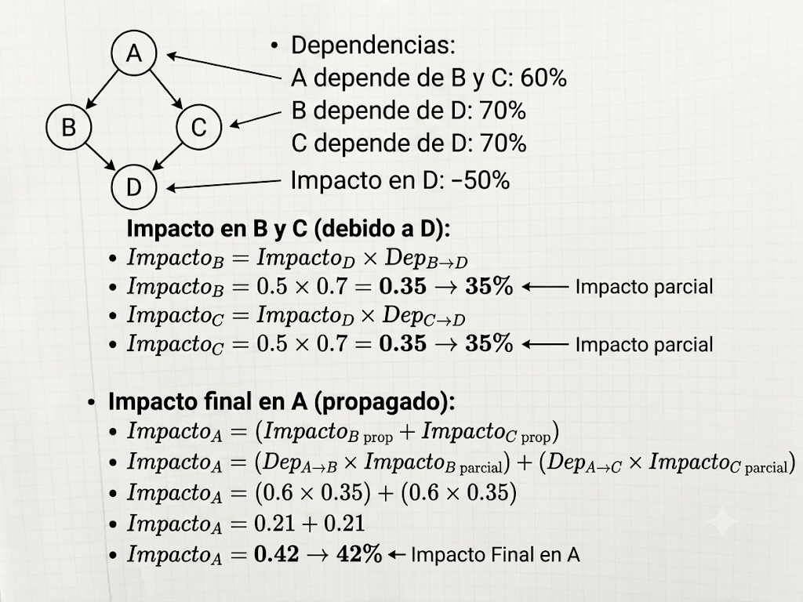
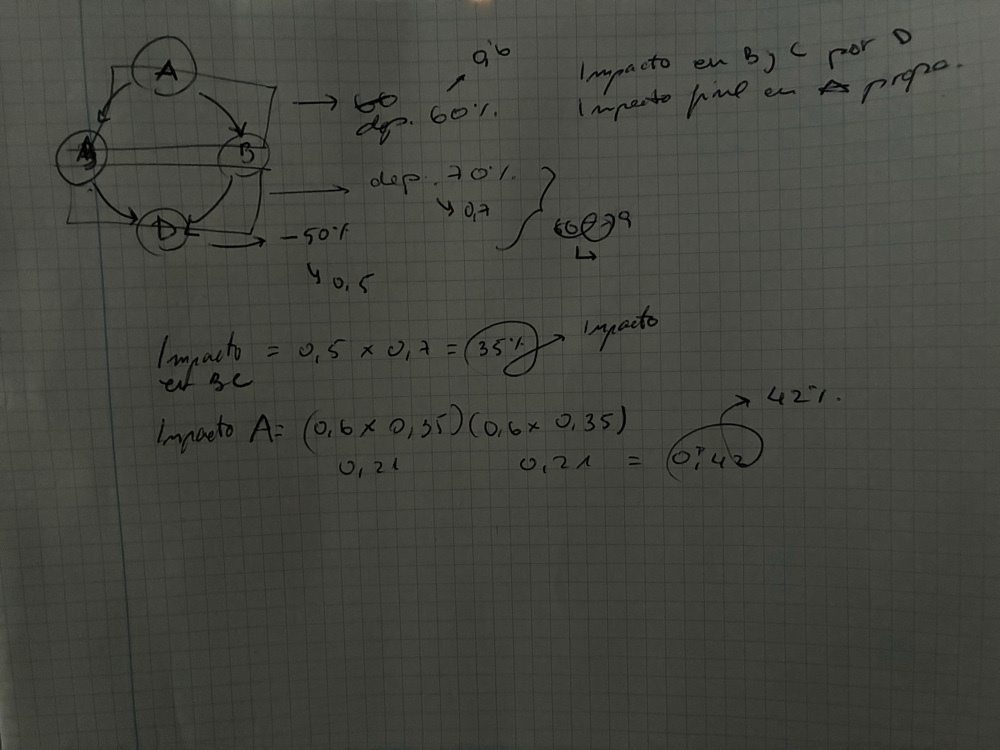
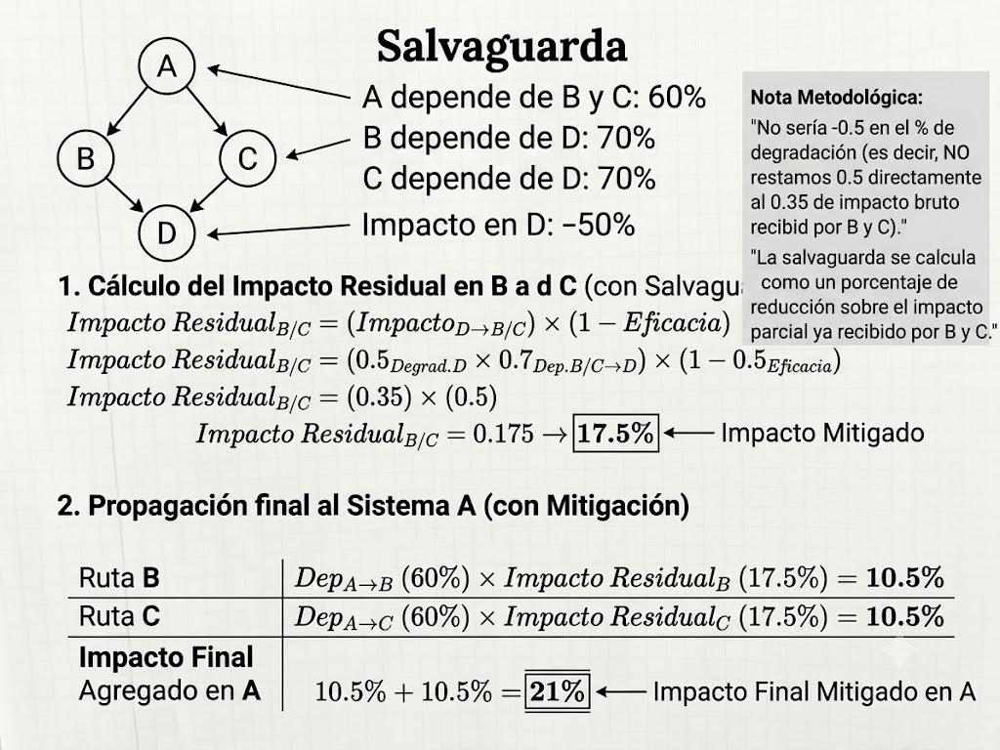
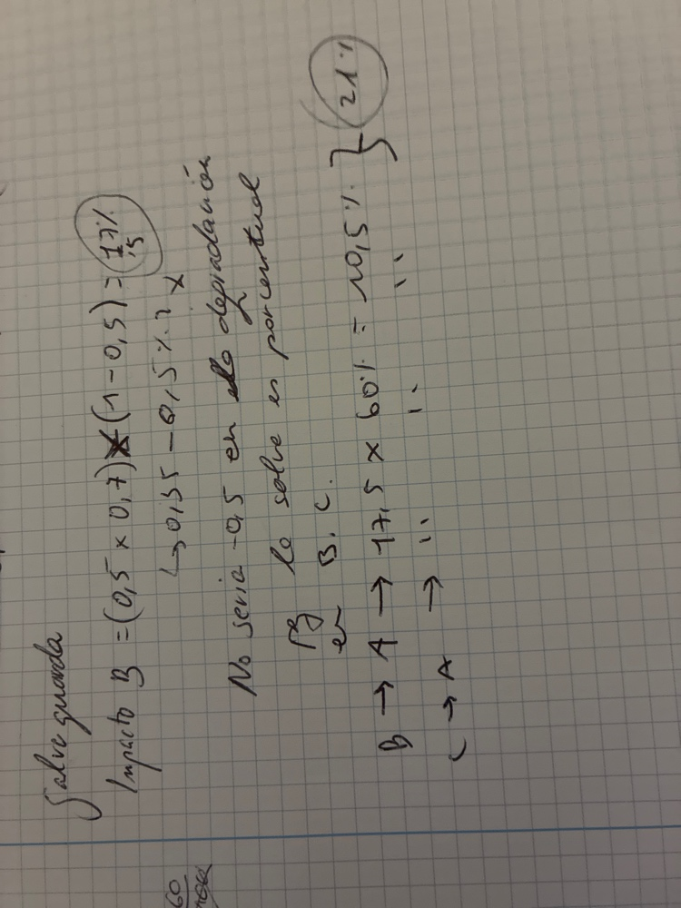

# REPORT DE AUDITORÍA: ANÁLISIS DE RIESGO OPERACIONAL

 

**Autor:** Xavier Margalef  
**Actividad:** Actividad 01 & 02 - Modelado de Dependencias y Mitigación en Cascada (BIA)  
**Fecha:** 2 de julio de 2026  
**Actividad:** [AP 11] Propagación de Impacto Lab

 

---

---

 

# Actividad 01 - Cuantificación de Impacto (Línea Base)

El análisis evalúa el impacto operacional en cascada dentro del árbol de dependencias de la infraestructura, identificando cómo la degradación de un activo de soporte afecta al activo crítico de negocio bajo las directrices del [NIST SP 800-34 (Contingency Planning)](https://csrc.nist.gov/pubs/sp/800/34/r1/final).

## 1. Inventario de Activos y Matriz de Dependencias

* **Activo principal:** Sistema A (Core de Negocio)
* **Activos intermedios:** Sistema B y Sistema C (Soporte Operativo)
* **Activo Base:** Servidor D (Infraestructura Crítica)
* **Tipo de Arquitectura:** Dependencia tipo **Diamante** (Convergencia Paralela).
* **Degradación activo D ($D$):** 50% ($0.5$)
* **Nivel de dependencia:** La dependencia de B y C sobre D es del 70% ($0.7$), y la de A sobre B y C es del 60% ($0.6$).

 

---

## 2. Desarrollo por Fases del Impacto Operacional

### 🟠 Fase 1: Impacto en Activos de Soporte B y C debido al fallo en D
La pérdida de disponibilidad parcial del Servidor D se transfiere a los sistemas intermedios en proporción directa a su nivel de criticidad o dependencia interconectada, siguiendo los modelos de criticidad cuantitativa del [BIA (Business Impact Analysis)](https://www.ready.gov/business-impact-analysis).

* **Fórmula Core:** $\text{Impacto en Activo} = \text{Degradación Origen} \times \text{Factor de Dependencia}$
* **Cálculo para B:** $0.50$ (debido al 50% deterioro del activo) $\times 0.70$ (nivel de dependencia) $= 0.35 \rightarrow \mathbf{35\%}$
* **Cálculo para C:** $0.50$ (idem) $\times 0.70$ (idem) $= 0.35 \rightarrow \mathbf{35\%}$

> **Resultado Intermedio:** El impacto transferido y consolidado en los activos B y C debido al fallo raíz en D es del **35%**.

 

### 🔴 Fase 2: Impacto final en A considerando la propagación de la degradación
Al no indicarse si el Sistema A **cuenta con mecanismos de tolerancia a fallos** (tales como arquitecturas de alta disponibilidad, balanceo activo/pasivo o *failover* automático según los estándares [ISO/IEC 27031](https://www.iso.org/standard/46219.html)), el impacto de ambas ramas concurrentes se acumula linealmente sobre el servicio del nodo final.

1. **Degradación transferida por canal B:** $0.35$ (Impacto B, proveniente de su dependencia a D) $\times 0.60$ (Dependencia A $\rightarrow$ B, ya que A depende al 60% de B) $= 0.21 \rightarrow \mathbf{21\%}$
2. **Degradación transferida por canal C:** $0.35$ (Impacto C, proveniente de su dependencia a D) $\times 0.60$ (Dependencia A $\rightarrow$ C, ya que A depende al 60% de C) $= 0.21 \rightarrow \mathbf{21\%}$
3. **Impacto Total Acumulado en A:** $21\% + 21\% = \mathbf{42\%}$

---

# Actividad 02 - Análisis de Incidentes y Mitigación con Salvaguardas

## 1. Clasificación Estructural de la Dependencia
¿Qué tipo de dependencia representa este escenario? Representa una dependencia de **Diamante**.

* **Justificación Arquitectónica:** El flujo de riesgo e impacto se origina en un único Single Point of Failure o componente base (Servidor D), se bifurca en paralelo a través de dos nodos independientes en la capa intermedia (Sistemas B y C), y finalmente vuelve a converger en un único activo crítico superior (Sistema A).

**Topología Dependencia Diagrama:**  

**Captura del diseño manuscrito original:**  

---

## 2. Caso de Estudio: Aplicación de Salvaguardas (Eficacia del 50% en B y C)

### ℹ️ Justificación Metodológica del Cálculo
Como no sabía dónde iría el 50% de reducción, he investigado las políticas de mitigación basadas en el framework de control [Magerit v3 (Metodología de Análisis y Gestión de Riesgos)](https://administracionelectronica.gob.es/pae_Home/pae_Documentacion/pae_Metodologias/pae_Magerit.html):

En la gestión de riesgos tecnológicos e infraestructura ([BCP - Business Continuity Planning](https://www.iso.org/standard/75106.html)), las salvaguardas aplicadas en nodos intermedios **se calculan respecto al impacto parcial recibido (el 35%)**, y nunca restando de forma directa el porcentaje de eficacia al daño original del nodo raíz.

* **Razón Teórica:** Las salvaguardas actúan como un factor de mitigación local. Su efectividad reduce de forma proporcional la degradación operativa que el activo ya ha absorbido antes de retransmitirla en cascada hacia los niveles superiores.
* **Error de Resta Directa ($0.5 - 0.5 = 0$):** Si se restara directamente, significaría que una salvaguarda en la capa intermedia tiene la capacidad de anular por completo la degradación física del Servidor D, lo cual es arquitectónicamente falso (la avería en la base de la infraestructura sigue existiendo).

### 🧮 Cálculo de la diferencia de impacto en B y C aplicando salvaguarda
La degradación del Servidor D ($50\%$) multiplicada por la dependencia de la capa intermedia ($70\%$) establece el impacto bruto de entrada para B y C:
$$\text{Impacto Bruto}_{B/C} = 0.50 \times 0.70 = 0.35 \rightarrow \mathbf{35\%}$$

**Mitigación Local mediante Salvaguardas (Eficacia del 50%):**  
Multiplicamos $0.5$ por el impacto bruto para obtener el impacto residual neto (remanente tras el control):
$$\text{Impacto Residual} = \text{Impacto Bruto} \times (1 - \text{Eficacia})$$
$$\text{Impacto Residual}_{B/C} = 0.35 \times (1 - 0.50) = 0.175 \rightarrow \mathbf{17.5\%}$$

### 📡 Propagación hacia el nodo A con Impacto Mitigado
Calculamos el impacto final en A utilizando la degradación ya reducida por la acción de la salvaguarda en B y C:

* **Afectación vía Canal B:**  
  $$17.5\% \text{ (Impacto Residual B)} \times 60\% \text{ (Dependencia A)} = \mathbf{10.5\%} \quad (0.105)$$
* **Afectación vía Canal C:**  
  $$17.5\% \text{ (Impacto Residual C)} \times 60\% \text{ (Dependencia A)} = \mathbf{10.5\%} \quad (0.105)$$
* **Impacto Final Agregado en A:**  
  $$\text{Impacto Final}_{A} = 10.5\% + 10.5\% = \mathbf{21\%} \quad (0.21)$$

**Desarrollo analítico del impacto mitigado:**  

**Notas y desarrollo en sucio del laboratorio:**  

---

## 3. Conclusión Comparativa y Cuadro de Mando

| Escenario Operativo | Impacto Residual en B y C | Impacto Total en Sistema A | Estado Operacional del Core |
| :--- | :---: | :---: | :--- |
| 🔴 **Línea Base (Sin Controles)** | $35\%$ | **$42\%$** | **Servicio Degradado (58% Capacidad)** |
| 🟢 **Mitigado (Salvaguarda 50%)** | $17.5\%$ | **$21\%$** | **Operación Estable (79% Capacidad)** |