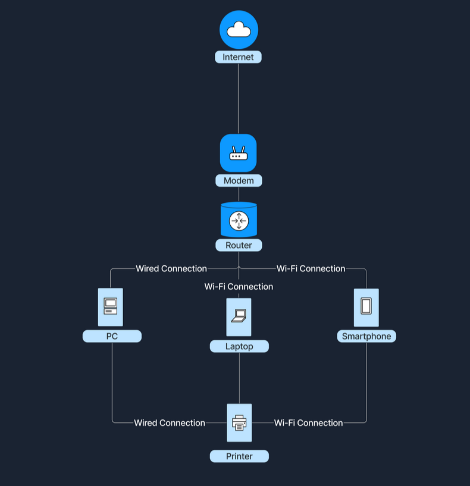
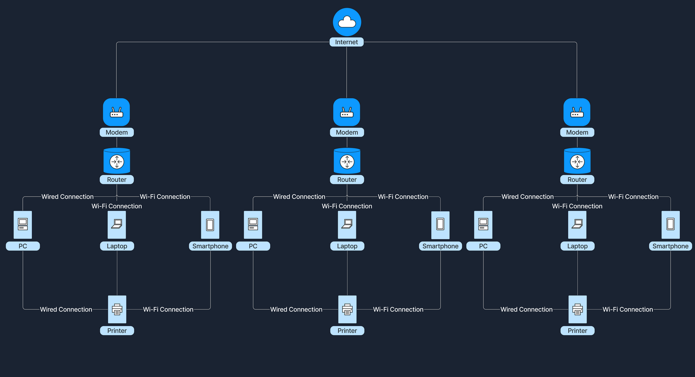
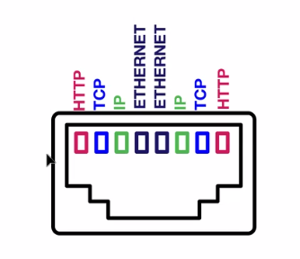
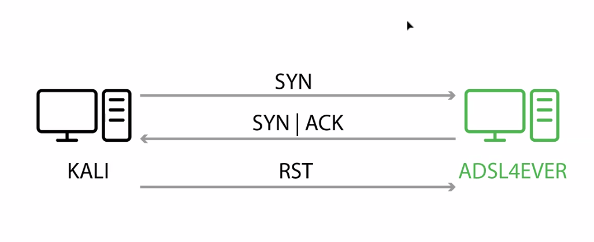
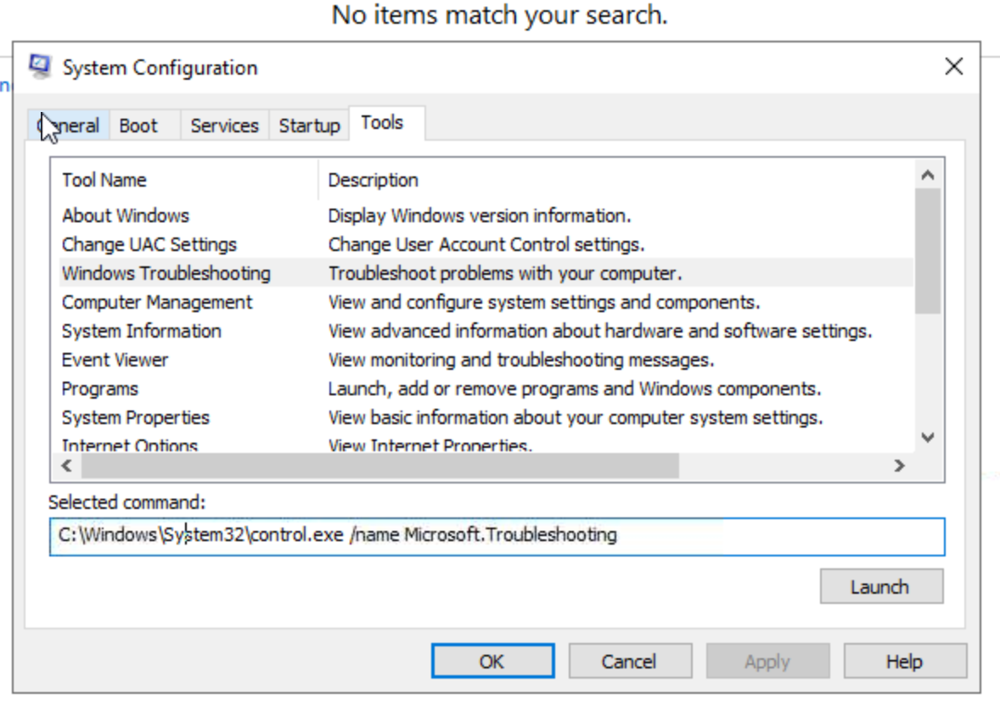
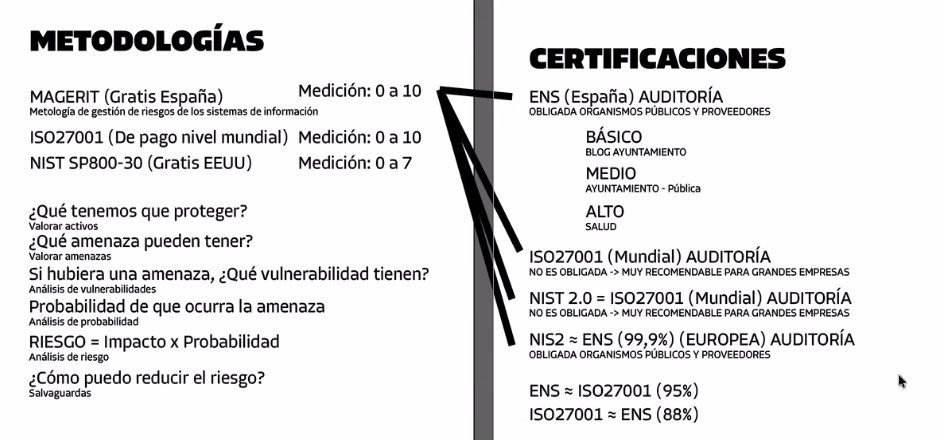
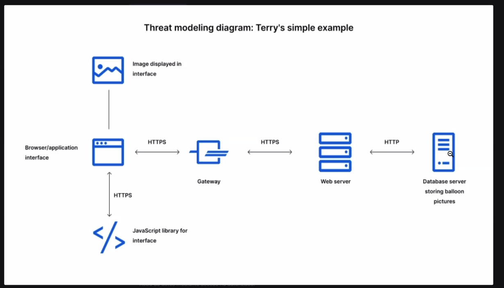
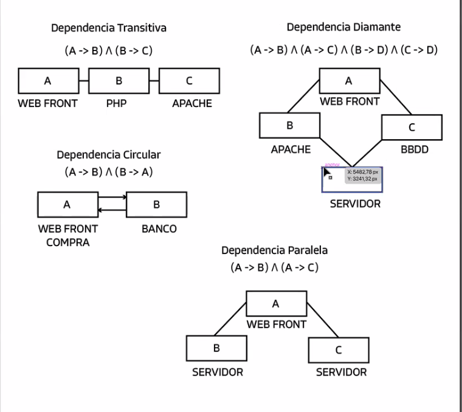
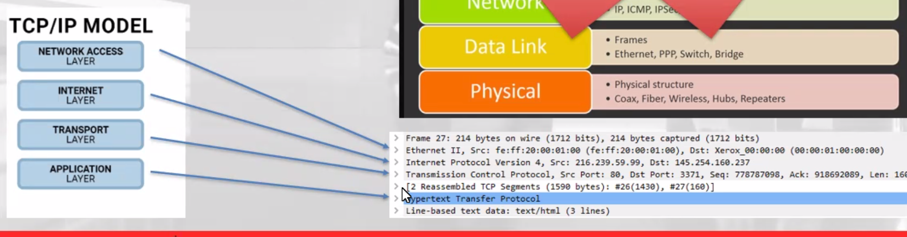
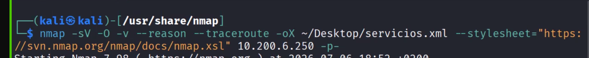

InfoSec plays an integral role in safeguarding an organization's data from various threats, ensuring the confidentiality, integrity, and availability of data

In essence, a risk represents the potential for damage, a threat is what can cause that damage, and a vulnerability is the weakness that allows the threat to cause damage. All three concepts are interconnected, and understanding the difference between them is essential for effective information security management.

InfoSec professionals use a wide array of tools to perform their duties. As a beginner in penetration testing, you should be aware of these common categories:

    Firewalls: Control incoming and outgoing network traffic
    Intrusion Detection/Prevention Systems (IDS/IPS): Monitor for and block suspicious activities
    Security Information and Event Management (SIEM) systems: Collect and analyze security event data
    Vulnerability scanners: Identify potential weaknesses in systems and applications
    Penetration testing tools: Simulate attacks to find vulnerabilities (e.g., Metasploit, Burp Suite)
    Encryption tools: Protect data confidentiality and integrity
    Access control systems: Manage user permissions and authentication
    Security awareness training platforms: Educate users about security best practices

For penetration testing specifically, you'll need to become familiar with many tools and operating systems including but not limited to:

    Linux, Windows, MacOS
    Nmap: Network scanning and discovery
    Wireshark: Network protocol analysis
    Metasploit: Exploitation framework
    Burp Suite: Web application security testing
    John the Ripper: Password cracking

Responsibility for DR and BC typically falls to a dedicated team within an organization, often led by a Business Continuity Manager or a similar role. This team works closely with IT, operations, and executive leadership to develop, implement, and maintain the DR/BC plans. They conduct risk assessments, identify critical business functions, set Recovery Time Objectives (RTOs) and Recovery Point Objectives (RPOs), and design strategies to meet these goals.

A Distributed Denial of Service (DDoS) attack is a malicious attempt to interrupt the normal functioning of a website, server, or online service by overwhelming it with a flood of internet traffic. Unlike a traditional Denial of Service (DoS) attack, which originates from a single source, a DDoS attack comes from multiple sources simultaneously. These sources are often compromised computers or devices infected with malware, collectively known as a "botnet.”

Ransomware is a type of malicious software (or malware) that infiltrates servers, computers, and networks, encrypting valuable files so they become inaccessible. The attackers then demand a ransom payment, often in cryptocurrency like Bitcoin, in exchange for a decryption key that promises to restore access to the locked data. It's similar to a digital hostage situation, where your important files are held captive.
Imagine you own a small art gallery filled with priceless paintings and sculptures. One morning, you arrive to find that all your artwork has been locked away behind impenetrable glass cases installed overnight. A note is left on the door demanding a hefty sum of money in exchange for the keys to unlock the cases. Until you pay, you can't access or display your art, and your business grinds to a halt. This unsettling scenario mirrors what happens during a ransomware attack in the digital world.

How it works

Social engineering techniques are sophisticated methods that exploit the fundamental human tendency to trust others. These tactics leverage psychological vulnerabilities to manipulate individuals into divulging confidential information or performing actions that compromise security. Cybercriminals have developed and refined a diverse array of social engineering techniques, each designed to exploit different aspects of human behavior and social interactions. These methods are constantly evolving, adapting to new technologies and social norms, making them particularly challenging to defend against. There are five fundamental techniques being utilized, but not limited to:

    Phishing
    Pretexting
    Baiting
    Tailgating
    Quid Pro Quo

Phishing

Imagine receiving an email that looks like it's from your bank, urging you to update your account information immediately to avoid suspension. The email provides a link to a website that looks just like your bank's site. Trusting the email, you enter your login details, which are then captured by the attacker.

Phishing is one of the most common social engineering techniques. Attackers send deceptive emails or messages that appear to come from legitimate sources to trick individuals into revealing sensitive information like usernames, passwords, or credit card numbers.
Pretexting

Think of a scenario where someone calls you claiming to be from the IT department. They say there's an issue with your computer and need your login credentials to fix it. Believing they are who they say they are, you provide the information. Pretexting involves creating a fabricated scenario (a pretext) to engage the target and extract information or persuade them to perform an action.
Baiting

Imagine finding a USB drive labeled "Employee Salaries 2023" in the office parking lot. Curiosity piqued, you plug it into your computer to see what's on it. Unknown to you, the drive installs malware on your system. Baiting uses the promise of something enticing to lure victims into a trap.
Tailgating

Suppose you're entering a secure building that requires a keycard. An individual carrying a large box approaches and asks you to hold the door because they can't reach their card. Being polite, you let them in, unknowingly allowing unauthorized access. Tailgating involves an attacker following an authorized person into a restricted area without proper credentials.
Quid Pro Quo

Imagine receiving a call from someone offering a free software upgrade in exchange for your login details. They promise the upgrade will improve your computer's performance. Quid pro quo attacks offer a benefit in exchange for information or access.

An insider threat refers to the danger that comes from individuals who have authorized access to an organization's resources, such as employees, contractors, or business partners. Unlike external attackers who breach defenses from the outside, insider threats originate from within the organization. These insiders misuse their access privileges to harm the organization, either intentionally or unintentionally.

Network diagram showing applications, servers, cloud, internet, and client connections. Includes employees, mobile, company, and teams: Blue, Red, and Purple.

There are different types of insider threats:

    Malicious Insiders: These are individuals who intentionally seek to cause harm. They might steal sensitive information, sabotage systems, or commit fraud for personal gain, revenge, or to benefit another organization.
    Negligent Insiders: These individuals don't intend to cause harm but do so through carelessness or lack of awareness. For example, an employee might accidentally send confidential information to the wrong email address or fall for a phishing scam that compromises security.
    Compromised Insiders: In this case, external attackers gain access to insider credentials, like usernames and passwords, often through hacking or social engineering. They then operate within the organization's systems as if they were legitimate users.

An Advanced Persistent Threat (APT) is a sophisticated and continuous cyberattack where an intruder gains unauthorized access to a company’s network and remains undetected for an extended period. Unlike typical cyberattacks that are quick and aim for immediate payoff, APTs are long-term operations that require significant resources and planning. They are often carried out by well-funded groups, sometimes sponsored by nation-states or organized criminal organizations.

A Threat Actor "team" is an organized group of individuals with specialized skills collaborating to carry out cyber attacks. Red Teams apply the same techniques but with the intention to secure the company instead of harming it. Unlike cybersecurity professionals who protect systems (like the Blue Team), these teams are the adversaries aiming to breach defenses for malicious purposes.

Chief Information Security Officer CISO

Networks vary in size and scope. The two primary types are Local Area Network (LAN) and Wide Area Network (WAN).
A network is a collection of interconnected devices that can communicate - sending and receiving data, and also sharing resources with each other. These individual endpoint devices, often called nodes, include computers, smartphones, printers, and servers. However, nodes alone do not comprise the entire network. The table below shows some networking key concepts.
Concepts	Description
Nodes	Individual devices connected to a network.
**Links**	Communication pathways that connect nodes (wired or wireless).
Data Sharing	The primary purpose of a network is to enable data exchange.
LAN

The Internet is the largest example of a WAN, connecting millions of LANs globally.
Wide Area Network
WAN 

Let's consider the following scenario to illustrate how LANs and WANs work together. At home, our devices—such as laptops, smartphones, and tablets—connect to our home router, forming a LAN. This router doesn't just manage local traffic; it also communicates with our ISP's WAN. Through this connection to the WAN, our home network gains the ability to access websites and online services hosted all over the world. This seamless integration between the LAN and WAN enables us to reach global content and interact with services beyond our local network.
For instance, when accessing the Internet, a home LAN connects to an Internet Service Provider's (ISP's) WAN, which grants Internet access to all devices within the home network. An ISP is a company that provides individuals and organizations with access to the Internet.

Modelo OSI          Modelo TCP/IP     Que hace                     

Aplicacion          
Presentacion        Aplicacion        Interaccion HTTP, SMTP, DNS, FTP
Sesion
Transporte          Transporte        Garantiza comunicacion UDP, TCP
Red                 Internet           Conexion IP, ICMP
Enlace (MAC)
                    Acceso            Transmision datos fisico PPP
Fisica

The third layer of the OSI model (network layer) is where the magic of routing & re-assembly of data takes place (from these small chunks to the larger chunk). Firstly, routing simply determines the most optimal path in which these chunks of data should be sent.

Whilst some protocols at this layer determine exactly what is the "optimal" path that data should take to reach a device, we should only know about their existence at this stage of the networking module. Briefly, these protocols include OSPF (Open Shortest Path First) and RIP (Routing Information Protocol). The factors that decide what route is taken is decided by the following:

    What path is the shortest? I.e. has the least amount of devices that the packet needs to travel across.
    What path is the most reliable? I.e. have packets been lost on that path before?
    Which path has the faster physical connection? I.e. is one path using a copper connection (slower) or a fibre (considerably faster)?

At this layer, everything is dealt with via IP addresses such as 192.168.1.100.

La diferencia principal es que IP es el protocolo responsable de enrutar y entregar datos de un punto a otro, mientras que ICMP es un protocolo de diagnóstico utilizado para enviar informes de errores y probar el estado de la red.

What is the name of the piece of hardware that all networked devices come with?
Network Interface Card

Protocol	Description
HTTP (Hypertext Transfer Protocol)	Primarily used for transferring web pages. It operates at the Application Layer, allowing browsers and servers to communicate in the delivery of web content.
FTP (File Transfer Protocol)	Facilitates the transfer of files between systems, also functioning at the Application Layer. It provides a way for users to upload or download files to and from servers.
SMTP (Simple Mail Transfer Protocol)	Handles the transmission of email. Operating at the Application Layer, it is responsible for sending messages from one server to another, ensuring they reach their intended recipients.
TCP (Transmission Control Protocol)	Ensures reliable data transmission through error checking and recovery, operating at the Transport Layer. It establishes a connection between sender and receiver to guarantee the delivery of data in the correct order.
UDP (User Datagram Protocol)	Allows for fast, connectionless communication, which operates without error recovery. This makes it ideal for applications that require speed over reliability, such as streaming services. UDP operates at the Transport Layer.
IP (Internet Protocol)	Crucial for routing packets across network boundaries, functioning at the Internet Layer. It handles the addressing and routing of packets to ensure they travel from the source to the destination across diverse networks.

Because of this, guarantees that any data sent will be received on the other end. This process is named the Three-way handshake, which is something we'll come on to discuss shortly. A table comparing the advantages and disadvantages of is located below:
Next, we'll come on to discuss the Three-way handshake - the term given for the process used to establish a connection between two devices. The Three-way handshake communicates using a few special messages - the table below highlights the main ones:

Step	Message	Description
1	SYN	A SYN message is the initial packet sent by a client during the handshake. This packet is used to initiate a connection and synchronise the two devices together (we'll explain this further later on).
2	SYN/ACK	This packet is sent by the receiving device (server) to acknowledge the synchronisation attempt from the client.
3	ACK	The acknowledgement packet can be used by either the client or server to acknowledge that a series of messages/packets have been successfully received.
4	DATA	Once a connection has been established, data (such as bytes of a file) is sent via the "DATA" message.
5	FIN	This packet is used to cleanly (properly) close the connection after it has been complete.
#	RST	This packet abruptly ends all communication. This is the last resort and indicates there was some problem during the process. For example, if the service or application is not working correctly, or the system has faults such as low resources. 

    SYN - Client: Here's my Initial Sequence Number(ISN) to SYNchronise with (0)
    SYN/ACK - Server: Here's my Initial Sequence Number (ISN) to SYNchronise with (5,000), and I ACKnowledge your initial number sequence (0)
    ACK - Client: I ACKnowledge your Initial Sequence Number (ISN) of (5,000), here is some data that is my ISN+1 (0 + 1)

Header	Description
Source Port	This value is the port opened by the sender to send the
packet from. This value is chosen randomly (out of the ports from 0-65535 that aren't already in use at the time).
Destination Port	This value is the port number that an application or service is running on the remote host (the one receiving data); for example, a webserver running on port 80. Unlike the source port, this value is not chosen at random.
Source IP	This is the IP address of the device that is sending the packet.
Destination IP	This is the IP address of the device that the packet is destined for.
Sequence Number	When a connection occurs, the first piece of data transmitted is given a random number. We'll explain this more in-depth further on.
Acknowledgement Number	After a piece of data has been given a sequence number, the number for the next piece of data will have the sequence number + 1. We'll also explain this more in-depth further on.
Checksum	This value is what gives
. A mathematical calculation is made where the output is remembered. When the receiving device performs the mathematical calculation, the data must be corrupt if the output is different from what was sent.
Data	This header is where the data, i.e. bytes of a file that is being transmitted, is stored.
Flag	This header determines how the packet should be handled by either device during the handshake process. Specific flags will determine specific behaviours, which is what we'll come on to explain below.

Protocol 	Port Number 	Description
File Transfer Protocol (
) 	21 	This protocol is used by a file-sharing application built on a client-server model, meaning you can download files from a central location.
Secure Shell (
) 	22 	This protocol is used to securely login to systems via a text-based interface for management.
HyperT
Transfer Protocol (
) 	80 	This protocol powers the World Wide Web (WWW)! Your browser uses this to download text, images and videos of web pages.
HyperT
 Transfer Protocol Secure (HTTPS) 	443 	This protocol does the exact same as above; however, securely using encryption.
Server Message Block (
) 	445 	This protocol is similar to the File Transfer Protocol (
); however, as well as files,
allows you to share devices like printers.
Remote Desktop Protocol (
) 	3389 	This protocol is a secure means of logging in to a system using a visual desktop interface (as opposed to the text-based limitations of the
protocol).

https://www.iana.org/assignments/service-names-port-numbers/service-names-port-numbers.xhtml

    Where the traffic is coming from? (has the 

been told to accept/deny traffic from a specific network?)
Where is the traffic going to? (has the
been told to accept/deny traffic destined for a specific network?)
What port is the traffic for? (has the
been told to accept/deny traffic destined for port 80 only?)
What protocol is the traffic using? (has the
been told to accept/deny traffic that is , or both?)

Firewalls perform packet inspection to determine the answers to these questions.

Transmission

Transmission in networking refers to the process of sending data signals over a medium from one device to another. To further understand this concept, let’s examine the different types of transmission, the modes in which these transmissions can occur, and the media that carry the signals.
Transmission Types

Transmission in networking can be categorized into two main types: analog and digital. Analog transmission uses continuous signals to represent information, commonly seen in traditional radio broadcasts. In contrast, digital transmission employs discrete signals (bits) to encode data, which is typical in modern communication technologies like computer networks and digital telephony.
Transmission Modes

Transmission modes define how data is sent between two devices. Simplex mode allows one-way communication only, such as from a keyboard to a computer, where signals travel in a single direction. Half-duplex mode permits two-way communication but not simultaneously; examples include walkie-talkies where users must take turns speaking. Full-duplex mode, used in telephone calls, supports two-way communication simultaneously, allowing both parties to speak and listen at the same time.
Transmission Media

The physical means by which data is transmitted in a network is known as transmission media, which can be wired or wireless. Wired media includes twisted pair cables, commonly used in Ethernet networks and local area network (LAN) connections; coaxial cables, used for cable TV and early Ethernet; and fiber optic cables, which transmit data as light pulses and are essential for high-speed internet backbones. Wireless media, on the other hand, encompasses radio waves for Wi-Fi and cellular networks, microwaves for satellite communications, and infrared technology used for short-range communications like remote controls. Each type of media has its specific use cases depending on the requirements of the network environment.

Component	Description
End Devices	Computers, Smartphones, Tablets, IoT / Smart Devices
Intermediary Devices	Switches, Routers, Modems, Access Points
Network Media and Software Components	Cables, Protocols, Management and Firewalls Software
Servers	Web Servers, File Servers, Mail Servers, Database Servers

An end device, also known as a host

A Network Interface Card (NIC) is a hardware component installed in a computer, or other device, that enables connection to a network. It provides the physical interface between the device and the network media, handling the sending and receiving of data over the network. Each NIC has a unique Media Access Control (MAC) address, which is essential for devices to identify each other, and facilitate communication at the data link layer. NICs can be designed for wired connections, such as Ethernet cards that connect via cables, or for wireless connections, like Wi-Fi adapters utilizing radio waves.

Servers

A server is a powerful computer designed to provide services to other computers, known as clients, over a network. Servers are the backbone behind websites, email, files, and applications. In the realm of computer networking, servers play a crucial role by hosting services that clients access (i.e., web pages and email services), facilitating service provision. They enable resource sharing by allowing multiple users to access resources like files and printers. Servers also handle data management by storing and managing data centrally, which simplifies backup processes and enhances security management. Additionally, they manage authentication by controlling user access and permissions, across multiple components in the network. Servers often run specialized operating systems optimized for handling multiple, simultaneous requests in what is known as the Client-Server Model, where the server waits for requests from clients and responds accordingly. Whether you knew it or not, this is what was happening under-the-hood the last time you accessed a website from your notebook. Your browser sends a request to the web server hosting the site, and the server subsequently processes the request and sends back the web page data in its response.

Devices on a network will all have a physical network interface, which is a microchip board found on the device's motherboard. This network interface is assigned a unique address at the factory it was built at, called a MAC (Media Access Control ) address
However, an interesting thing with MAC addresses is that they can be faked or "spoofed" in a process known as spoofing. This spoofing occurs when a networked device pretends to identify as another using its MAC address. When this occurs, it can often break poorly implemented security designs that assume that devices talking on a network are trustworthy. Take the following scenario: A is configured to allow any communication going to and from the MAC address of the administrator. If a device were to pretend or "spoof" this MAC address, the would now think that it is receiving communication from the administrator when it isn't.

Windows

Other users
lusrmgr.msc

msconfig
The System Configuration utility (MSConfig) is for advanced troubleshooting, and its main purpose is to help diagnose startup issues. 

tskmgr

View advanced system settings

msconfig > tools para tools interesantes

compmgmt

msinfo32
The  information in System Summary is divided into three sections:

    Hardware Resources
    Components
    Software Environment

resmon
Resource Monitor displays per-process 

cmd power shell
ipconfig
ipconfig /all
netstat

regedit
The Windows Registry (per Microsoft) is a central hierarchical database used to store information necessary to configure the system for one or more users, applications, and hardware devices.

WF.msc
firewall
Microsoft Defender SmartScreen

core isolation

bitlocker
Per Microsoft, "BitLocker Drive Encryption is a data protection feature that integrates with the operating system and addresses the threats of data theft or exposure from lost, stolen, or inappropriately decommissioned computers".

On devices with TPM installed, BitLocker offers the best protection.

Per Microsoft, "BitLocker provides the most protection when used with a Trusted Platform Module (TPM) version 1.2 or later. The TPM is a hardware component installed in many newer computers by the computer manufacturers. It works with BitLocker to help protect user data and to ensure that a computer has not been tampered with while the system was offline".
On devices that don't have a TPM, BitLocker can still be used to encrypt the operating system drive. This implementation requires the user to either:

    Use a startup key, which is a file stored on a removable drive that is used to start the device, or when resuming from hibernation.
    Use a password. This option isn't secure since it's subject to brute force attacks as there isn't a password lockout logic. As such, the password option is discouraged and disabled by default.

eventvwr
event logs window logs security 

quser 
para ver logins en windows

net user <John>

net localgroup administrators
para ver permisos administrador de los usuarios

**ver** command to determine the operating system (OS) version

**systeminfo** command to list various information about the system such as OS information, system details, processor and memory

**ping target_name**. Inspired by ping-pong, we send a specific ICMP packet and listen for a response. If a response is received, we know that we can reach the target and that the target can reach us.

**tracert target_name** traces the network route traversed to reach the target. Without getting into more details, it expects the routers on the path to notify us if they drop a packet because its time-to-live (TTL) has reached zero. 

**nslookup**. It looks up a host or domain and returns its IP address. The syntax nslookup example.com

**netstat** command with no arguments will show you established connections, as shown below. In this case, we only have one SSH connection; we figured out it is SSH because it is bound to port 22.

Busca el identificador de proceso (PID) que está usando el puerto:
Ejecuta: netstat -ano | findstr :135

Get-Process -Id (Get-NetTCPConnection -LocalPort 135).OwningProcess

**netstat -abon**
el mejor
What is the name of the process listening on port 3389?

You can type **tree** to visually represent the child directories and subdirectories.

Working With Directories

    cd: Displays the current directory or changes directories.
    dir: Lists the files in a directory.
    dir /a: Shows hidden files.
    dir /s: Lists files in the current directory and subdirectories.
    mkdir [directory_name]: Creates a new directory.
    rmdir [directory_name]: Removes a directory.
    tree: Shows a visual representation of directories and subdirectories.

Working With Files

    type [file]: Displays the contents of a text file.
    more [file]: Shows a file's content one page at a time.
    copy [file] [destination]: Copies a file to a new location.
    move [file] [destination]: Moves a file to a new location.
    **del [file] or erase [file]: Deletes a file.
    copy *.md [destination]: Copies all files with the .md extension to the destination folder.

    chkdsk: checks the file system and disk volumes for errors and bad sectors.
    driverquery: displays a list of installed device drivers.
    sfc /scannow: scans system files for corruption and repairs them if possible.

Metodologias policies 
equivalencias

Magerit (gratis espana) Metodologia de gestion de riesgos de los sistemas informacion
medicion de 0 a 10

ISO27001 (pago a nivel mundial)
medicion 0 a 10

**NIST SP800-30** (gratis eeuu)
medicion 0 a 7 

que tenemos que proteger?
valorar activos

que amenaza pueden tener?
valorar amenazas

si hubiera una amenaza, que vulnerabilidad tienen?
analisis vulnerabilidades

probabilidad de que ocurra la amenaza
analisis de probabilidades

riesgo = impacto x probablilidad
analisis de riesgo

como puedo reducir el riesgo?
salvaguardas

todo forma parte del PDCA (plan do check act)
junto a la triada CIA
y al FN, FP, VN, VP
conforma la base de la InfoSec

Para entender cómo encajan todas las piezas, imagina que la ciberseguridad en España es como la seguridad vial: NIS2 es el código de circulación europeo (la ley general), el ENS es el examen de conducir técnico (el manual práctico), el CCN e INCIBE son las jefaturas de tráfico que vigilan, y los CERTs son las ambulancias y mecánicos de emergencia en la carretera.

Si un ciberdelincuente ataca una empresa privada de energía en España:La empresa está obligada a protegerse bajo la ley NIS2.Para protegerse de forma correcta, la empresa implementa las medidas del ENS.Al sufrir el hackeo, la empresa llama de urgencia al INCIBE-CERT (su equipo de asistencia por ser empresa privada) en un plazo de 24 horas.Si el ataque escala y amenaza la infraestructura crítica de España, el INCIBE-CERT activa la alerta nacional y se coordina con el CCN-CERT para blindar los sistemas del Estado.

La Ley de la UE: NIS2 (Obliga a reportar e implementar control).La Ley en España: Anteproyecto de Ley de Coordinación y Gobernanza de la Ciberseguridad.El Supervisor Político/Legal: SEDIA (Privado) o CCN (Público).El Supervisor Policial/Delictivo: OCC (Interior / Policía / Guardia Civil).El "Bombero" Técnico: INCIBE-CERT (Privado) o CCN-CERT (Público).El Estándar Organizativo: ENS (Nacional) o ISO 27001 (Internacional).El Motor del Riesgo: MAGERIT (Herramienta PILAR) o ISO 27005.El Vigilante del Dato: AEPD (RGPD).

1. La Ley de la UE: NIS2El código de circulación europeo.¿Qué hace?: Obliga por ley a proteger los sistemas críticos y reportar ciberataques bajo amenaza de multas millonarias.Su función: Obligar legalmente a las organizaciones medianas y grandes a tomarse en serio la ciberseguridad.2. La Ley en España: Anteproyecto de Ley de CoordinaciónLa adaptación local del código de circulación.¿Qué hace?: Traduce la ley europea al derecho español y reparte las competencias de control en el país.Su función: Dar validez legal a las multas dentro de España y organizar el territorio.3. El Supervisor Político/Legal: SEDIA (Privado) o CCN (Público)Los radares fijados en la carretera que multan.¿Qué hacen?: Inspeccionan los niveles de seguridad y firman los expedientes de sanción si hay negligencias.Su función: Ejercer de autoridad competente y reguladora (SEDIA para empresas privadas, CCN para administraciones).4. El Supervisor Policial/Delictivo: OCC (Interior)La patrulla de la Guardia Civil de Tráfico.¿Qué hace?: Coordina a las unidades tecnológicas de la Policía y la Guardia Civil para perseguir el crimen.Su función: Investigar quién está detrás del ciberataque, rastrear el dinero y detener a los delincuentes.5. El "Bombero" Técnico: INCIBE-CERT (Privado) o CCN-CERT (Público)Las ambulancias y los mecánicos de emergencia.¿Qué hacen?: Reciben obligatoriamente las alertas de hackeo en 24 horas y ayudan técnicamente a contener la crisis.Su función: Mitigar el impacto del ataque en tiempo real y alertar al resto de conductores del peligro (INCIBE para empresas, CCN para el Estado).6. El Estándar Organizativo: ENS (Nacional) o ISO 27001 (Internacional)Las clases de la autoescuela y el examen de conducir.¿Qué hacen?: Manuales de gestión que estructuran cómo debe organizarse la empresa (políticas, contraseñas, accesos).Su función: Lograr una certificación oficial que demuestra que sabes conducir seguro (el ENS da el sello oficial del Gobierno; la ISO da el sello internacional).7. El Motor del Riesgo: MAGERIT (Software PILAR) o ISO 27005El ordenador de a bordo que calcula el desgaste de los frenos.¿Qué hacen?: Metodologías científicas que miden qué activos tienes y qué impacto económico tendría perderlos.Su función: Justificar tus inversiones ante el supervisor demostrando matemáticamente dónde hay más peligro de accidente.8. El Vigilante del Dato: AEPD (RGPD)El seguro de responsabilidad civil a terceros.¿Qué hace?: Protege exclusivamente el derecho a la privacidad y los datos personales robados en el hackeo.Su función: Multar e intervenir de forma paralela e independiente si los hackers se llevan los DNI o tarjetas de los clientes.

pintra de derecha a izquierda hacer ingenieria inversa

**RCE** = remote code execution

**bajo mitre framework**:
0-Click (Zero-Click): Máximo peligro. Cero interacción del usuario. El dispositivo se infecta en segundo plano con solo recibir un paquete de datos (ej. una videollamada perdida).1-Click (Un clic): Es el ataque clásico. El hacker te envía un correo falso (Phishing) con un enlace. Si haces un solo clic, el virus se descarga y se ejecuta automáticamente aprovechando una vulnerabilidad del navegador.2-Click / Multi-Click: El usuario debe realizar múltiples acciones debido a las protecciones del sistema

nmap output
