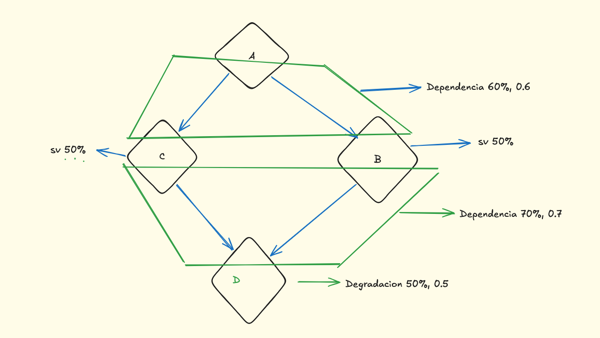

<div align="center">

# INFORME TÉCNICO

## AP13 · Propagación del impacto por dependencias

### Fortune Bank

<br>

**Alumno:** Xavier Margalef Riestra

**Metodología:** [MAGERIT v3](https://administracionelectronica.gob.es/pae_Home/pae_Documentacion/pae_Metodologias/pae_Magerit.html) · [Esquema Nacional de Seguridad (ENS)](https://www.ccn-cert.cni.es/es/seguridad-al-dia/esquema-nacional-de-seguridad)

**Actividad:** Dependencias entre activos y propagación del impacto

**Fecha:** Julio 2026

<br>


</div>

<div style="page-break-after: always;"></div>

# Introducción

Este informe analiza la propagación del impacto entre activos aplicando la metodología **MAGERIT v3**. El objetivo es determinar cómo una degradación sobre un activo de soporte afecta a los activos que dependen de él y calcular el impacto que finalmente alcanza al servicio de negocio.

El ejercicio también evalúa el efecto de implantar **salvaguardas**, calculando el impacto residual obtenido tras su aplicación e identificando el patrón de dependencias presente en la arquitectura analizada.

---

# Planteamiento

Durante una auditoría realizada sobre la infraestructura de **Fortune Bank** se estudia el comportamiento del sistema de transferencias ante un incidente que afecta a uno de sus activos de soporte.

La infraestructura está formada por los siguientes componentes:

- **Activo A:** Sistema Core de transferencias.
- **Nodo B:** Middleware de procesamiento.
- **Nodo C:** Middleware de procesamiento.
- **Servidor D:** Servidor físico del que dependen ambos nodos.

Escenario analizado:

- El **Servidor D** sufre una degradación del **50 %** debido a un fallo de hardware.
- Los nodos **B** y **C** mantienen una dependencia del **70 %** respecto al Servidor D.
- El **Sistema Core (A)** depende en un **60 %** de cada uno de los nodos intermedios.

A partir de estos datos se calcula el impacto repercutido sobre el servicio de negocio y el efecto de aplicar salvaguardas con una eficacia del 50 %.

<div style="page-break-after: always;"></div>

# Identificación de activos

Según **MAGERIT v3**, los activos pueden clasificarse en **activos esenciales** y **activos de soporte**. El activo esencial representa el servicio de negocio, mientras que los activos de soporte proporcionan los recursos necesarios para su funcionamiento.

| Activo | Clasificación | Descripción |
|---------|---------------|-------------|
| **Activo A** | Activo esencial | Sistema Core de transferencias. Servicio crítico del banco. |
| **Nodo B** | Activo de soporte | [Middleware](https://owasp.org/www-community/Application_Architecture) encargado del procesamiento de operaciones. |
| **Nodo C** | Activo de soporte | Middleware con funciones equivalentes al Nodo B. |
| **Servidor D** | Activo de soporte crítico | Servidor físico compartido por ambos nodos. Constituye un **[Single Point of Failure (SPOF)](https://en.wikipedia.org/wiki/Single_point_of_failure)**. |

En MAGERIT, el valor del negocio se asigna inicialmente al activo esencial y se propaga hacia los activos de soporte mediante las relaciones de dependencia. Como resultado, una degradación del **Servidor D** termina repercutiendo sobre el **Sistema Core**.

<div align="center">



</div>

---

# Topología de dependencias

La arquitectura puede representarse mediante el siguiente esquema:

```text
          Activo A
         /        \
      60 %      60 %
      /            \
 Nodo B          Nodo C
      \            /
      70 %      70 %
         \      /
        Servidor D