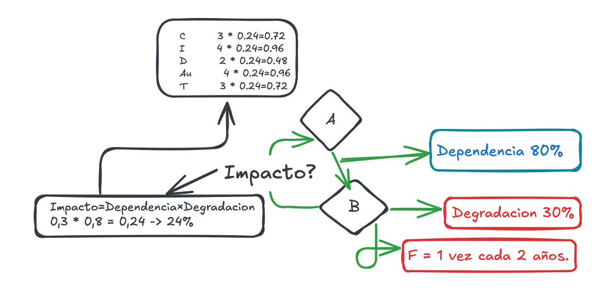
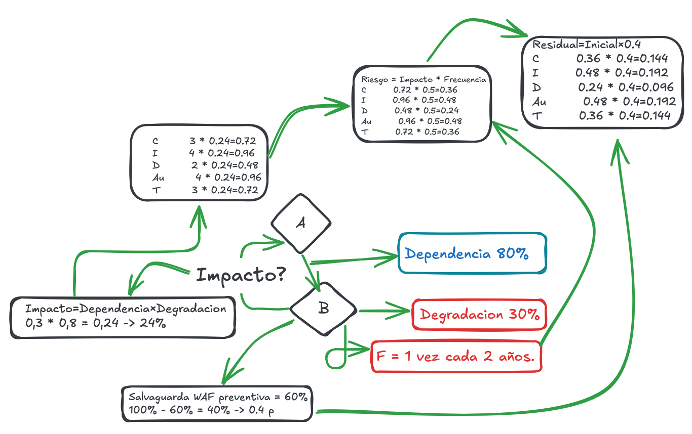

<div class="cover">
<div class="cover-inner">

# AP12 · Auditoría – Ayuntamiento de Bollullos

**Alumno:** Xavier Margalef  
**Metodología:** MAGERIT v3 · ENS  
**Fecha:** 14/07/2026  
**Actividad:** [AP 12] Auditoría - Ayuntamiento Bollullos


</div>
</div>

<div style="page-break-after: always;"></div>

## 1. Valor Propio / Acumulado del Activo A
El Activo A es el activo esencial que depende del Activo B que es el sistema de soporte, por lo que el activo A no acumula valor heredado del B.

`v_activo = 3, 4, 2, 4, 3`

El Sistema de Gestión depende del Servidor para funcionar. Por eso el Servidor hereda el valor del Sistema de Gestión, no al revés.

El valor de los activos esenciales se propaga hacia los activos de soporte, porque son estos los que deben protegerse para mantener operativo el negocio.

```
Sistema de Gestión de Clientes (Activo A)
            │
            ▼
Servidor BD (Activo B)
            │
            ▼
Sistema Operativo
            │
            ▼
Hardware
```

En conclusión, **Valor Propio = Valor Acumulado**.

El valor propio del Activo A en dimensiones del [Esquema Nacional de Seguridad (ENS)](https://www.ccn-cert.cni.es/ens.html) por el método [MAGERIT v3](https://administracionelectronica.gob.es/pae_Home/pae_Documentacion/pae_Metodologias/pae_Magerit.html) es:
* **C** (Confidencialidad) = 3
* **I** (Integridad) = 4 *(Activo Crítico)*
* **D** (Disponibilidad) = 2
* **Au** (Autenticidad) = 4 *(Activo Crítico)*
* **T** (Trazabilidad) = 3

En ese caso, **40.000 €** simplemente sirve para calcular las pérdidas económicas en las dos últimas secciones.

<div style="page-break-after: always;"></div>
---

## 2. El Impacto Repercutido sobre el negocio (Activo A) por la caída del servidor (Activo B)



$$	{Impacto} = 	{Dependencia} x {Degradación}$$

* **Dependencia:** $80\% = 0.8$
* **Degradación:** $30\% = 0.3$

**Entonces:**  
$$0.8 x 0.3 = 
\mathbf{24\%}$$

Ese **24%** afecta a todas las dimensiones. Por tanto:

| Dimensión | Operación | Impacto Repercutido |
| :--- | :---: | :---: |
| **C** | $3 x 0.24$ | **0.72** |
| **I** | $4 x 0.24$ | **0.96** |
| **D** | $2 x 0.24$ | **0.48** |
| **Au** | $4 x 0.24$ | **0.96** |
| **T** | $3 x 0.24$ | **0.72** |

> **Interpretación Técnico:** Estos valores significan cuánto daño recibe cada propiedad de seguridad del Activo A. Por ejemplo, **0.96** sobre 4. Como la dimensión de la *Integridad* se considera un activo crítico, a causa del impacto por caída del activo por la degradación en base a la dependencia, pues su daño resultante es mayor a la de la *Disponibilidad* (0.48). Se han perdido puntos de valor nominales en las dimensiones del activo, traduciéndose en una pérdida directa de valor.

---

<div style="page-break-after: always;"></div>

## 3. El Riesgo Inicial del Activo A

En la metodología de gestión de riesgos **MAGERIT**, el cálculo base se estructura como:
$$	{Riesgo} = 	{Impacto} x {Frecuencia}$$

* **Frecuencia:** 1 vez cada 2 años $
F = 0.5$

Por tanto:

| Dimensión | Operación (Impacto × Frecuencia) | Riesgo Inicial |
| :--- | :---: | :---: |
| **C** | $0.72 x 0.5$ | **0.36** |
| **I** | $0.96 x 0.5$ | **0.48** |
| **D** | $0.48 x 0.5$ | **0.24** |
| **Au** | $0.96 x 0.5$ | **0.48** |
| **T** | $0.72 x 0.5$ | **0.36** |

> **Conceptos Clave de la Cadena de Riesgo:**
> * **Valor:** ¿Qué tan importante es el activo? *Ej.: Integridad = 4.*
> * **Impacto:** Si el ataque ocurre, ¿cuánto valor pierdo? *Ej.: 0.96 puntos.*
> * **Riesgo:** Como el ataque no ocurre siempre, ¿cuál es la pérdida esperada teniendo en cuenta su frecuencia? *Ej.: 0.96 × 0.5 = 0.48.*

---
<div style="page-break-after: always;"></div>

## 4. El Riesgo Residual si aplicamos un WAF con una eficacia del 60%

El **WAF** ([Web Application Firewall](https://www.cloudflare.com/es-es/learning/ddos/glossary/web-application-firewall-waf/)) entraría dentro de las **salvaguardas preventivas** porque actúa antes de que suceda alguna explotación de vulnerabilidad, reduciendo el vector de ataque y en total el riesgo.

> ℹ️ **Definición de Riesgo Residual:** Es el riesgo que permanece después de que se hayan implementado controles o medidas de mitigación para reducir la probabilidad o el impacto de un evento adverso. Representa la parte del riesgo que no puede ser eliminada completamente y que la organización debe aceptar, gestionar o transferir según las directrices [ISO/IEC 27005](https://www.iso.org/standard/75281.html).

Seguimos con la lógica de que cada dimensión representa una sección dentro como activo del valor total, y debe medirse por separado porque según qué salvaguardas o según el valor del activo pues es variante.

El WAF reduce el riesgo un 60%, por lo que **queda el 40% del riesgo remanente**.
$$	{Residual} = 	{Inicial} x 0.4$$

Entonces:

| Dimensión | Operación (Riesgo Inicial × 0.4) | Riesgo Residual |
| :--- | :---: | :---: |
| **C** | $0.36 x 0.4$ | **0.144** |
| **I** | $0.48 x 0.4$ | **0.192** |
| **D** | $0.24 x 0.4$ | **0.096** |
| **Au** | $0.48 x 0.4$ | **0.192** |
| **T** | $0.36 x 0.4$ | **0.144** |



---
<div style="page-break-after: always;"></div>

## 5. El dinero exacto que ha perdido el Ayuntamiento en el ataque (A d. S)

La pérdida real del ataque es el porcentaje de impacto sobre el negocio.

El **SLE** ([Single Loss Expectancy](https://www.nist.gov/)) significa pérdida esperada por un único incidente. El SLE calcula cuánto dinero perdería la organización si una amenaza concreta afectara a un activo una sola vez.

* **Impacto:** $24\%$
* **Activo:** $40.000\ €$

$$	{SLE} = 	{Valor} 	x 	{Factor de Exposición (Impacto)}$$
$$	{SLE} = 40.000 	x 0.24 = \mathbf{9.600\ €}$$

---

## 6. El dinero que perderá en un año (A d. S)

Aquí entra en juego no solo una ocurrencia sino el ratio. El **ALE** ([Annualized Loss Expectancy](https://csrc.nist.gov/glossary/term/annualized_loss_expectancy)) representa la Pérdida Anual Esperada y calcula cuánto dinero espera perder una organización en un año debido a un riesgo concreto.

$$	{ALE} = 	{SLE} 	x 	{ARO}$$

El **ARO** (*Annualized Rate of Occurrence*) significa la tasa anual de ocurrencia (en este caso, nuestra frecuencia de 0.5).

$$	{ALE} = 9.600 	x 0.5 = \mathbf{4.800\ €/año}$$

*(Nota: **A d. S** = Antes de Salvaguardas, lo cual significa que los puntos 5 y 6 se calculan sin tener en cuenta el WAF).*

---
<div style="page-break-after: always;"></div>

## 7. Calcula si tiene sentido aplicar esta medida

La licencia de Cloudflare Business más las horas de mantenimiento del técnico es de **1.200 € anuales**. Básicamente tenemos que hacer los cálculos con la situación inicial, antes de aplicar cualquier salvaguarda para comparar esa situación inicial con la situación después del WAF para decidir si la inversión merece la pena.

* **Sin protección (Pérdida anual esperada):** $4.800\ €$
* **Con WAF (Reduce el riesgo un 60%):** $4.800 	x 0.4 = 1.920\ €$
* **Coste del WAF:** Si le metemos el coste del WAF que son $1.200\ €$, nos deja en **3.120 € totales**.

### ⚖️ Comparativa de Gastos Anuales
* **Sin WAF:** $4.800\ €/	{año}$
* **Con WAF:** $3.120\ €/	{año}$ ($1.920\ €$ de riesgo residual + $1.200\ €$ de coste)

$$	{Ahorro Esperado} = 4.800 - 3.120 = \mathbf{1.680\ €/año}$$

Por tanto: **Sí, económicamente compensa implantar la medida**, ya que el coste total anual (3.120 €) es inferior a la pérdida anual esperada sin protección (4.800 €), generando un ahorro esperado de 1.680 € al año.

### 📈 Cálculo del ROSI (Return on Security Investment)
Para validar formalmente la rentabilidad bajo estándares internacionales de auditoría, aplicamos la métrica del [ROSI](https://www.enisa.europa.eu/):

$$	{ROSI} = {	{Riesgo Mitigado} - {Coste de la Solución} / {Coste}}$$
$$	{ROSI} = {2.880 - 1.200} / {1.200} = 
\mathbf{140\%}$$

> **Interpretación Financiera:** Un ROSI positivo del **140%** indica que la inversión es altamente rentable, ya que el valor económico del riesgo que mitiga supera con creces el coste anual de la solución tecnológica.

---

<div style="page-break-after: always;"></div>

## Resumen Final de Control

| Apartado / Pregunta | ¿Con WAF? | Expresión / Fórmula | Resultado Neto |
| :--- | :---: | :--- | :---: |
| **Valor Propio/Acumulado** | - | Escala ENS / MAGERIT | **C3 I4 D2 Au4 T3** |
| **Impacto Repercutido** | - | $	{Dependencia} 	x 	{Degradación}$ | **24 %** |
| **Riesgo Inicial** | ❌ No | $	{Impacto} 	x 	{Frecuencia}$ | **C0.36 I0.48 D0.24 Au0.48 T0.36** |
| **Riesgo Residual** | ✅ Sí | $	{Inicial} 	x 0.4$ | **C0.144 I0.192 D0.096 Au0.192 T0.144** |
| **5. Dinero Perdido (A d. S.)** | ❌ No | $	{SLE} = 40.000 	x 0.24$ | **9.600 €** |
| **6. Dinero Perdido al Año (A d. S.)** | ❌ No | $	{ALE} = 9.600 	x 0.5$ | **4.800 €/año** |
| **7. ¿Compensa el WAF?** | ✅ Sí | $	{Coste Efectivo Total}$ | **Sí, ahorro de 1.680 €/año (140% ROSI)** |

<br>
