<div style="max-width: 1200px; margin: 0 auto; padding: 24px 32px 48px 32px; font-family: 'Roboto', 'Segoe UI', Arial, Helvetica, sans-serif; font-size: 13px; line-height: 1.2; word-wrap: break-word; color: #111; background: #fff;">

# [ExP 86] Entrega - Silent Exposure 


---

<div style="text-align: center; margin-top: 36px; margin-bottom: 18px; padding: 8px 0;">
  <h2>Entrega - Silent Exposure</h2>
  <p><strong>Analista:</strong> Xavier Margalef Riestra</p>
  <p><strong>Fecha:</strong> 2026-06-11</p>
  <p><strong>Módulo:</strong> MF0486_3</p>
  <p><strong>Clasificación:</strong> Examen Práctico</p>
</div>

---

### Actividad 1 - Fundamentos 101

Entrega evidencia:
![[ExP] Fundamentos 101](images/image-1.png)

### Actividad 2 - Middle east

Entrega evidencia:
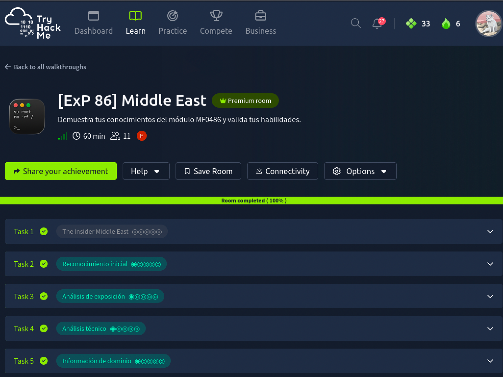](images/image-3.png)


### Actividad 3 - Analisis 101

Entrega evidencia:
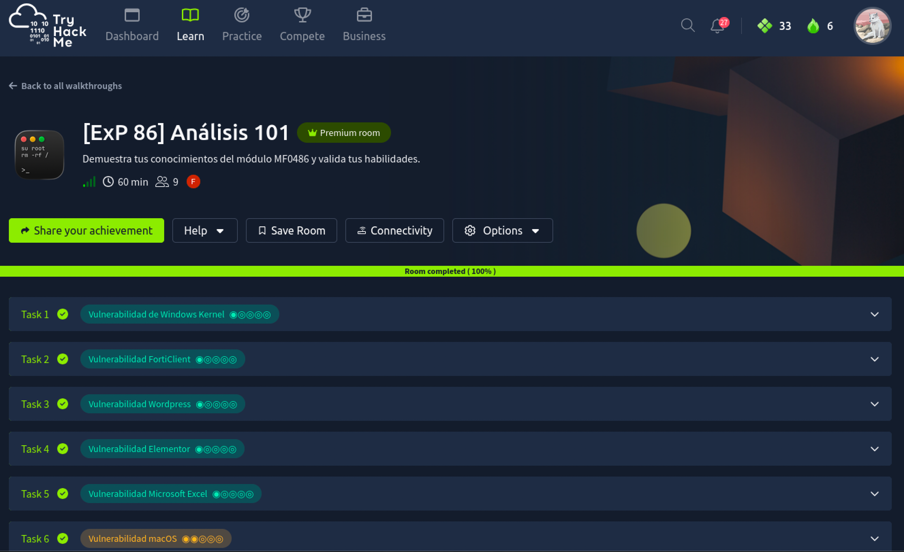


# Actividad 4 - Silent Exposures

## 01 - Resumen Ejecutivo

Durante la auditoría de seguridad realizada sobre la máquina **10.130.135.78 (lab-nublar-os)** se identificó una cadena de vulnerabilidades que permitió el compromiso completo del sistema.

La investigación comenzó con el análisis de servicios expuestos a través de la aplicación web, donde se localizaron archivos de respaldo accesibles públicamente que contenían información sensible. A partir de estos hallazgos fue posible obtener acceso inicial al servidor y continuar con una fase de enumeración interna orientada a identificar configuraciones inseguras y mecanismos de escalada de privilegios.

Se detectaron controles de seguridad insuficientes relacionados con la gestión de credenciales, la exposición de información sensible y la asignación de privilegios elevados a determinados binarios del sistema. La combinación de estas debilidades permitió obtener privilegios administrativos sobre el servidor.

El impacto del compromiso se considera **crítico**, ya que un atacante con acceso equivalente podría consultar, modificar o eliminar información sensible, alterar la configuración del sistema, establecer mecanismos de persistencia y utilizar el servidor como punto de partida para comprometer otros activos de la infraestructura.

Como medidas de mitigación se recomienda:

- Saneamiento de activos: Eliminar permanentemente archivos de desarrollo y copias de respaldo de los entornos productivos.
- Refuerzo de controles: Aplicar el principio de mínimo privilegio y auditar binarios con permisos elevados (SUID), reduciendo así la superficie de ataque.
- Gestión de credenciales: Reforzar la política de acceso y rotar las llaves comprometidas para restaurar la cadena de confianza.
- Ciclo de mejora: Institucionalizar revisiones periódicas que aseguren la trazabilidad de los eventos, garantizando que el sistema vuelva a ser una fuente confiable dentro de la infraestructura corporativa."


## 02 - Fase de Reconocimiento

El objetivo de esta fase es **verificar la disponibilidad del servidor, identificar servicios activos y analizar la configuración del servidor web**.

### 2.1 Identificación del objetivo
- Dirección IP del servidor: **10.130.135.78**  

### 2.2 Verificación de conectividad
Se comprobó que el servidor estaba operativo mediante un ping:

```bash
ping 10.130.135.78
```
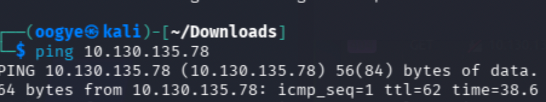

### 2.3 Acceso y análisis web inicial
- Se accedió a la IP mediante navegador.  
- Se utilizaron **Dev Tools** para inspeccionar HTTP, puerto y estructura HTML.

**Hallazgos:**
- Protocolo: **HTTP** 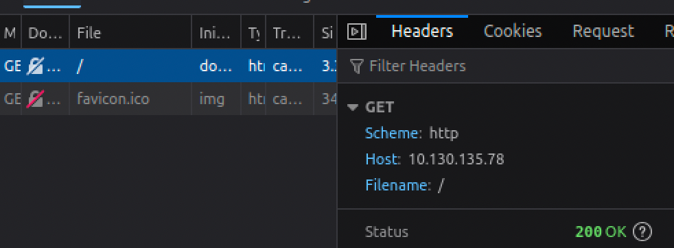  
- Puerto: **80** ([referencia](https://stackoverflow.com/questions/3364144/is-port-number-required-in-http-host-header-parameter))  
- Título de página en `<title>` 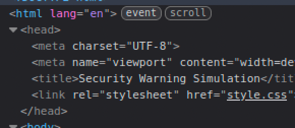  
- Código de error y motivo mediante opciones avanzadas 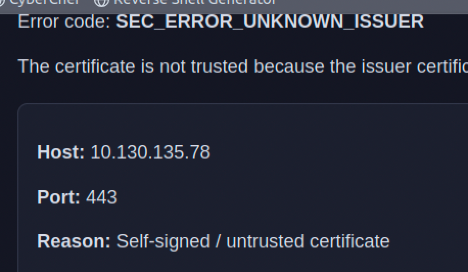

### 2.4 Descarga de archivo de prueba
- Se aceptaron riesgos y se descargó el archivo disponible.  
- Contenía la flag: **"Bienvenidos a Jurassic Park"** 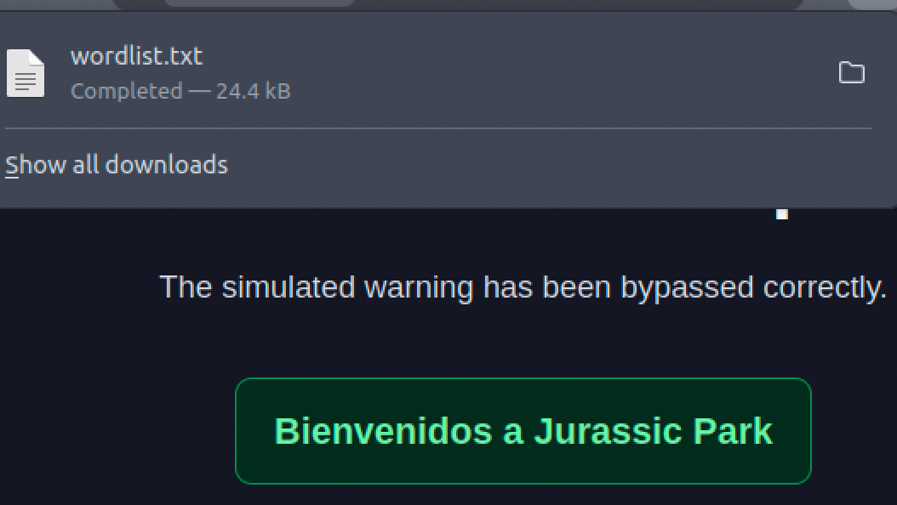  
- Archivo en texto plano, útil para fases posteriores.  
- Relevancia del uso de wordlists: [FreeCodeCamp](https://www.freecodecamp.org/news/the-power-of-wordlists-why-every-ethical-hacker-needs-one/)

## 03 - Fase de Enumeración y Descubrimiento

Realizamos una fase de enumeración de directorios y archivos para identificar rutas ocultas en el servidor web. El objetivo es localizar recursos no indexados o expuestos que puedan servir como vector de ataque. 

### 3.1 Enumeración de directorios y archivos
Se utilizó **fuzzing** y **fuerza bruta** para identificar rutas ocultas o archivos sensibles.

```bash
dirb http://10.130.191.20 /root/wordlist.txt/
gobuster dir -u http://10.130.191.20 -w /root/wordlist.txt
dirb http://10.129.175.105 /root/wordlist.txt -N 403
```
- dirb nos devuelve que hay 17 archivos en el servidor 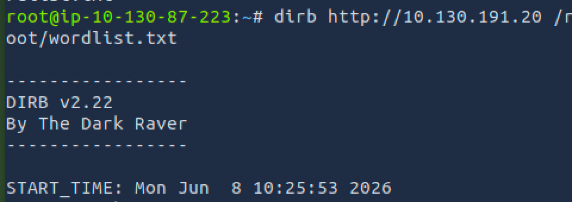
- Gobuster nos da mas detalles como la respuesta en el acceso a los archivos (especificando los **200 y 403**)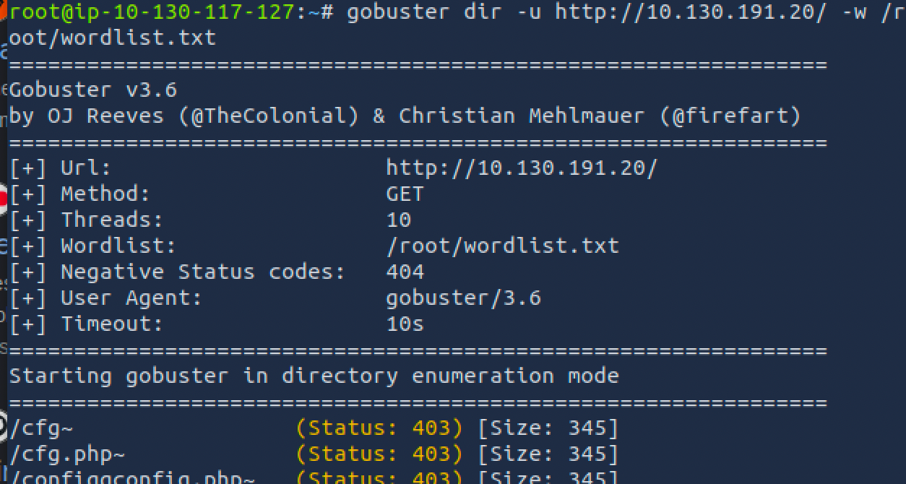

Para filtrar los archivos con respuesta negativa como el 403, anadimos `-N 403` al final del dirb i.e.; `dirb http://10.129.175.105  /root/wordlist.txt -N 403` que nos devuelve solo los dos archivos con 200 status
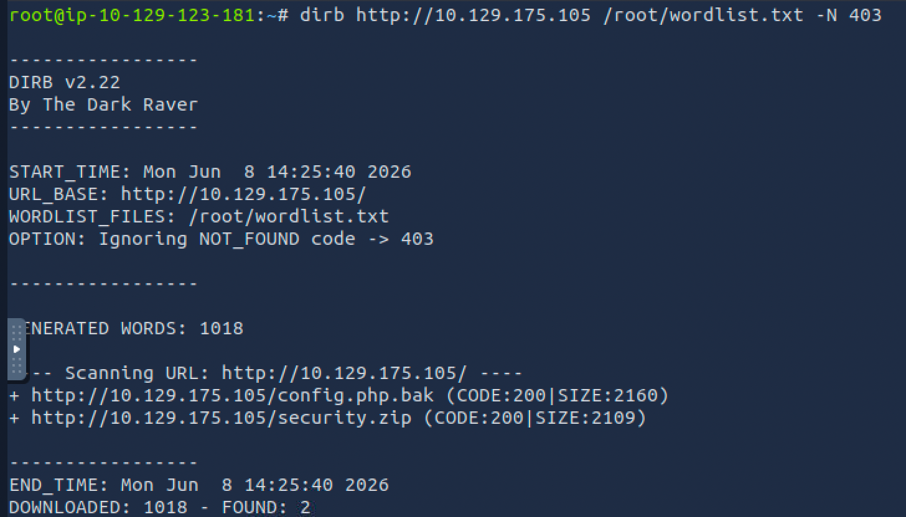
Este comando fue encontrado en una guia de [Linkedin](https://www.linkedin.com/pulse/dirb-cyberhorizon-defentech-zo21c) dado que otras **opciones como -b o -x o -s o no funcionaban.**

- Archivos descubiertos: `config.php.bak` y `security.zip` 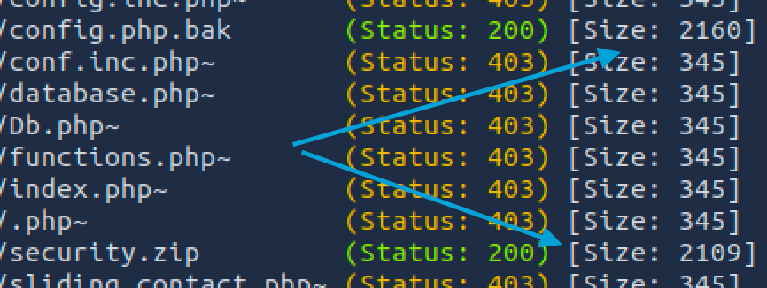

Por el momento nos encontramos delante a de una vulnerabilidad que afecta a la confidencialidad debido a que se usuarios no autorizados acceden a informacion privilegiada critica para el sistema con dos archivos con status 200.

### 3.2 Análisis de archivos críticos
Identificamos mediante un comando grep informacion clave como el nombre de la intranet o el host con **grep "host" wordlist.txt** que nos devuelve que el host es **localhost**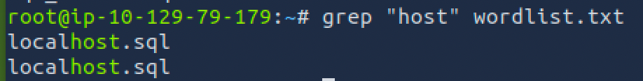.
Para identificar el nombre de la intranet no encontramos ningun archivo con **grep** analizando el wordlist.txt 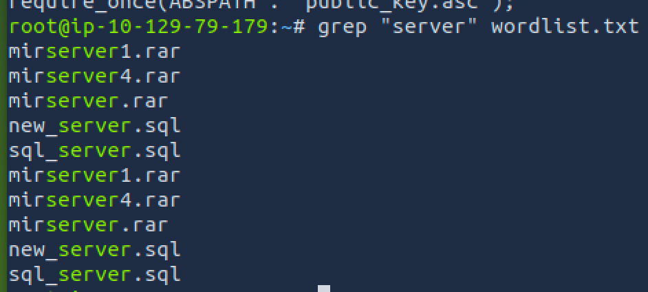.
Asi que tenemos que ir mas abajo ya que es la informacion accesible mas directa que tenemos para explorar los dos archivos que nos devuelve gobuster como accesibles con 200 status code que son **config.php.bak** y **security.zip**.

#### config.php.bak
Como es un **backup** de un archivo importante y probablemente tenga informacion sobre el servidor y la base de datos. Buscando como descargarse archivos despues de identificarlos con gobuster de este [write up](https://infosecwriteups.com/how-to-use-gobuster-to-find-interesting-directories-files-on-website-a1aaf8fc771e?gi=44e8bf222dde) encontramos que el comando es **wget**

```bash
wget http://10.129.175.105/config.php.bak
cat config.php.bak
```
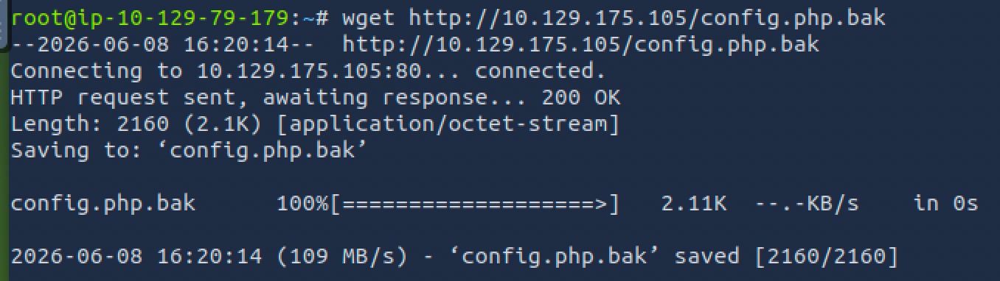 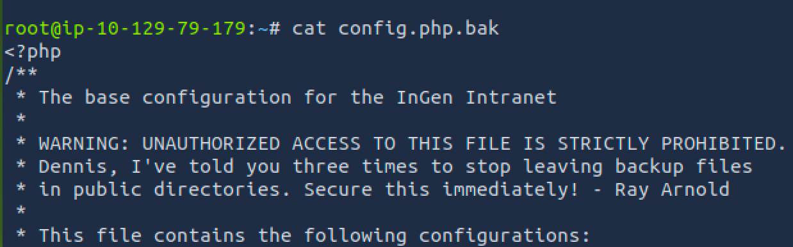

- Intranet: `ingen_park_ops`  
- Codificación: `utf8mb4`  
- Auth keys, prefijo de base de datos y clave del parque 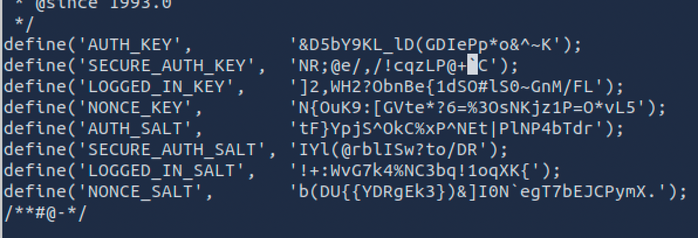 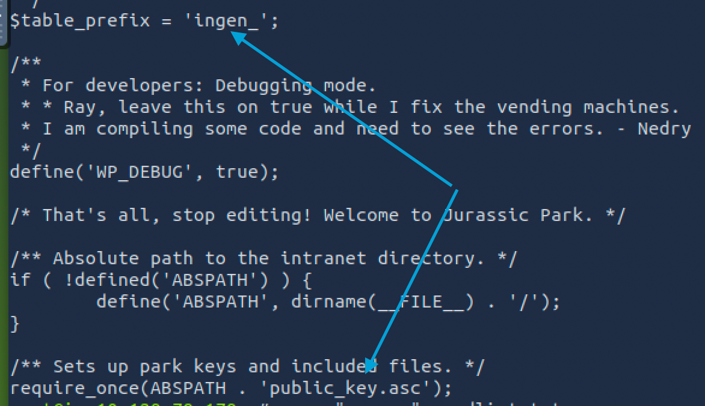

#### security.zip
```bash
wget http://10.129.175.105/security.zip
```
- Contenido protegido con contraseña obtenida de `config.php.bak` 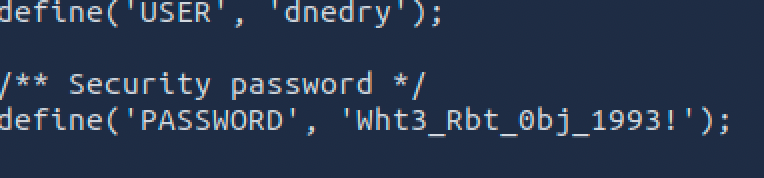  
- Llave pública `public_key.asc` (GPG, RSA 3072 bits) 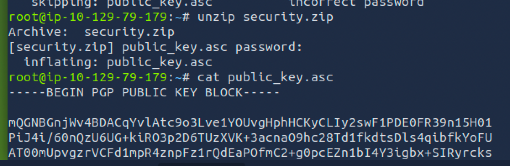 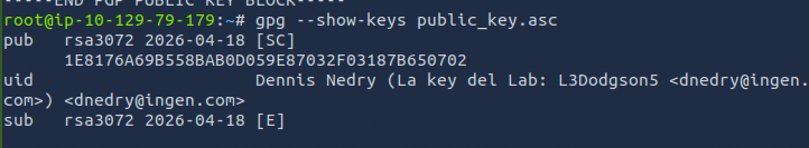

Esta extraccion es muy importante porque esto nos da la llave de acceso a conectarnos a servidor or web ya que es GPG que es una herramienta que utiliza el sistema de claves publicas y privadas para comunicar entre aplicaciones mediante **SSH**
Para averiguar que algoritmo de cifrado usa para cifrar la clave publica, debemos aplicar el comando **gpg --show-keys public_key.asc** que nos devuelve que usa RSA de 3072 bits  esto lo encontramos investigando mas sobre [GNU](https://www.gnupg.org/gph/es/manual.html).

## 04 - Fase de Acceso Inicial y Análisis del Sistema

Una vez obtenido acceso al sistema mediante credenciales válidas, se inicia una fase de enumeración interna con el objetivo de comprender la arquitectura del servidor, identificar usuarios relevantes, analizar los servicios en ejecución y detectar posibles configuraciones vulnerables que pudieran facilitar una escalada de privilegios.

### 4.1 Acceso SSH
Accedemos con SSH al host del servidor, pasando de ser un usario externo a un usuario interno con acceso directo a la consola del servidor. A esto le llamamos [Intrusión o Acceso Inicial / Pivoteo](https://www.incibe.es/incibe-cert/blog/acceso-inicial-no-autorizado-equipos-sci-parte-1).

```bash
ssh dnedry@10.129.175.105
```
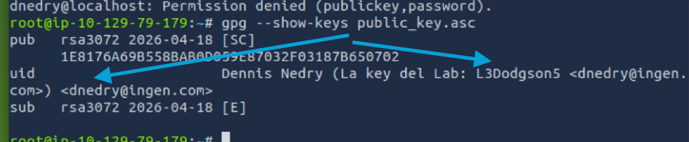 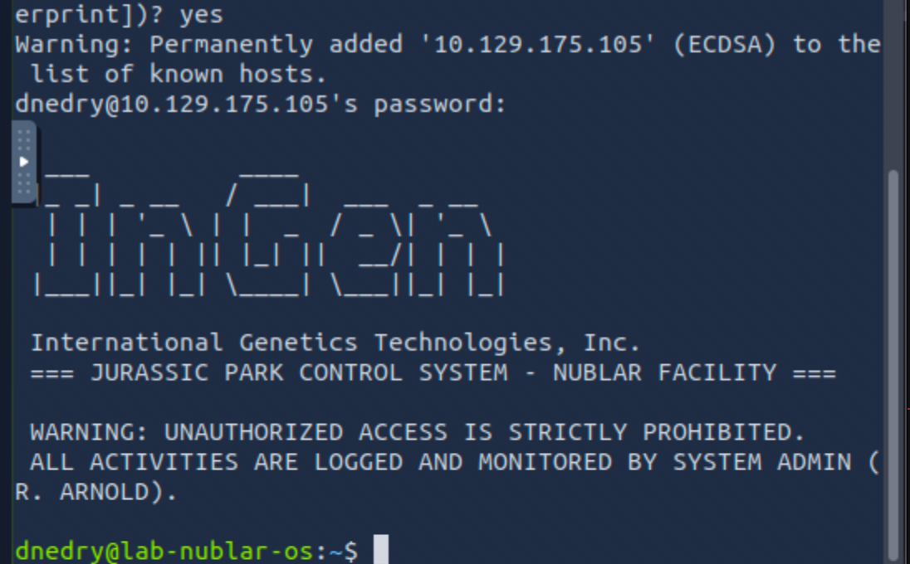

- Directorio inicial: `/home/dnedry` identificado con `pwd`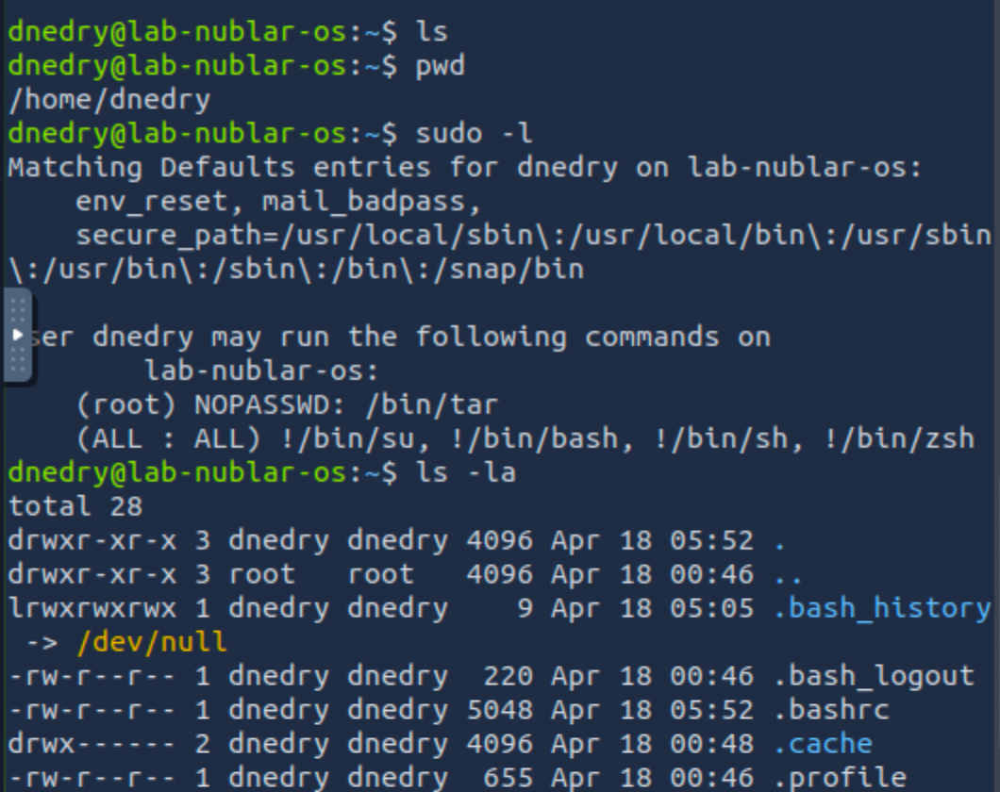  
- Usuarios en el sistema: 28 con `awk -F ":" '{print $1}' /etc/passwd` encontrado en [Man7](https://man7.org/linux/man-pages/man5/passwd.5.html) 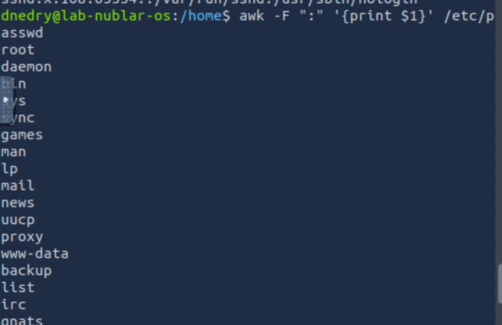  
- Usuario principal de monitoreo: R.ARNOLD 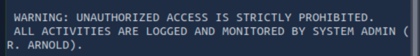  
- Hostname: `lab-nublar-os` 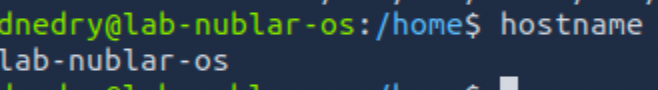  
- Distribución: `securityos` identificado con `cat /etc/os-release`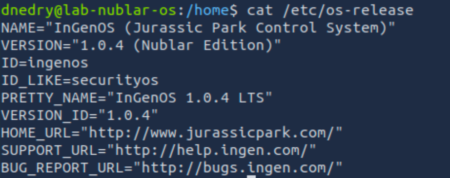  
- Grupos del usuario: 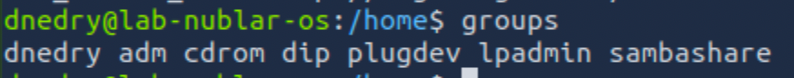

### 4.2 Puertos y servicios
Ahora necesitamos hacer un analisis de la network del servidor, emepzando por mirar como checkear que puertos estan abiertos en el servidor linux buscando en [Red Hat Documentation](https://docs.redhat.com/es/documentation/red_hat_enterprise_linux/6/html/security_guide/sect-security_guide-server_security-verifying_which_ports_are_listening) donde encontramos que `nmap + IP` nos indica los puertos abiertos pero al intentar tirarlo nos da error de instalacion de que no esta instalado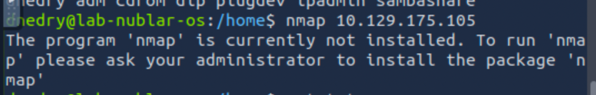. 
Haciendo una busqueda concreto de **check open ports linux** encontramos en [SuperUser](https://superuser.com/questions/529830/get-a-list-of-open-ports-in-linux) que un comando mejor es `netstat -lntu` porque los flags utilizados aplican los filtros exactos a nivel de kernel, eliminando todo el ruido sin necesidad de usar grep, garantizando una visibilidad real de los sockets abiertos y reduciendo la posibilidad de falsos positivos en la enumeración de puertos.

```bash
netstat -lntu
```
- 4 puertos abiertos 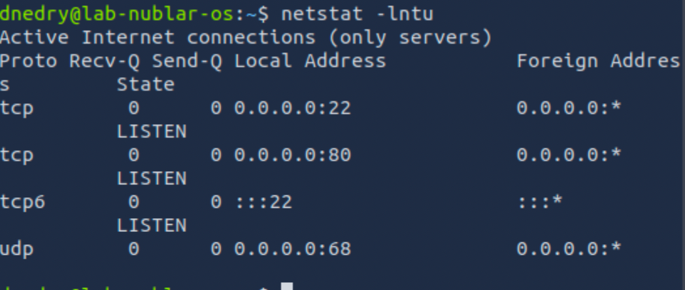  

Al ejecutar `netstat -lntu`, buscamos confirmar la presencia del puerto 80 (servicio web) y descartar servicios innecesarios que aumenten la superficie de ataque. 

### 4.3 Espacio en disco
Seguimos analizando unidades del sistema y ahora buscamos porcentaje de disco usado por sistema. Buscamos en Google para encontrar como con una [explicacion del porque](https://terminaldelinux.com/terminal/disco/espacio-libre-usado/) y encontramos que **df -h** nos informa del espacio libre en cada partición del disco.
En el disco encontramos **18GB** disponibles. Para resolver el reto ignoramos el valor de 17G que mostraba el comando **df -h** porque [Linux calcula en base 2 (Gibibytes)](https://man7.org/linux/man-pages/man1/df.1.html), y ejecutamos **df -B 1 /** para obtener los bytes puros disponibles (17.302.560.768 bytes); al aplicar la pista de potencias de 10 (10^9) dividiendo entre mil millones, obtenemos 17,3 GB, valor que el sistema redondea al alza dando el número 18. 

```bash
df -h
```
- Porcentaje de disco usado: 009%
- Espacio disponible: 18 GB 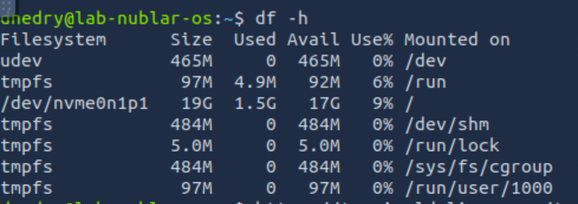

### 4.4 Informacion sobre usuario www-data
Ahora vamos a buscar informacion sobre **www-data** que es el usuario estándar en sistemas Linux que utiliza el servidor web para ejecutarse y gestionar los archivos de las páginas de forma aislada y segura. 

Para extraerla y verla en pantalla, ejecutamos segun lo encontrado en [Stack-Overflow](https://stackoverflow.com/questions/57245919/how-to-check-which-user-a-certain-process-belongs-to)
```bash
ps aux | grep www-data
```
- Ruta y usuario www-data: **ruta /usr/sbin/lighttpd -D -f /etc/lighttpd/lighttpd.conf** 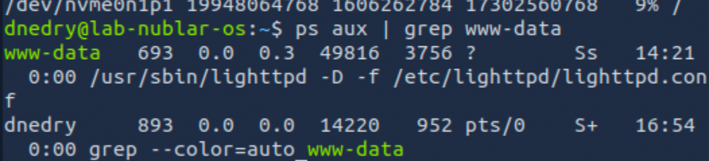.


### 4.5 Estado de firewall
Ahora vamos a ver el estado del firewall, ya que definira los límites de movimiento. Buscamos como analizar el estado del firewall en [Unix&Linux](https://unix.stackexchange.com/questions/555020/how-should-i-enable-ufw-through-systemctl-enable-or-ufw-enable).

```bash
systemctl status ufw
```
- Firewall activo 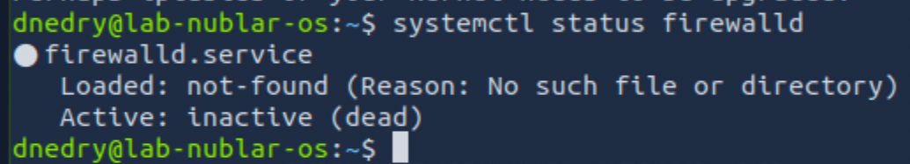

## 4.6 Enumeracion SUID
Para proseguir buscamos los archivos del sistema que tienen permisos especiales para ejecutarse con los privilegios del propietario (que suele ser root) para la **escalada definitiva de privilegios**. Tenemos que encontrar que archivos binarios con bit SUID activo existe en el sistema y encontramos esta [guia](https://www.linuxtotal.com.mx/index.php?cont=info__tips_016) y esta [oficial de Linux](man7.org/linux/man-pages/man1/find.1.html).

```bash
find / -perm -4000 -type f 2>/dev/null | wc -l
```
- 16 archivos con bit SUID activo 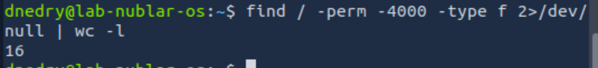

## 4.7 Version paquete apt
Proseguimos buscando la version de paquete **apt** para comprobar si el paquete es vulnerable a ataques conocidos (CVEs). Para ello tiramos de comandos encontrados en [PackageCloud](https://blog.packagecloud.io/apt-cheat-sheet/#:~:text=Use%20the%20apt%2Dcache%20show,command%20to%20install%20a%20package.) y [AskUbuntu](https://askubuntu.com/questions/110123/how-do-i-find-a-list-of-packages-with-priority-required)

```bash
apt-cache policy apt
dpkg-query -W -f='${Package}: ${Priority}\n' apt
```
- apt tiene la version 1.2.32ubuntu0.1 con prioridad **important**
  
## 05 - Fase de Escalada de Privilegios

Tras obtener acceso inicial al sistema, la siguiente etapa de la auditoría se centró en la **escalada de privilegios**, cuyo objetivo es determinar si un usuario con permisos limitados puede alcanzar privilegios administrativos.  

### 5.1 Evaluación de controles de acceso: revision de sudo y su 
Tratamos de cambiar de usuario con su pero nos retorna auth failure aun metiendo la contrasena intentando variaciones como root o user2, nos percatamos que hay que buscar un vector de ataque 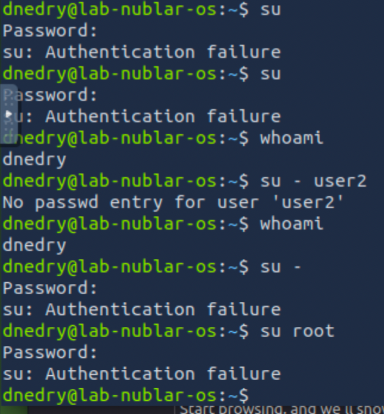.

```bash
su
```

Revisamos una [guia de como hacer escalada de privilegios](https://delinea.com/blog/linux-privilege-escalation) y revisando comandos encontramos `sudo -l` que lista commandos que permiten **sudo**, para saltarnos la contrasena que nos da auth failure.

```bash
sudo -l
```

- Observamos que `tar` no requiere password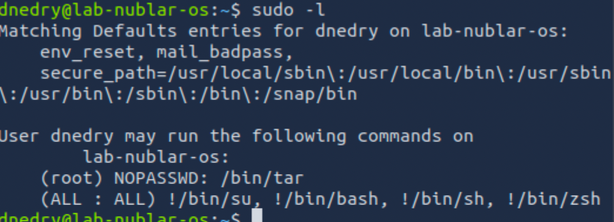 

### 5.2 Escalada mediante tar
Buscamos en Google **"sudo -l" tar privilege escalation"** y encontramos una [guia que nos ayuda a con la escalada de privilegios a traves de tar](https://www.thehacker.recipes/infra/privilege-escalation/unix/sudo).
Se detectó que el binario estándar de empaquetado `tar` se encontraba configurado con el bit SUID activo (permisos de ejecución de propietario asignados a root).
Abusando de las funcionalidades nativas de `tar`, se ejecutó una inyección de comandos aprovechando los parámetros de ejecución de checkpoints. Al procesar un archivo, el binario ejecutó una acción del sistema con los privilegios heredados de root.

```bash
sudo /bin/tar -cf /dev/null /dev/null --checkpoint=1 --checkpoint-action=exec=/bin/sh
```
- Obtención de root 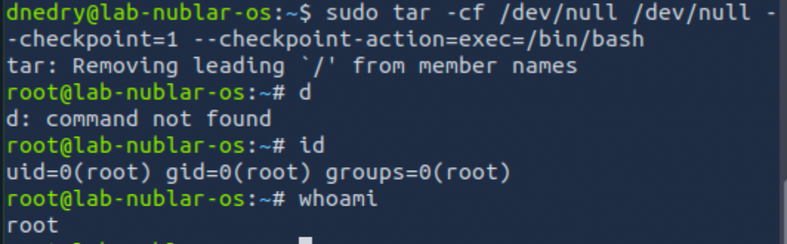  

```bash
id
# uid=0(root)
```

```bash
cd /r00t
cat r00t.txt
```

La ejecución del comando anterior devolvió una shell interactiva con el ddentificador de usuario **uid=0(r00t)**. Con el control total de la máquina, se navega hacia el directorio personal del administrador para comprometer el objetivo final leyendo la flag del root


## 5.4 Análisis Post-Explotación: Evaluación de controles de acceso
Como no descubrimos que nos devuelve la respuesta de que pasa cuando se hace cambio de usuario hacemos un exit.
- Hacemos `sudo su` para cambiar de usuario y al volver a root nos devuelve el mensaje que sucede al cambiar de usuario dandonos cuenta que no hacia falta hacer los pasos previos con `tar` para usar sudo ya que no requiere de contrasena 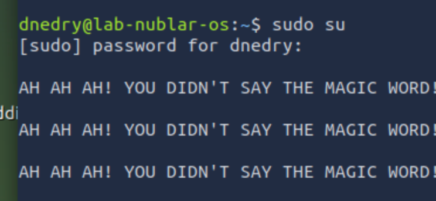.

## 5.5 Descifrado de IP ejecutora de proces
Para descubrir la IP que descrubio el proceso cogemos la **flag de root** y la descriframos con [ASCI](https://elcodigoascii.com.ar/codigos-ascii/abre-llaves-curvas-codigo-ascii-123.html).


## 06 - Conclusiones y Recomendaciones

La auditoría ha validado que el sistema **lab-nublar-os** presenta deficiencias de seguridad estructurales que comprometen la integridad y confidencialidad del servicio.

**Recomendaciones:**

| Prioridad | Acción de Remediación              | Justificación Técnica                                                                                          |
| :-------- | :--------------------------------- | :------------------------------------------------------------------------------------------------------------- |
| **Alta**  | **Limpieza de entorno**            | Eliminar archivos `.bak` y `.zip` de directorios web para evitar filtraciones de información sensible.         |
| **Alta**  | **Auditoría SUID**                 | Remover bit SUID de binarios no esenciales (ej. `tar`, `find`) para bloquear rutas de escalada de privilegios. |
| **Alta**  | **Principio de Mínimo Privilegio** | Restringir permisos de ejecución; asegurar que los usuarios solo accedan a lo estrictamente necesario.         |
| **Media** | **Gestión de Credenciales**        | Rotar llaves GPG/RSA y aplicar políticas de contraseñas robustas para restaurar la autenticidad.               |
| **Media** | **Hardening de Red**               | Implementar segmentación mediante firewall para restringir accesos no autorizados a servicios internos.        |
| **Baja**  | **Trazabilidad y Logs**            | Centralizar logs para asegurar la integridad de la autenticidad frente a futuras intrusiones.                  |


< Happy Hacking! >
```
\   ^__^
 \  (oo)\_______
    (__)\       )\/        ||----w |
        ||     ||
```

</div>
