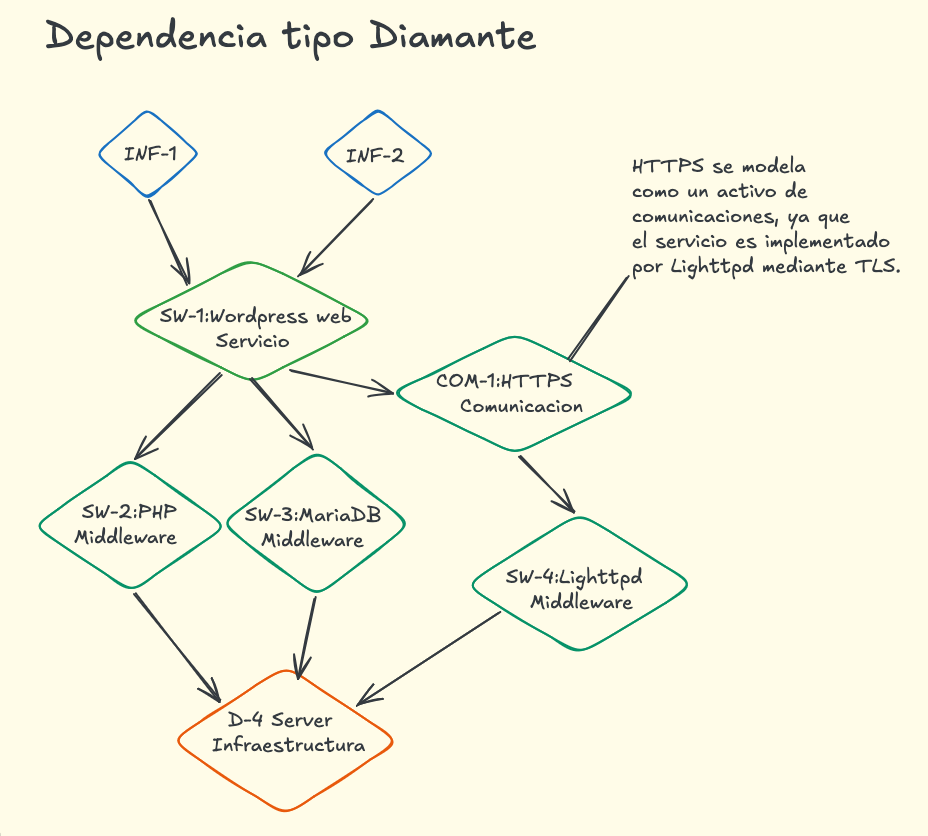

    
Informe Técnico de Auditoría

    <h1 style="font-size: 32px; color: #1a202c; font-weight: 800; margin-top: 10px; border-bottom: none; line-height: 1.2;">[ExP 87] Auditoría de Seguridad</h1>
    
Plataforma Web Corporativa

    

    <table style="width: 100%; border-collapse: collapse; font-size: 14px; background: transparent;">
        <tr style="border-bottom: 1px solid #e2e8f0;"><td style="padding: 6px 0; font-weight: bold; color: #4a5568; width: 35%;">Cliente:</td><td style="padding: 6px 0; color: #1a202c;">Black Mamba</td></tr>
        <tr style="border-bottom: 1px solid #e2e8f0;"><td style="padding: 6px 0; font-weight: bold; color: #4a5568;">Sistema Auditado:</td><td style="padding: 6px 0; color: #1a202c;">Web corporativa WordPress (<code>https://auditmf0487.thm</code>)</td></tr>
        <tr style="border-bottom: 1px solid #e2e8f0;"><td style="padding: 6px 0; font-weight: bold; color: #4a5568;">Auditor:</td><td style="padding: 6px 0; color: #1a202c;">Xavier Margalef Riestra</td></tr>
        <tr style="border-bottom: 1px solid #e2e8f0;"><td style="padding: 6px 0; font-weight: bold; color: #4a5568;">Fecha de Emisión:</td><td style="padding: 6px 0; color: #1a202c;">15/07/2026</td></tr>
        <tr style="border-bottom: 1px solid #e2e8f0;"><td style="padding: 6px 0; font-weight: bold; color: #4a5568;">Clasificación:</td><td style="padding: 6px 0;">CONFIDENCIAL</td></tr>
        <tr style="border-bottom: 1px solid #e2e8f0;"><td style="padding: 6px 0; font-weight: bold; color: #4a5568;">Destinatarios:</td><td style="padding: 6px 0; color: #1a202c;">Dirección, responsables de TI y personal autorizado</td></tr>
        <tr><td style="padding: 6px 0; font-weight: bold; color: #4a5568; vertical-align: top;">Objetivo:</td><td style="padding: 6px 0; color: #1a202c; line-height: 1.4;">Evaluar la postura de seguridad de la infraestructura, identificar los principales riesgos y priorizar las medidas de tratamiento.</td></tr>
    </table>

---

# Índice
1. [Resumen Ejecutivo](#1-resumen-ejecutivo)
2. [Alcance y Metodología](#2-alcance-y-metodología)
3. [Hallazgos Prioritarios](#3-hallazgos-prioritarios)
4. [Consideraciones Normativas](#4-consideraciones-normativas)
5. [Anexos Técnicos (Actividad 01-10)](#anexos)

---

# 1. Resumen Ejecutivo

La auditoría realizada sobre la infraestructura que soporta la web corporativa de **Black Mamba** (`https://auditmf0487.thm`) concluye que la **postura de seguridad actual es Deficiente**, identificándose **8 hallazgos** que incrementan los vectores de ataque y requieren actuaciones correctivas para reducir el riesgo de la plataforma.

Los riesgos de mayor criticidad están asociados al uso de **versiones obsoletas de PHP, MariaDB y WordPress**, así como a deficiencias en el proceso de actualización y mantenimiento de la infraestructura. Aunque durante la auditoría no se ha obtenido evidencia de una explotación activa, estas debilidades aumentan la exposición frente a vulnerabilidades conocidas y podrían facilitar un compromiso de la aplicación o de los activos de información que soporta.

<h4 style="margin-top: 0; color: #2d3748; margin-bottom: 10px;">📊 Indicadores Principales</h4>

* **Postura de seguridad:** Deficiente
* **Sistema auditado:** Web corporativa WordPress
* **Hallazgos identificados:** 8
* **Hallazgos prioritarios:** 1 Crítico · 2 Altos
* **Metodología aplicada:** MAGERIT v3 / ENS

La evaluación se ha llevado a cabo aplicando la metodología **MAGERIT v3**, identificando los activos y bienes que forman parte de la infraestructura, analizando las dependencias entre ellos, categorizando las amenazas detectadas y calculando el impacto, el riesgo potencial y el riesgo residual para cada uno de los hallazgos que se han encontrado. A partir de estos, se han determinado las medidas de tratamiento y las salvaguardas prioritarias teniendo en cuenta el **Esquema Nacional de Seguridad (ENS)** como referencia.

Desde el punto de vista del business, mantener estas debilidades incrementa el riesgo de interrupciones del servicio, accesos no autorizados, alteración de la información y pérdida de confianza por parte de clientes y terceros. Además, un incidente que afectara a datos personales podría implicar obligaciones regulatorias y responsabilidades derivadas del **Reglamento General de Protección de Datos (RGPD)**.

Las actuaciones deben centrarse, prioritariamente en la actualización de los componentes fuera de soporte y desactualizados, el refuerzo del proceso de mantenimiento y la implementacion de una gestión continua de vulnerabilidades que permita reducir progresivamente el nivel de riesgo de la infraestructura que puede llegar a afectar al negocio.

---

# 2. Alcance y Metodología

### 2.1 Alcance
La auditoría se ha llevado a cabo sobre la infraestructura que mantiene la web corporativa de **Black Mamba**, tanto los componentes tecnológicos que soportan el servicio como los activos de información:
* Aplicación web **WordPress** (activo principal del servicio).
* Entorno de ejecución **PHP** (procesamiento de la lógica).
* Base de datos **MariaDB** (almacenamiento de información y configuración).
* Servidor web **Lighttpd** (publicación del servicio).
* Canal seguro de comunicaciones **HTTPS/TLS** (protección del tráfico de red).
* Sistema operativo **Ubuntu Server** (infraestructura base).
* **Datos de negocio y credenciales** asociadas al servicio (activos de información críticos).

El análisis ha tenido encuenta las relaciones de dependencia entre los componentes para establecer la propagación del impacto. Para la valoración se han considerado las dimensiones esenciales de la seguridad de la informacion; **Confidencialidad (C)**, **Integridad (I)**, **Disponibilidad (D)**, **Autenticidad (Au)** y **Trazabilidad (T)**.

### 2.2 Metodología
El proceso formal de análisis y gestión del riesgo se ha fundamentado en:
* **MAGERIT v3:** Para la identificación, valoración, análisis de dependencias, cálculo de impactos y estimación de riesgos potenciales y residuales.
* **Esquema Nacional de Seguridad (ENS):** Como marco de referencia para la selección, estructuración y priorización de las salvaguardas técnicas.

---

# 3. Hallazgos Prioritarios

Los hallazgos se muestran ordenados por el nivel de riesgo potencial obtenido en el análisis mediante MAGERIT v3.

### 3.1 Resumen de priorización

| Prioridad | Ref. | Hallazgo | Riesgo | Activo Principal | Acción Inmediata |
| :---: | :--- | :--- | :---: | :--- | :--- |
| 1 | AM-08 | PHP 7.0.33 fuera de soporte | Crítico | SW-2 PHP | Actualizar a versión soportada |
| 2 | AM-04 | Servidor MariaDB obsoleto | Alto | SW-3 MariaDB | Actualizar y revisar permisos |
| 3 | AM-01 | WordPress desactualizado | Alto | SW-1 WordPress | Actualizar el CMS Core |

---

### 3.2 Hallazgo Crítico · PHP 7.0.33 fuera de soporte (AM-08)

* **Activo afectado:** PHP 7.0.33 (`SW-2`)
* **Activos relacionados:** WordPress, Lighttpd y Ubuntu Server
* **Nivel de riesgo:** Crítico (Riesgo Potencial: **83,7**)
* **Dimensión más afectada:** Integridad (I)

**Descripción:** El servidor ejecuta PHP 7.0.33, versión obsoleta y desactualizada que no recibe actualizaciones ni parches de seguridad. Al ser el entorno de ejecución del CMS, cualquier vulnerabilidad técnica permite comprometer la lógica de la aplicación.

**Impacto técnico:** La explotación de fallos conocidos facilita la ejecución remota de código (RCE), permitiendo a un atacante tomar el control del backend de la aplicación, alterar archivos y propagar el impacto hacia el sistema operativo base por herencia de dependencias.

**Plan de remediación:**
| Tipo de Acción | Descripción Técnica | Responsable | Plazo |
| :--- | :--- | :--- | :---: |
| **Contención** | Aislar el entorno o aplicar parches virtuales (WAF) si la actualización inmediata no es viable. | Infraestructura IT | $\le$ 24 h |
| **Correctiva** | Actualizar PHP a una rama estable y soportada, verificando compatibilidad en entorno de staging. | Desarrollo / Sistemas | 3-5 días |
| **Remediación** | Definir una política formal de ciclo de vida del software (*Lifecycle Management*). | CISO / Operaciones | $\le$ 30 días |
| **Verificación** | Ejecución de escaneo de vulnerabilidades local para confirmar la erradicación del fallo. | Auditoría / Seguridad | Trimestral |

---

### 3.3 Hallazgo Alto · Servidor MariaDB obsoleto (AM-04)

* **Activo afectado:** MariaDB (`SW-3`)
* **Activos relacionados:** WordPress, Datos de negocio y Credenciales
* **Nivel de riesgo:** Alto (Riesgo Potencial: **80,0**)
* **Dimensión más afectada:** Confidencialidad (C)

**Descripción:** El motor de la base de datos se encuentra desactualizado. Almacena de forma centralizada la configuración del sitio, los datos de los clientes y los hashes de las credenciales de acceso.

**Impacto técnico:** Un compromiso a nivel de base de datos permite la exfiltración masiva de información confidencial de negocio e identidades administrativas, además de la manipulación directa de registros internos (quiebra de integridad).

**Plan de remediación:**
| Tipo de Acción | Descripción Técnica | Responsable | Plazo |
| :--- | :--- | :--- | :---: |
| **Contención** | Generar backup completo y restringir accesos a la base de datos únicamente a la IP local (`127.0.0.1`). | DBA / Sistemas | $\le$ 24 h |
| **Correctiva** | Actualizar el motor MariaDB a la última versión LTS estable disponible en los repositorios. | DBA / Infraestructura | $\le$ 7 días |
| **Remediación** | Aplicar plantilla de *hardening* sobre la base de datos y auditar los privilegios de los usuarios asignados. | DBA | $\le$ 30 días |
| **Verificación** | Validación de políticas de acceso, robustez de contraseñas y consistencia de las réplicas. | Seguridad | Mensual |

---

### 3.4 Hallazgo Alto · WordPress desactualizado (AM-01)

* **Activo afectado:** WordPress Core (`SW-1`)
* **Activos relacionados:** PHP, MariaDB y Datos de negocio
* **Nivel de riesgo:** Alto (Riesgo Potencial: **64,8**)
* **Dimensión más afectada:** Integridad (I)

**Descripción:** La plataforma web corporativa trabaja sobre una versión antigua del CMS WordPress, exponiendo públicamente fallos de seguridad corregidos en versiones posteriores.

**Impacto técnico:** Vectores conocidos de inyección de código, escalada de privilegios o desfiguración de sitio (*Defacement*) explotables de forma automatizada por bots concurrentes en el puerto 80/443.

**Plan de remediación:**
| Tipo de Acción | Descripción Técnica | Responsable | Plazo |
| :--- | :--- | :--- | :---: |
| **Contención** | Realizar snapshot de la máquina virtual y copia de seguridad de archivos y base de datos de WordPress. | Administrador Web | $\le$ 24 h |
| **Correctiva** | Actualizar el Core de WordPress a la última versión estable mediante el panel de administración o CLI (`wp-cli`). | Desarrollo Web | $\le$ 5 días |
| **Remediación** | Establecer un entorno de preproducción para pruebas de regresión automáticas antes de parches. | Operaciones IT | $\le$ 30 días |
| **Verificación** | Monitorización activa de los logs de la aplicación y comprobación del estado de salud en el sitio. | Auditoría / Soporte | Trimestral |

---

# 4. Consideraciones Normativas

El estado técnico analizado genera repercusiones directas sobre el cumplimiento legal y normativo de la organización en los siguientes ámbitos:

<h4 style="margin-top: 0; color: #2b6cb0; margin-bottom: 5px;">🇪🇺 4.1 Reglamento General de Protección de Datos (RGPD)</h4>
El mantenimiento de infraestructura crítica del software fuera de soporte y con vulnerabilidades conocidas va en contra de forma directa las obligaciones del <strong>Artículo 32 del RGPD</strong>, el cual obliga a la implementación de medidas técnicas y organizativas adecuadas para garantizar un nivel de seguridad adecuado al riesgo (incluyendo la confidencialidad, integridad y disponibilidad continua de los sistemas de tratamiento).

<h4 style="margin-top: 0; color: #2b6cb0; margin-bottom: 5px;">🛡️ 4.2 Directiva NIS2</h4>
Las deficiencias estructurales en el lado preventivo, la gestión de parches y la falta de control continuo del ciclo de vida del software no van en direccion de los requisitos de gobernanza y gestión de riesgos exigidos por la <strong>Directiva NIS2</strong> para asegurar la resiliencia de los servicios digitales.

<h4 style="margin-top: 0; color: #2b6cb0; margin-bottom: 5px;">🚨 4.3 Gestión y Notificación de Incidentes</h4>
A pesar de no se han identificado evidencias de explotación activa o exfiltración durante este analisis, el compromiso exitoso de cualquiera de los activos críticos analizados obligaría a la organización a iniciar la gestión forense del incidente y evaluar la comunicación obligatoria a la <strong>Agencia Española de Protección de Datos (AEPD)</strong> en un plazo máximo de 72 horas.

---

# Anexos

Este apartado recoge el desarrollo técnico del análisis de riesgos realizado sobre el entorno web de **Black Mamba**.

El análisis se estructura siguiendo la metodología **MAGERIT v3**, incluyendo la identificación y valoración de activos, el modelo de dependencias, la clasificación de amenazas, el cálculo del riesgo y la selección de salvaguardas.

Los resultados obtenidos en este bloque se establencen como la base técnica utilizada para encontra los hallazgos y definir recomendaciones incluidos en el informe principal.

---

# Anexo A. Identificación de Activos

La primera fase del análisis consiste en identificar los activos que forman parte del sistema de información.

Los activos se organizan desde los elementos de información que deben protegerse hasta la infraestructura que permite la ejecución del servicio. Para cada activo se analiza su función dentro del sistema y el impacto que tendría un compromiso sobre la organización.

| Referencia | Activo | Tipo | Descripción y valoración inicial |
| :--- | :--- | :--- | :--- |
| **INF-1** | Datos de negocio y contactos | Información | Información asociada a clientes y posibles clientes. Una pérdida de confidencialidad, integridad o disponibilidad podría afectar a la reputación de la organización y generar consecuencias legales relacionadas con protección de datos. |
| **INF-2** | Credenciales de usuarios y administradores | Información | Información necesaria para acceder a la plataforma. Su compromiso permitiría accesos no autorizados, modificación de contenidos, exposición de información sensible o toma de control del sistema. |
| **SW-1** | Aplicación web WordPress | Software | Aplicación principal utilizada para publicar contenido y gestionar la interacción con usuarios. Su compromiso podría afectar al funcionamiento del servicio, modificar información o permitir la ejecución de código no autorizado. |
| **SW-2** | Entorno de ejecución PHP | Software | Componente encargado de ejecutar la lógica de WordPress. Una versión vulnerable u obsoleta podría permitir explotación de vulnerabilidades conocidas y comprometer la aplicación completa. |
| **SW-3** | Base de datos MariaDB | Software | Almacena la información utilizada por WordPress, incluyendo configuraciones, usuarios y datos gestionados por la aplicación. Su compromiso afectaría principalmente a confidencialidad e integridad. |
| **SW-4** | Servidor web Lighttpd | Software | Servicio encargado de recibir y procesar las peticiones HTTP/HTTPS hacia la aplicación. Una configuración insegura o fallo del servicio puede afectar a disponibilidad y exposición del sistema. |
| **COM-1** | Canal de red y cifrado HTTPS | Comunicaciones | Mecanismo utilizado para proteger las comunicaciones entre usuarios y servidor. Una configuración incorrecta podría permitir interceptación de credenciales o información transmitida. |
| **HW-1** | Servidor Ubuntu | Infraestructura | Sistema base donde se ejecutan los componentes principales. Un compromiso de esta capa afecta indirectamente al resto de activos al actuar como soporte de toda la plataforma. |

### Clasificación de activos

Según la naturaleza del activo, se realiza la siguiente agrupación:

| Tipo de activo | Activos incluidos |
| :--- | :--- |
| **Información** | INF-1 Datos de negocio y contactos, INF-2 Credenciales de usuarios y administradores |
| **Software** | SW-1 WordPress, SW-2 PHP, SW-3 MariaDB, SW-4 Lighttpd |
| **Comunicaciones** | COM-1 Canal de red y cifrado HTTPS |
| **Infraestructura** | HW-1 Servidor Ubuntu |

**Referencias:**

- **MAGERIT v3 - Libro II: Catálogo de Elementos:** clasificación de activos y relaciones de dependencia.
- **ISO/IEC 27001:2022:** identificación y gestión de activos dentro de un sistema de gestión de seguridad de la información.

---

# Anexo B. Modelo de Dependencias entre Activos

El análisis de dependencias permite conocer cómo se propaga el impacto de un activo superior hacia los activos que lo soportan.

Siguiendo MAGERIT, los activos de información se sitúan en los niveles superiores, mientras que los componentes software, comunicaciones e infraestructura actúan como elementos de soporte.

**Esquema**

El modelo presenta una arquitectura con estructura de **diamante**, donde:

1. **Nivel de información (`INF-1`, `INF-2`)**

   Los datos de negocio y las credenciales dependen del correcto funcionamiento de la aplicación web WordPress (`SW-1`).

2. **Nivel de aplicación (`SW-1`)**

   WordPress depende simultáneamente de varios componentes:

   - `SW-2` PHP, encargado de ejecutar la lógica de aplicación.
   - `SW-3` MariaDB, donde se almacena la información utilizada.
   - `COM-1` HTTPS, encargado de proporcionar acceso seguro al servicio.

3. **Nivel de comunicaciones (`COM-1`)**

   El canal HTTPS depende del correcto funcionamiento del servidor web (`SW-4` Lighttpd), encargado de procesar las peticiones recibidas.

4. **Nivel de infraestructura (`HW-1`)**

   El servidor Ubuntu constituye la base del sistema. Un fallo en esta capa afecta a todos los elementos superiores al ser el soporte físico y lógico donde se ejecuta la plataforma.

### Propagación de dependencias

| Relación | Tipo de dependencia | Ejemplo |
| :--- | :--- | :--- |
| Información → Aplicación | Dependencia transitiva | Los datos dependen de WordPress y de sus componentes internos. |
| Aplicación → Software soporte | Dependencia paralela | WordPress necesita PHP, MariaDB y HTTPS para funcionar correctamente. |
| Software → Infraestructura | Dependencia transitiva | Todos los componentes dependen del servidor Ubuntu. |

Esta estructura será utilizada posteriormente para calcular el **valor acumulado de los activos**, propagando la necesidad de protección desde los activos de información hacia los elementos que los soportan.

**Referencias:**

- **MAGERIT v3 - Libro II: Catálogo de Elementos:** dependencias entre activos y criterios de valoración.
- **NIST Cybersecurity Framework - Asset Management:** identificación y gestión de recursos tecnológicos.

# Anexo C. Valoración de Activos y Cálculo del Valor Acumulado

La valoración de activos nos permite determinar la importancia de cada elemento dentro del sistema de la información.

Siguiendo la metodología **MAGERIT v3**, cada activo se evalúa según las dimensiones de seguridad:

- **Confidencialidad (C):** necesidad de evitar accesos o divulgaciones no autorizadas.
- **Integridad (I):** necesidad de garantizar que la información y los sistemas no sean modificados incorrectamente.
- **Disponibilidad (D):** necesidad de garantizar que el activo esté operativo cuando sea necesario.
- **Autenticidad (Au):** necesidad de garantizar la identidad y legitimidad de usuarios, sistemas o información.
- **Trazabilidad (T):** necesidad de registrar acciones y permitir su seguimiento posterior.

La escala utilizada es de **0 a 10**, donde valores superiores representan una mayor necesidad de protección.

---

## C.1 Valor propio de los activos

El valor propio representa la criticidad intrínseca de cada activo considerando únicamente su función individual, sin tener en cuenta todavía las dependencias con otros elementos del sistema.

| Ref. | Activo | C | I | D | Au | T | Justificación técnico-operativa |
| :--- | :--- | :---: | :---: | :---: | :---: | :---: | :--- |
| **INF-1** | Datos de negocio y contactos | 8 | 8 | 7 | 7 | 7 | Contiene información de clientes y contactos. Una divulgación, modificación o pérdida afectaría a la confianza de usuarios y podría generar consecuencias legales relacionadas con protección de datos. |
| **INF-2** | Credenciales de usuarios y administradores | **10** | 9 | 8 | 9 | 8 | Activo crítico porque permite acceder al sistema. Una exposición podría permitir accesos ilegítimos, modificación de contenidos o control de la plataforma. |
| **SW-1** | Aplicación Web WordPress | 3 | 8 | 9 | 7 | 7 | No almacena directamente la información más sensible, por lo que la confidencialidad propia es menor. Sin embargo, la integridad y disponibilidad son críticas al ser el servicio principal. |
| **SW-2** | Entorno PHP | 4 | 8 | 9 | 5 | 6 | Componente necesario para ejecutar WordPress. Una vulnerabilidad puede afectar al funcionamiento de la aplicación y permitir ejecución de código no autorizado. |
| **SW-3** | MariaDB | 8 | 9 | 9 | 7 | 7 | Almacena información utilizada por la aplicación. Un fallo puede provocar exposición, modificación o pérdida de datos críticos. |
| **SW-4** | Lighttpd | 5 | 8 | 9 | 6 | 7 | Servicio encargado de publicar la aplicación. Su disponibilidad e integridad son esenciales para mantener operativo el acceso web. |
| **COM-1** | Canal de red y cifrado HTTPS | 8 | 8 | 6 | 8 | 6 | Protege las comunicaciones entre usuarios y servidor. La confidencialidad e integridad son prioritarias para evitar interceptación o modificación del tráfico. |
| **HW-1** | Servidor Ubuntu | 6 | 8 | 9 | 6 | 7 | Infraestructura base del sistema. Su indisponibilidad o compromiso afecta al resto de componentes alojados sobre él. |

---

## C.2 Valor acumulado de los activos

El valor acumulado incorpora el efecto de las dependencias identificadas en el Anexo B.

Un activo de soporte puede requerir un nivel de protección superior al de su valoración inicial cuando sostiene activos más críticos.

Para este análisis se aplica el criterio de **herencia por dependencia utilizando el valor máximo (`max`)**.

Este criterio no modifica el valor propio del activo, sino que determina el nivel de protección necesario que debe asumir un activo soporte cuando una degradación del mismo puede afectar a activos superiores.

Por tanto, un componente técnico como PHP o Lighttpd puede requerir medidas de protección elevadas aunque su función directa no almacene información crítica, ya que un compromiso del componente podría permitir afectar a activos de mayor valor.

### Ejemplo de propagación

WordPress tiene un valor propio:

\[
C(SW-1)=3
\]

Sin embargo, gestiona las credenciales del sistema:

\[
C(INF-2)=10
\]

Por dependencia:

\[
C(SW-1)=max(3,10)=10
\]

Esto no significa que WordPress tenga un valor propio de 10, sino que debe protegerse como un activo crítico porque una vulnerabilidad en él podría comprometer las credenciales almacenadas.

| Ref. | Activo | C | I | D | Au | T | Justificación del valor acumulado |
| :--- | :--- | :---: | :---: | :---: | :---: | :---: | :--- |
| **INF-1** | Datos de negocio y contactos | 8 | 8 | 7 | 7 | 7 | Activo de información principal. Mantiene sus valores propios al no depender de otros activos superiores. |
| **INF-2** | Credenciales de usuarios y administradores | 10 | 9 | 8 | 9 | 8 | Activo crítico por permitir autenticación y acceso al sistema. Mantiene su máxima valoración en confidencialidad y autenticidad. |
| **SW-1** | WordPress Core, Temas y Plugins | 10 | 9 | 9 | 8 | 8 | La aplicación procesa información de negocio y gestiona accesos administrativos, por lo que debe protegerse según la criticidad de los activos que soporta. |
| **SW-2** | PHP | 8 | 9 | 9 | 7 | 7 | Entorno de ejecución de WordPress. Un compromiso permitiría afectar a la aplicación, aunque no almacena directamente la información gestionada. |
| **SW-3** | MariaDB | 10 | 9 | 9 | 9 | 8 | Almacena datos utilizados por la aplicación, incluyendo información operativa y credenciales de usuarios. |
| **SW-4** | Lighttpd | 8 | 8 | 9 | 7 | 7 | Servicio encargado de publicar la aplicación. Su disponibilidad es necesaria para mantener el servicio accesible. |
| **COM-1** | Canal de red y cifrado HTTPS | 9 | 8 | 8 | 8 | 7 | Protege la comunicación entre usuarios y servidor. Una degradación afecta principalmente a confidencialidad e integridad del tráfico. |
| **HW-1** | Servidor Ubuntu | 9 | 9 | 9 | 8 | 8 | Infraestructura base del sistema. Un compromiso afecta al conjunto de componentes alojados sobre ella. |

---

## C.3 Interpretación del resultado

El análisis muestra que los activos de soporte alcanzan una criticidad elevada debido a la propagación de dependencias.

Aunque componentes como PHP, Lighttpd o Ubuntu no almacenan directamente información de negocio, una vulnerabilidad en cualquiera de ellos podría permitir comprometer los activos superiores.

Por ello, las medidas de protección deben aplicarse no únicamente sobre la información final, sino también sobre todos los elementos que permiten el procesamiento y disponibilidad.

**Referencias:**

- **MAGERIT v3 - Libro I: Método:** valoración de activos, análisis de impacto y propagación mediante dependencias.
- **MAGERIT v3 - Libro II: Catálogo de Elementos:** dimensiones de seguridad y escalas de valoración.
- **ISO/IEC 27005:2022:** gestión del riesgo de seguridad de la información.

# Anexo D. Clasificación de Activos según ENS

La clasificación ENS se obtiene transformando las valoraciones numéricas obtenidas mediante MAGERIT a los niveles definidos por el **Esquema Nacional de Seguridad (ENS)**.

La equivalencia utilizada es:

| Valor MAGERIT | Nivel ENS |
| :---: | :--- |
| 0 - 4 | Bajo (B) |
| 5 - 7 | Medio (M) |
| 8 - 10 | Alto (A) |

Un nivel alto implica que una pérdida de la propiedad de seguridad tendría consecuencias importantes para la organización, pudiendo afectar a la continuidad del servicio, la información gestionada o la confianza de los usuarios.

---

## D.1 Clasificación por valor propio

| Ref. | Activo | C | I | D | Au | T |
| :--- | :--- | :---: | :---: | :---: | :---: | :---: |
| **INF-1** | Datos de negocio | A | A | M | M | M |
| **INF-2** | Credenciales | A | A | M | A | A |
| **SW-1** | Aplicación Web WordPress | B | A | A | M | M |
| **SW-2** | PHP | B | A | A | M | M |
| **SW-3** | MariaDB | A | A | A | M | M |
| **SW-4** | Lighttpd | M | A | A | M | M |
| **COM-1** | Canal HTTPS | A | A | M | A | M |
| **HW-1** | Servidor Ubuntu | M | A | A | M | M |

---

## D.2 Clasificación por valor acumulado

Tras aplicar la propagación de dependencias, los activos de soporte alcanzan el nivel de protección requerido por los activos que dependen de ellos.

| Ref. | Activo | C | I | D | Au | T | Categoría ENS |
| :--- | :--- | :---: | :---: | :---: | :---: | :---: | :--- |
| **INF-1** | Datos de negocio | A | A | M | M | M | Alta |
| **INF-2** | Credenciales | A | A | A | A | A | Alta |
| **SW-1** | WordPress | A | A | A | A | A | Alta |
| **SW-2** | PHP | A | A | A | A | A | Alta |
| **SW-3** | MariaDB | A | A | A | A | A | Alta |
| **SW-4** | Lighttpd | A | A | A | A | A | Alta |
| **COM-1** | HTTPS | A | A | A | A | A | Alta |
| **HW-1** | Ubuntu Server | A | A | A | A | A | Alta |

El resultado indica que la plataforma requiere medidas de protección elevadas en todas las capas, ya que una vulnerabilidad en un componente de soporte puede comprometer los activos de información superiores.

**Referencias:**

- **Esquema Nacional de Seguridad (ENS):** Real Decreto 311/2022.
- **MAGERIT v3 - Libro II:** dimensiones de seguridad y valoración de activos.

---

# Anexo E. Identificación y Clasificación de Amenazas

Una vez identificados los activos, se analizan las amenazas que pueden afectar al sistema.

Los hallazgos se obtienen a partir de la herramienta **WordPress Site Health** y se clasifican utilizando el catálogo de amenazas de **MAGERIT v3**.

| Ref. | Hallazgo técnico identificado | Activo afectado | Código MAGERIT | Dimensión principal | Justificación del riesgo |
| :--- | :--- | :--- | :--- | :---: | :--- |
| **AM-01** | Actualización de WordPress disponible | SW-1 WordPress | S.21 - Fallos de programas | I | Un CMS desactualizado puede contener vulnerabilidades conocidas explotables desde Internet. Un atacante podría modificar contenidos o ejecutar código. |
| **AM-02** | Presencia de temas inactivos | SW-1 WordPress | S.24 - Deficiencias de mantenimiento | I | Los componentes sin uso continúan instalados y pueden contener vulnerabilidades. Aumentan la superficie de ataque disponible. |
| **AM-03** | Ausencia de módulos PHP recomendados | SW-2 PHP | S.22 - Errores de configuración | D | Una configuración incompleta puede provocar errores de funcionamiento, pérdida de compatibilidad o degradación del servicio. |
| **AM-04** | Servidor SQL obsoleto | SW-3 MariaDB | S.21 - Fallos de programas | C | Una versión antigua del motor de base de datos puede contener vulnerabilidades conocidas que permitan acceso no autorizado a información. |
| **AM-05** | Fallo de conexión con WordPress.org | COM-1 HTTPS | A.6 - Fallos de comunicaciones | D | La pérdida de conectividad dificulta comprobaciones, actualizaciones y aplicación de medidas preventivas. |
| **AM-06** | Actualizaciones automáticas incorrectas | SW-1 WordPress | S.21 - Fallos de programas | I | Las vulnerabilidades conocidas permanecen más tiempo expuestas al no aplicarse parches automáticamente. |
| **AM-07** | Ausencia de caché de página | SW-1 / SW-4 | A.11 - Degradación del servicio | D | Sin caché, cada petición requiere ejecución completa de PHP y consultas SQL, aumentando consumo de recursos. |
| **AM-08** | PHP 7.0.33 fuera de soporte | SW-2 PHP | S.21 - Fallos de programas | I | La versión utilizada no recibe actualizaciones de seguridad. Las vulnerabilidades conocidas permanecen explotables. |

---

## Análisis técnico de amenazas críticas

### AM-01 - WordPress desactualizado

WordPress es el punto principal de interacción con los usuarios. Al estar expuesto públicamente, las vulnerabilidades conocidas son objetivo frecuente de ataques automatizados y aumenta la probabilidad de ataque.

Un compromiso del CMS puede afectar a:

- Aplicación web.
- Datos de negocio.
- Credenciales administrativas.

---

### AM-04 - MariaDB obsoleta

La base de datos almacena información utilizada por WordPress.

Una explotación del motor SQL podría permitir:

- Lectura de información sensible.
- Modificación o eliminación de datos.
- Acceso indirecto a credenciales almacenadas.

Por dependencia, el impacto se propaga hacia la aplicación y los activos de información.

---

### AM-08 - PHP fuera de soporte

PHP constituye la capa de ejecución de WordPress.

Mantener una versión sin soporte implica:

- Ausencia de parches oficiales.
- Vulnerabilidades conocidas sin corregir.
- Posibilidad de ejecución de código malicioso.

Debido a la dependencia existente, un compromiso de PHP puede afectar al conjunto del sistema.

---

### AM-07 - Ausencia de caché

La ausencia de mecanismos de caché provoca que cada petición ejecute procesos completos:

---

# Anexo F. Relación de Amenazas con Dimensiones de Seguridad

Cada amenaza identificada se relaciona con las dimensiones de seguridad afectadas.

La dimensión principal indica el impacto inicial más relevante, aunque debido al modelo de dependencias una amenaza puede afectar posteriormente a otras propiedades de seguridad.

| Ref. | Hallazgo | C | I | D | Au | T | Dimensión principal | Justificación |
| :--- | :--- | :---: | :---: | :---: | :---: | :---: | :--- | :--- |
| **AM-01** | WordPress desactualizado | X | X | X | X | X | Integridad | Una vulnerabilidad del CMS puede permitir modificar código, contenido o configuración. El resto de dimensiones se ven afectadas por propagación. |
| **AM-02** | Temas inactivos instalados | X | X | X | X | X | Integridad | Componentes sin uso pueden contener vulnerabilidades explotables que permitan alterar la aplicación. |
| **AM-03** | Falta de módulos PHP |  |  | X |  |  | Disponibilidad | La configuración incompleta afecta principalmente al funcionamiento del servicio. |
| **AM-04** | MariaDB obsoleta | X | X | X | X | X | Confidencialidad | Una explotación del motor SQL puede permitir acceso a datos almacenados y comprometer la información gestionada. |
| **AM-05** | Desconexión con WordPress.org |  |  | X |  |  | Disponibilidad | Impide comprobar actualizaciones y realizar mantenimiento preventivo del sistema. |
| **AM-06** | Fallos en actualizaciones automáticas | X | X | X | X | X | Integridad | Las vulnerabilidades permanecen sin corregir aumentando la posibilidad de modificación no autorizada del sistema. |
| **AM-07** | Ausencia de caché |  |  | X |  |  | Disponibilidad | Incrementa el consumo de recursos del servidor y puede provocar degradación ante cargas elevadas. |
| **AM-08** | PHP 7.0.33 obsoleto | X | X | X | X | X | Integridad | Una versión sin soporte puede permitir ejecución de código y compromiso de componentes superiores. |

---

# Anexo G. Evaluación del Riesgo Cuantitativo

El riesgo se calcula combinando dos factores:

- **Probabilidad:** posibilidad de que una amenaza llegue a materializarse.
- **Impacto:** pérdida de valor provocada sobre el activo afectado.

La fórmula utilizada es:

\[
Riesgo\ Potencial = Probabilidad \times Impacto
\]

La escala resultante está comprendida entre **0 y 100**.

---

# G.1 Cálculo de la Probabilidad

Para calcular la probabilidad se consideran tres factores:

- **Atracción:** interés que presenta el activo o vulnerabilidad para un atacante.
- **Facilidad:** dificultad técnica necesaria para explotar la amenaza.
- **Accesibilidad:** posibilidad de llegar al activo afectado.

La fórmula aplicada es:

\[
P=\frac{Atracción+Facilidad+Accesibilidad}{3}
\]

### Escala de probabilidad

| Valor | Clasificación |
| :---: | :--- |
| 0 - 1,9 | Nula |
| 2 - 3,9 | Baja |
| 4 - 5,9 | Media |
| 6 - 7,9 | Alta |
| 8 - 10 | Muy Alta |

| Ref. | Amenaza | Atracción | Facilidad | Accesibilidad | Cálculo | Resultado | Clasificación | Justificación |
| :--- | :--- | :---: | :---: | :---: | :---: | :---: | :--- | :--- |
| **AM-01** | WordPress desactualizado | 9 | 8 | 10 | (9+8+10)/3 | **9,0** | Muy Alta | CMS expuesto a Internet con vulnerabilidades conocidas. Es objetivo habitual de ataques automatizados. |
| **AM-02** | Temas inactivos | 6 | 7 | 8 | (6+7+8)/3 | **7,0** | Alta | Componentes instalados pueden contener fallos explotables aunque no estén activos. |
| **AM-03** | Módulos PHP ausentes | 2 | 2 | 5 | (2+2+5)/3 | **3,0** | Baja | Tiene impacto operativo, pero no suele representar un vector de ataque directo. |
| **AM-04** | MariaDB obsoleta | 9 | 8 | 7 | (9+8+7)/3 | **8,0** | Muy Alta | Motor de base de datos crítico con vulnerabilidades conocidas por falta de actualización. |
| **AM-05** | Desconexión WordPress.org | 4 | 5 | 7 | (4+5+7)/3 | **5,3** | Media | Riesgo indirecto asociado a pérdida de mantenimiento y actualización. |
| **AM-06** | Fallo actualizaciones automáticas | 7 | 7 | 8 | (7+7+8)/3 | **7,3** | Alta | Mantiene versiones vulnerables durante más tiempo. |
| **AM-07** | Sin caché de página | 5 | 8 | 10 | (5+8+10)/3 | **7,7** | Alta | Aumenta carga del servidor y facilita problemas de disponibilidad. |
| **AM-08** | PHP 7.0.33 obsoleto | 9 | 9 | 10 | (9+9+10)/3 | **9,3** | Muy Alta | Software sin soporte, con vulnerabilidades conocidas y exposición indirecta mediante WordPress. |

---

# G.2 Cálculo del Impacto

El impacto representa la pérdida de valor que sufriría un activo si la amenaza se materializa.

Se utiliza el valor acumulado obtenido en el Anexo C, ya que representa la importancia real del activo considerando las dependencias existentes.

La fórmula aplicada es:

\[
Impacto = Valor\ Acumulado \times Degradación
\]

---

### Escala de impacto

| Valor | Clasificación |
| :---: | :--- |
| 0 - 1,9 | Muy Bajo |
| 2 - 3,9 | Bajo |
| 4 - 5,9 | Medio |
| 6 - 7,9 | Alto |
| 8 - 10 | Muy Alto |

| Ref. | Activo afectado | Dimensión | Valor acumulado | Degradación | Cálculo | Impacto |
| :--- | :--- | :---: | :---: | :---: | :---: | :---: |
| **AM-01** | SW-1 WordPress | I | 9 | 80% | 9 × 0,80 | **7,2 Alto** |
| **AM-02** | SW-1 WordPress | I | 9 | 50% | 9 × 0,50 | **4,5 Medio** |
| **AM-03** | SW-2 PHP | D | 9 | 20% | 9 × 0,20 | **1,8 Muy Bajo** |
| **AM-04** | SW-3 MariaDB | C | 10 | 100% | 10 × 1,00 | **10 Muy Alto** |
| **AM-05** | SW-1 WordPress | D | 9 | 50% | 9 × 0,50 | **4,5 Medio** |
| **AM-06** | SW-1 WordPress | I | 9 | 70% | 9 × 0,70 | **6,3 Alto** |
| **AM-07** | COM-1 / SW-4 | D | 9 | 70% | 9 × 0,70 | **6,3 Alto** |
| **AM-08** | SW-2 PHP | I | 9 | 100% | 9 × 1,00 | **9 Muy Alto** |

---

# G.3 Cálculo del Riesgo Potencial

El riesgo potencial combina la probabilidad y el impacto obtenido anteriormente.

\[
Riesgo = Probabilidad \times Impacto
\]

### Clasificación del riesgo

| Riesgo | Nivel | Acción |
| :---: | :--- | :--- |
| 0 - 20 | Bajo | Riesgo asumible |
| 21 - 50 | Medio | Requiere vigilancia |
| 51 - 80 | Alto | Requiere acción correctiva |
| 81 - 100 | Crítico | Requiere actuación prioritaria |

| Ref. | Activo | Dimensión | Probabilidad | Impacto | Riesgo | Prioridad |
| :--- | :--- | :--- | :---: | :---: | :---: | :--- |
| **AM-08** | SW-2 PHP | Integridad | 9,3 | 9,0 | **83,7** | **Crítico - Prioridad 1** |
| **AM-04** | SW-3 MariaDB | Confidencialidad | 8,0 | 10,0 | **80,0** | **Alto - Prioridad 2** |
| **AM-01** | SW-1 WordPress | Integridad | 9,0 | 7,2 | **64,8** | **Alto - Prioridad 3** |
| **AM-07** | SW-1 WordPress | Disponibilidad | 7,7 | 6,3 | **48,5** | Medio |
| **AM-06** | SW-1 WordPress | Integridad | 7,3 | 6,3 | **46,0** | Medio |
| **AM-02** | SW-1 WordPress | Integridad | 7,0 | 4,5 | **31,5** | Medio |
| **AM-05** | SW-1 WordPress | Disponibilidad | 5,3 | 4,5 | **23,9** | Medio |
| **AM-03** | SW-2 PHP | Disponibilidad | 3,0 | 1,8 | **5,4** | Bajo |

El análisis nos muestra que los riesgos prioritarios corresponden a componentes sin soporte oficial (**PHP y MariaDB**) y al CMS principal (**WordPress**), ya que combinan una elevada exposición con un impacto significativo sobre los activos superiores.

**Referencias:**

- **MAGERIT v3 - Libro I:** análisis de riesgos y cálculo del impacto.
- **NIST SP 800-30 Rev.1:** metodología de evaluación de riesgos.
- **OWASP Web Security Testing Guide:** análisis de vulnerabilidades en aplicaciones web.

---

## Anexo H. Plan de Tratamiento del Riesgo y Salvaguardas ENS

Una vez calculado y priorizado el riesgo potencial, definimos las medidas de tratamiento necesarias para reducir la probabilidad de que se materialicen las amenazas o limitar su impacto.

Dentro del marco del **Esquema Nacional de Seguridad (ENS)**, estas medidas se corresponden con salvaguardas o controles orientados a mejorar la seguridad del sistema.

La selección de controles se realiza relacionando cada hallazgo técnico identificado con la medida más adecuada para corregir la causa del riesgo.

---

# H.1 Selección y Asociación de Controles ENS

| Ref. | Amenaza Técnica Detectada | Activo Afectado | Control ENS | Reducción Principal | Justificación |
| :--- | :--- | :--- | :--- | :---: | :--- |
| **AM-01** | Actualización de WordPress disponible | SW-1 WordPress | **op.exp.8 - Gestión de parches** | Probabilidad | Mantener WordPress actualizado elimina vulnerabilidades conocidas del CMS y reduce la superficie de ataque disponible. |
| **AM-02** | Presencia de temas inactivos | SW-1 WordPress | **op.exp.2 - Configuración de seguridad** | Probabilidad | La eliminación de componentes no utilizados reduce código innecesario y posibles vectores de explotación. |
| **AM-03** | Ausencia de módulos PHP recomendados | SW-2 PHP | **op.exp.2 - Configuración de seguridad** | Impacto | Una configuración correcta del entorno evita errores de funcionamiento y reduce problemas derivados de una instalación incompleta. |
| **AM-04** | Servidor MariaDB obsoleto | SW-3 MariaDB | **op.exp.8 - Gestión de parches** | Probabilidad | Actualizar el motor de base de datos permite corregir vulnerabilidades conocidas y evitar accesos no autorizados. |
| **AM-05** | Fallo de conexión con WordPress.org | COM-1 HTTPS / SW-1 WordPress | **mp.com.2 - Protección de comunicaciones** | Probabilidad | Garantizar comunicaciones correctas permite recibir actualizaciones y realizar tareas de mantenimiento seguro. |
| **AM-06** | Fallo en actualizaciones automáticas | SW-1 WordPress | **op.exp.4 - Gestión de la configuración** | Probabilidad | Asegura que los mecanismos de actualización funcionan correctamente y evita acumulación de vulnerabilidades. |
| **AM-07** | Ausencia de caché de página | SW-1 WordPress / SW-4 Lighttpd | **op.pl.1 - Planificación de capacidad** | Impacto | La optimización de recursos reduce degradaciones del servicio ante incrementos de carga. |
| **AM-08** | Versión obsoleta de PHP 7.0.33 | SW-2 PHP | **op.exp.8 - Gestión de parches** | Probabilidad | Migrar a una versión soportada elimina vulnerabilidades conocidas y recupera soporte del fabricante. |

---

# H.2 Evaluación de la Eficacia de las Salvaguardas

Para estimar el riesgo residual se asigna una eficacia aproximada a cada control aplicado.

La eficacia representa la reducción esperada del riesgo tras implementar correctamente la medida:

- Valores altos indican controles que eliminan gran parte de la causa del riesgo.
- Valores inferiores indican medidas que reducen el impacto pero no eliminan completamente la amenaza.

---

# H.3 Cálculo del Riesgo Residual

El riesgo residual representa el nivel de riesgo que permanece después de aplicar las medidas de seguridad.

La fórmula aplicada es:

\[
Riesgo\ Residual = Riesgo\ Potencial \times (1-Eficacia)
\]

Ejemplo:

Para AM-08:

\[
83,7 \times (1-0,80)=16,7
\]

El riesgo inicial era **crítico**, pero tras aplicar la actualización de PHP el riesgo se reduce a un nivel aceptable.

| Ref. | Hallazgo Mitigado | Riesgo Potencial | Eficacia Estimada | Cálculo | Riesgo Residual | Nivel Final |
| :--- | :--- | :---: | :---: | :---: | :---: | :--- |
| **AM-01** | Actualización de WordPress disponible | 64,8 | 70% | 64,8 × 0,30 | **19,4** | Bajo |
| **AM-02** | Eliminación de temas inactivos | 31,5 | 90% | 31,5 × 0,10 | **3,2** | Bajo |
| **AM-03** | Falta de módulos PHP recomendados | 5,4 | 80% | 5,4 × 0,20 | **1,1** | Bajo |
| **AM-04** | Servidor SQL obsoleto | 80,0 | 80% | 80 × 0,20 | **16,0** | Bajo |
| **AM-05** | Desconexión con WordPress.org | 23,9 | 60% | 23,9 × 0,40 | **9,6** | Bajo |
| **AM-06** | Fallo de actualizaciones automáticas | 46,0 | 70% | 46 × 0,30 | **13,8** | Bajo |
| **AM-07** | Ausencia de caché de página | 48,5 | 50% | 48,5 × 0,50 | **24,3** | Medio |
| **AM-08** | PHP 7.0.33 fuera de soporte | 83,7 | 80% | 83,7 × 0,20 | **16,7** | Bajo |

---

# H.4 Resultado del Tratamiento del Riesgo

Después de aplicar las salvaguardas propuestas:

- Los riesgos relacionados con software obsoleto (**WordPress, MariaDB y PHP**) disminuyen significativamente al aplicar gestión de parches.
- La eliminación de componentes innecesarios reduce la superficie de ataque.
- Las medidas de configuración mejoran la estabilidad del servicio.
- La ausencia de caché continúa siendo el riesgo residual más elevado debido a que depende también de decisiones de arquitectura y capacidad.

El tratamiento propuesto permite reducir los riesgos críticos iniciales hasta niveles aceptables, manteniendo únicamente riesgos residuales que requieren seguimiento.

---

# H.5 Trazabilidad del análisis

La siguiente tabla resume la relación entre los principales hallazgos detectados, los activos afectados, el riesgo calculado y las medidas propuestas.

| Hallazgo | Activo afectado | Riesgo inicial | Medida aplicada |
| :--- | :--- | :---: | :--- |
| PHP 7.0.33 fuera de soporte | SW-2 PHP | 83,7 (Crítico) | Actualización del entorno PHP y gestión del ciclo de vida del software |
| MariaDB obsoleta | SW-3 MariaDB | 80,0 (Alto) | Actualización del motor de base de datos y revisión de permisos |
| WordPress desactualizado | SW-1 WordPress | 64,8 (Alto) | Actualización del CMS y mantenimiento periódico |
| Falta de caché | SW-1 / SW-4 | 48,5 (Medio) | Optimización de capacidad y mejora del rendimiento del servicio |

Esta trazabilidad permite relacionar cada vulnerabilidad técnica con el activo afectado, el nivel de riesgo obtenido mediante MAGERIT y la medida aplicada para reducirlo.

---

## Referencias Bibliográficas

- **MAGERIT v3 - Libro I: Método**  
  Metodología para análisis, valoración y tratamiento del riesgo en sistemas de información.

- **MAGERIT v3 - Libro II: Catálogo de Elementos**  
  Catálogo de activos, amenazas y salvaguardas.

- **Esquema Nacional de Seguridad (ENS)**  
  Real Decreto 311/2022, de 3 de mayo, por el que se regula el Esquema Nacional de Seguridad.

- **ISO/IEC 27005:2022**  
  Gestión del riesgo de seguridad de la información.

- **NIST Cybersecurity Framework**  
  Marco de referencia para identificación, protección, detección, respuesta y recuperación ante riesgos de ciberseguridad.