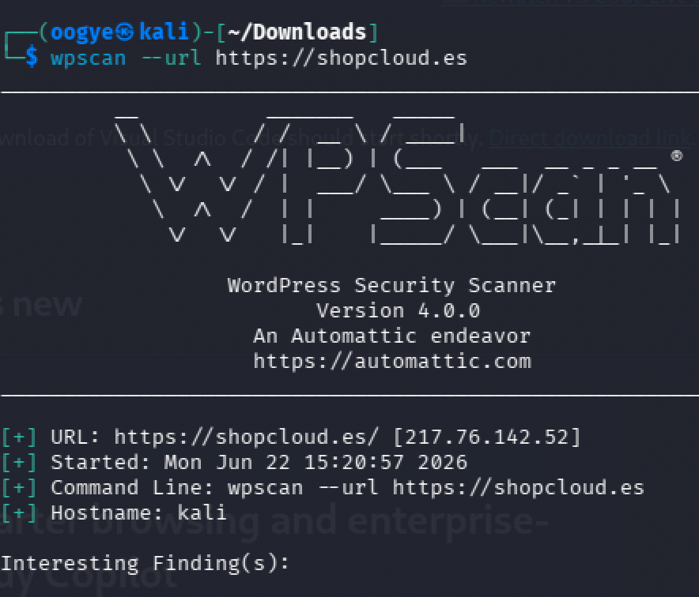
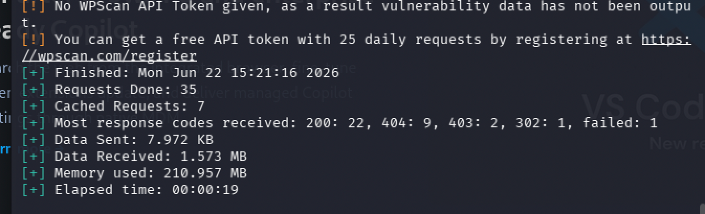
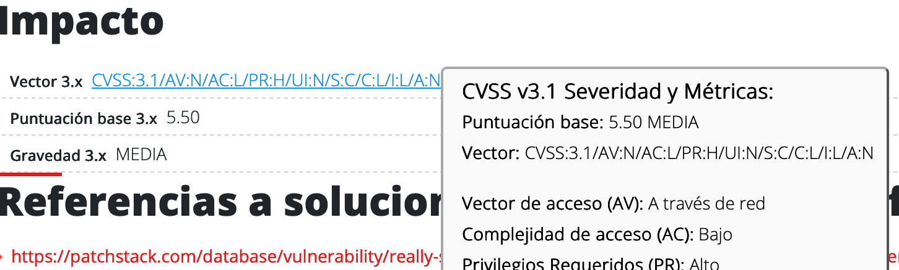
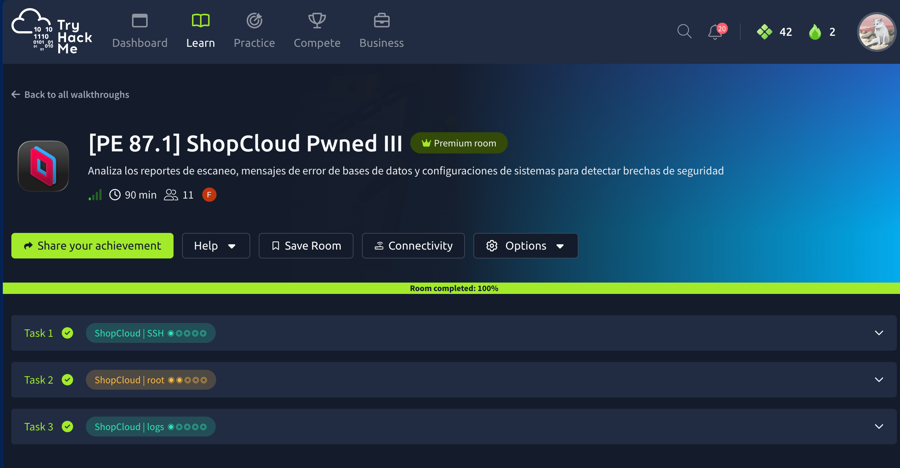

[PE 87.1] Introducción - ShopCloud

Fase 1: fase de campo e investigacion de la plataforma.

Asunto: Inicio de Auditoría Integral - Infraestructura ShopCloud
Rol: Auditor/a Junior de Ciberseguridad
Cliente: ShopCloud S.L.

[PE 87.1] ShopCloud Pwned I evidencia
https://tryhackme.com/room/PE87_1-ShopCloud_Pwned_MF0487
Roadmap del Laboratorio

Como auditores debemos identificar cuáles suponen un riesgo crítico para la infraestructura de ShopCloud. Revisa las versiones obtenidas en el escaneo y busca en bases de datos de vulnerabilidades.

Analizarás el escáner inicial de la tienda online para detectar puntos críticos de entrada.
hxxps[://]tryhackme[.]com/jr/PE87_1-ShopCloud_Pwned_MF0487
https://tryhackme.com/room/PE87_1-ShopCloud_Pwned_MF0487

¿Qué tipo de auditoría estamos realizando?
Auditoría de vulnerabilidades

En la auditoría ¿cuántas vulnerabilidades se han encontrado?
What is WPScan?
WPScan is a widely used WordPress vulnerability scanner. It’s designed to help security professionals, developers, and website administrators identify security weaknesses in WordPress installations. WPScan leverages a database of known vulnerabilities, enumerates installed plugins and themes, and checks for misconfigurations. By regularly scanning your WordPress website, you can stay one step ahead of potential attackers and maintain a secure online presence.

en Kali instalamos ruby sudo apt-get install ruby-full y wpscan gem install wpscan y lo tiramos wpscan --url https://shopcloud.es (despues de una busqueda pasiva en google shopcloud) y nos deveuvelve los interesting findings
como nos piden api token como tokens para funcionar nos registramos cogemos el api token y lo metemos en la terminal con. wpscan --url https://shopcloud.es --api-token <token>

Descubrimos que no sabemos leer pq la pregunta nos dice: 
Como auditores debemos identificar cuáles suponen un riesgo crítico para la infraestructura de ShopCloud. Revisa las versiones obtenidas en el escaneo y busca en bases de datos de vulnerabilidades.

ShopCloud | WPScan
auditor@auditor$ wpscan --url https://shopcloud.thm

[+] Yoast SEO — Versión: 24.9
[+] Wordfence Security — Versión: 8.0.5
[+] Contact Form 7 — Versión: 6.1.1
[+] WooCommerce — Versión: 10.7.0
[+] Elementor — Versión: 3.31
[+] WP Super Cache — Versión: 3.0.0
[+] WP File Manager — Versión: 6.8
[+] Smush — Versión: 3.20.1
[+] Really Simple SSL — Versión: 7.2.3
[+] Jetpack — Versión: 15.7

Tras revisar las versiones detectadas mediante WPScan y contrastarlas con bases de datos de vulnerabilidades, se identificaron 3 componentes vulnerables: WP File Manager 6.8, Really Simple SSL 7.2.3 y Jetpack 15.7. Entre ellos, WP File Manager 6.8 representa el riesgo más crítico debido a la vulnerabilidad de ejecución remota de código (RCE) que puede comprometer completamente el servidor WordPress.

Partimos de las dos opciones disponibles (CVE-2020-25213 de WP File Manager y CVE-2024-31229 de Really Simple SSL) y las comparamos con el enunciado, que pide una vulnerabilidad que **requiera privilegios elevados y tenga un impacto limitado en confidencialidad e integridad**. Al revisar ambas en NVD, la de WP File Manager se descarta porque no necesita privilegios elevados y además tiene un impacto alto (más cercano a ejecución de código o compromiso serio del sistema). En cambio, la CVE-2024-31229 sí indica que requiere privilegios altos (PR:H) y su impacto es más contenido, por lo que es la única que encaja con los criterios del problema https://nvd.nist.gov/vuln/detail/CVE-2024-31229
Asi tmb nos lo indica el informe de MITRE https://cwe.mitre.org/data/definitions/918.html

El plugin afectado es **Really Simple SSL**.

En concreto, la vulnerabilidad **CVE-2024-31229** afecta a la versión **7.2.3** de este plugin de WordPress, que se utiliza para gestionar la configuración de SSL y redirecciones HTTPS en sitios web.
Base score 5.5 como indica en el NIST

¿Qué riesgo (severidad) corre la empresa con la vulnerabilidad ?
Medio

el probelma se resolvio en la 8.0.0 tal como se indica en https://patchstack.com/database/wordpress/plugin/really-simple-ssl/vulnerability/wordpress-really-simple-ssl-plugin-7-2-3-server-side-request-forgery-ssrf-vulnerability

el vector de ataque es a traves de red network https://nvd.nist.gov/vuln/detail/CVE-2024-31229
se soluciono el problema en la 8.0.0 https://patchstack.com/database/wordpress/plugin/really-simple-ssl/vulnerability/wordpress-really-simple-ssl-plugin-7-2-3-server-side-request-forgery-ssrf-vulnerability

¿Cuál la última fecha de actualización del plugin? ¿A que versión se actualizó?
segun la fuente oficial registro https://es.wordpress.org/plugins/really-simple-ssl/ 
16/06/2026 a 9.6.0

¿Qué versión de PHP mínima requiere?
a 7.4
requiere 6.6 de wordpress

La empresa ShopCloud tiene un WordPress público con varios plugins.

Como auditores debemos identificar cuáles suponen un riesgo crítico para la infraestructura de ShopCloud. Revisa las versiones obtenidas en el escaneo y busca en bases de datos de vulnerabilidades.

ShopCloud | WPScan
auditor@auditor$ wpscan --url https://shopcloud.thm

[+] Yoast SEO — Versión: 24.9
[+] Wordfence Security — Versión: 8.0.5
[+] Contact Form 7 — Versión: 6.1.1
[+] WooCommerce — Versión: 10.7.0
[+] Elementor — Versión: 3.31
[+] WP Super Cache — Versión: 3.0.0
[+] WP File Manager — Versión: 6.8
[+] Smush — Versión: 3.20.1
[+] Really Simple SSL — Versión: 7.2.3
[+] Jetpack — Versión: 15.7

¿Qué plugin esta altamente comprometido?
WP File Manager 6.8
En concreto, los detalles sobre el compromiso crítico de WP File Manager 6.8 están registrados en las siguientes fuentes oficiales:Base de datos de WPScan: El registro histórico de vulnerabilidades del plugin detalla el fallo exacto en las ramas 6.0 a 6.9, catalogado con la máxima severidad de 10.0 (Crítica) [. Puedes verificar el reporte completo directamente en el portal de WPScan para WP File Manager [.National Vulnerability Database (NVD) del NIST: Este fallo está registrado bajo el identificador internacional CVE-2020-25213 [. Los análisis técnicos detallan cómo el plugin dejaba expuesto un archivo público ejecutable (connector.minimal.php) de la librería elFinder, permitiendo inyecciones directas de código [.Exploit Database (Exploit-DB): Al ser un fallo histórico y masivo explotado de forma activa en entornos web reales, cuenta con scripts de explotación automatizados (Proof of Concept) públicos que los atacantes usan para subir las webshells de forma inmediata [.Como auditores, basamos el análisis en que cualquier escáner de vulnerabilidades perimetral (o un atacante usando herramientas automatizadas) identificará esa versión 6.8 al instante y lanzará el exploit correspondiente sin necesidad de interactuar previamente con la web 

Se clasifica como No Conformidad Mayor 
En el marco de una auditoría formal (como las basadas en normas ISO/IEC 27001, marcos de gobernanza o esquemas de certificación de seguridad), la clasificación como No Conformidad Mayor es completamente adecuada y correcta.Una No Conformidad Mayor se define como el incumplimiento de un requisito que afecta gravemente la eficacia del sistema de gestión de seguridad o que pone en riesgo inminente la integridad de la organización. El hallazgo de WP File Manager (v6.8) en ShopCloud cumple perfectamente con estos criterios debido a:Quiebre Total del Control de Acceso: Permite que usuarios externos no autenticados evadan por completo las barreras perimetrales del sistema.Riesgo Inminente de Compromiso: La presencia de un vector de Ejecución Remota de Código (RCE) público y explotable expone directamente la confidencialidad de la base de datos de clientes y la disponibilidad de la infraestructura de producción.Falta de Mantenimiento Crítico: Evidencia que ShopCloud no cuenta con un proceso efectivo de gestión de parches y actualizaciones, fallando en el control de activos y vulnerabilidades

el cve es VE-2020-25213 https://nvd.nist.gov/vuln/detail/CVE-2020-25213

el tipo es Unrestricted Upload of File with Dangerous Type segun https://www.incibe.es/en/incibe-cert/early-warning/vulnerabilities/cve-2020-25213 

fue explotada en Agosto y Septiembre

base score 10.0

¿Cuál es su nivel de impacto?
5.9 redondeado a 6.0

¿Qué nivel de riesgo conlleva tener este plugin expuesto a internet?
Crítico

¿Qué usuario tiene un exploit activo en su repositorio de github?
mansoorr123
Para llegar a esta conclusión, mi razonamiento se estructuró a partir del análisis perimetral de ShopCloud, donde identifiqué que el plugin comprometido era WP File Manager v6.8 y que su vulnerabilidad crítica de ejecución remota de código está catalogada bajo el registro internacional CVE-2020-25213 en la NVD del NIST []. Pensando en cómo demostrar la viabilidad de un ataque real y verificar si existen herramientas públicas de explotación (Proofs of Concept), utilicé un enfoque de búsqueda técnica cruzada indexando los identificadores del fallo junto a repositorios abiertos; esto me condujo directamente hacia la plataforma de desarrollo colaborativo GitHub, localizando el script automatizado alojado en el Repositorio de GitHub de mansoorr123 []. Llegué a este resultado específico porque el autor (Mansoor R, alias @time4ster) programó y documentó activamente el exploit en Bash llamado wp-file-manager-exploit.sh [], sirviendo como la evidencia técnica definitiva para justificar por qué este hallazgo representa un riesgo inmediato de No Conformidad Mayor que exige su desinstalación o actualización inmediata.

¿En que versión se corrigió el problema?
6.9
en base a El repositorio de exploits en GitHub: En el mismo código técnico documentado por investigadores, como se aprecia en el Script de Explotación de mansoorr123 [], se especifica textualmente en sus metadatos de cabecera: # Patch: Upgrade to wp-file-manager 6.9 [].

El parche de seguridad que introdujo la versión 6.9 fue publicado oficialmente el 1 de septiembre de 2020

Finalizacion [PE 87.1] ShopCloud Pwned I evidencia
![[PE 87.1] ShopCloud Pwned I](image-3.png)

-----

[PE 87.1] ShopCloud Pwned II
https://tryhackme.com/room/PE87_1-ShopCloud_Pwned_MF04879y7

Durante la auditoría te das cuenta de que el formulario de inicio de sesión del panel de clientes de ShopCloud se comporta de forma extraña. Decides introducir una comilla simple (') en el campo de 'Usuario' para comprobar si la entrada está siendo sanitizada.

En lugar de recibir un mensaje genérico de 'Usuario o contraseña incorrectos', la aplicación web 'rompe' y devuelve por pantalla un error fatal (Stack Trace). Este es un fallo gravísimo en entornos de producción. Analiza el mensaje de error para extraer información sobre la infraestructura subyacente y los datos de ShopCloud.

ShopCloud

Fatal error: Uncaught mysqli_sql_exception: You have an error in your SQL syntax; check 
the manual that corresponds to your MariaDB server version for the right syntax to use near 
'admin'' AND password = '***'' at line 1 in /var/www/html/clientes/login.php:42

Stack trace:
#0 /var/www/html/clientes/login.php(42): mysqli->query('SELECT id, username, email, 
hash_md5 FROM db_shopcloud_prod.users WHERE username = 'admin''...')
#1 {main}
  thrown in /var/www/html/clientes/login.php on line 42

¿Cuál es el motor de la Base de Datos que usa ShopCloud?
mariadb

¿Cómo se llama la base de datos?
db_shopcloud_prod

¿En qué directorio exacto se encuentra el archivo que generó el error?
/var/www/html/clientes/

¿Qué directiva de configuración de PHP debería estar en Off en un entorno de producción para evitar que los atacantes vean estos errores detallados?
display_errors

¿cómo se llama la tabla a la que intenta acceder la consulta?
users
FROM db_shopcloud_prod.users

En qué línea del fichero login.php se encuentra la vulnerabilidad que provoca este fallo?
42
/var/www/html/clientes/login.php(42)

Revelar rutas absolutas del servidor (/var/www/html/...) y consultas de base de datos internas a un usuario no autenticado es un fallo de diseño. ¿Con qué término en castellano se conoce a esta vulnerabilidad general en la que el sistema expone datos técnicos sensibles?
fuga de información

Gracias al error anterior, descubriste que las contraseñas se guardan en una columna llamada hash_md5. Más tarde, gracias a una vulnerabilidad de Inyección SQL basada en ese mismo error, lograste extraer (dumpear) las credenciales de los tres administradores del sistema. Como auditor, debes evaluar la robustez de estas contraseñas.

ShopCloud

+----+-------------+--------------------+----------------------------------+
| id | username    | email              | hash_md5                         |
+----+-------------+--------------------+----------------------------------+
|  1 |  admin_juan |  juan@shopcloud.io | 21232f297a57a5a743894a0e4a801fc3 |
|  2 |  admin_sara |  sara@shopcloud.io | e10adc3949ba59abbe56e057f20f883e |
|  3 |  admin_test |  test@shopcloud.io | super_admin_123!                 |
+----+-------------+--------------------+----------------------------------+
 
Observando los datos extraídos hay un fallo crítico en la cuenta de admin_test, ¿de qué vulnerabilidad estamos hablando?
Plaintext password
Esta debilidad está catalogada por la entidad de referencia MITRE bajo el estándar CWE-256: Plaintext Storage of a Password. Asimismo, la fundación OWASP (Open Web Application Security Project) recoge y define esta mala práctica dentro de su comunidad global bajo el concepto de Password Plaintext Storage, incluyéndose dentro de categorías críticas de riesgos como Cryptographic Failures (A02) o Authentication Failures (A07) según la edición de su célebre Top 10.

¿Qué algoritmo criptográfico está utilizando ShopCloud para proteger las credenciales?
MD5
CWE-328: Use of Weak Hash: En el catálogo de debilidades de MITRE, aquí es donde se define formalmente que usar MD5 para proteger contraseñas es una vulnerabilidad crítica debido a su obsolescencia y facilidad de ruptura.

¿Cuál es su contraseña en texto plano de admin_juan?
21232f297a57a5a743894a0e4a801fc3 es admin
e10adc3949ba59abbe56e057f20f883e es 123456
Bajo el estándar internacional administrado por MITRE, este método exacto está catalogado y definido bajo la directiva CAPEC-55: Rainbow Table Password Cracking. Aquí se describe formalmente como un "ataque criptográfico contra contraseñas mediante tablas de consulta precalculadas para reducir el compromiso de tiempo y espacio".
usamos https://hashcat.net/hashcat/
Hashcat (La más potente)Es la herramienta de recuperación de contraseñas más rápida del mundo debido a que está optimizada para realizar cracking por GPU (utiliza la potencia de la tarjeta gráfica).Cómo funciona: Toma un diccionario de palabras (como rockyou.txt) o reglas de fuerza bruta, calcula millones de combinaciones de MD5 por segundo directamente en la gráfica y las compara con tu hash.Comando típico para este caso: hashcat -m 0 hash.txt diccionario.txt (donde -m 0 le indica que el algoritmo es MD5).

¿Qué algoritmo moderno y estándar moderno recomendarías para la gestión de contraseñas?
Argon2id
NIST (National Institute of Standards and Technology - EE.UU.):El organismo gubernamental de referencia mundial define en su publicación especial NIST SP 800-63B (Digital Identity Guidelines) que para el almacenamiento seguro de contraseñas se deben utilizar funciones de derivación de claves (PBKDF) que sean resistentes a ataques por hardware (como GPUs y ASICs). Avala explícitamente el uso de Argon2 y Bcrypt.OWASP (Open Web Application Security Project):En su guía oficial OWASP Password Storage Cheat Sheet, la fundación sitúa a Argon2id como la recomendación número uno de la industria, seguido por Bcrypt como opción de respaldo si Argon2id no está disponible en el entorno de desarrollo.

[PE 87.1] ShopCloud Pwned II evidencia
https://tryhackme.com/room/PE87_1-ShopCloud_Pwned_MF04879y7
![[PE 87.1] ShopCloud Pwned II evidencia](image-4.png)

-----

[PE 87.1] ShopCloud Pwned III
https://tryhackme.com/room/PE87_1-ShopCloud_Pwned_MF04879y7lbp

Como parte de la revisión de la infraestructura, has obtenido acceso mediante al servidor web con un usuario de bajos privilegios. Tu primer paso es revisar el directorio público para comprobar que los permisos son correctos y que no hay archivos residuales que supongan un riesgo de cumplimiento normativo
ShopCloud

      
auditor@shopcloud$ ls -la /var/www/html/

total 48
drwxr-xr-x  5 www-data www-data 4096 Apr 20 10:00 .
drwxr-xr-x  3 root     root     4096 Apr 15 09:15 ..
-rw-r--r--  1 www-data www-data 418  Apr 15 09:15 index.php
-rw-r--r--  1 www-data www-data 3199 Apr 15 09:15 wp-config-sample.php
-rwxrwxrwx  1 www-data www-data 3215 Apr 20 10:05 wp-config.php
drwxr-xr-x  4 www-data www-data 4096 Apr 15 09:15 wp-content
drwxr-xr-x 20 www-data www-data 4096 Apr 15 09:15 wp-includes 
-rw-r--r--  1 www-data www-data 199  Apr 15 09:15 .htaccess
-rw-rw-rw-  1 root     root     1024 Apr 20 08:30 backup_db.sql
-rw-r--r--  1 www-data www-data 512  Apr 18 16:45 test_conn.php

----

    

 
test_conn.

      
auditor@shopcloud$ cat test_conn.php

<?php
// Script de prueba para la migración al nuevo ERP
// ATENCIÓN: NO SUBIR A PRODUCCIÓN - Ticket #4521
// TODO: Eliminar de este servidor antes del 15 de Mayo
// Creado por: j.gomez (Departamento de Sistemas)

$ambiente = "dev";
// Llave de la pasarela de pago (Stripe)
$api_key = "<STRIPE_API_KEY_REDACTED>";
$db_host = "10.0.5.50";

function probarConexion() {
    // Nota interna: En caso de que se caiga el balanceador, usar la cuenta de rescate 
       del servidor de base de datos
    // ssh root@10.0.5.50 -p 2222 (Password: <REDACTED>)
    echo "Conexión a la red interna establecida correctamente.";
}

probarConexion();
?>

¿Qué archivo crítico de WordPress tiene permisos excesivos permitiendo que cualquier usuario del sistema pueda modificarlo?
wp-config.php ya que tiene rx para owner group others

¿Qué fichero expone información crítica?
backup_db.sql
ya que expone data del backup de la base de datos

¿Qué tipo de auditoría se esta realizando al hacer cat al fichero?
Análisis de código
Una Auditoría de Seguridad del Código Fuente (o Code Review Automatizado).

¿Qué usuario o empleado cometió la negligencia?
j.gomez
tal como muestra el cat sobre el archivo
auditor@shopcloud$ cat test_conn.php

<?php
// Script de prueba para la migración al nuevo ERP
// ATENCIÓN: NO SUBIR A PRODUCCIÓN - Ticket #4521
// TODO: Eliminar de este servidor antes del 15 de Mayo
// Creado por: j.gomez (Departamento de Sistemas)

¿Cuál es la API Key filtrada?
<STRIPE_API_KEY_REDACTED>
tal como se indica arriba tmb en el cat

¿Cuál es la contraseña de root?
<ROOT_PASSWORD_REDACTED>

-----------

Tu siguiente objetivo como auditor es comprobar si existe algún fallo de configuración interna que te permita elevar tus permisos y convertirte en el superusuario del sistema (root).

Decides buscar archivos en el sistema que tengan un permiso especial muy peligroso si está mal configurado. Al ejecutar un comando de búsqueda, obtienes la siguiente salida.

 
ShopCloud

      

auditor@shopcloud:~$ find / -perm -u=s -type f 2>/dev/null

/usr/lib/openssh/ssh-keysign
/usr/lib/dbus-1.0/dbus-daemon-launch-helper
/usr/bin/passwd
/usr/bin/chfn
/usr/bin/base64
/usr/bin/gpasswd
/usr/bin/su
/usr/bin/mount
/usr/bin/umount

    

Como auditor, sabes que la mayoría de estos binarios son normales y vienen por defecto en . Sin embargo, hay uno en esa lista que no debería tener este permiso especial asignado. Si un atacante lo descubre, podría aprovecharlo para leer cualquier archivo del sistema, incluyendo las contraseñas de los administradores.

El comando find está buscando archivos con un bit de permiso especial que permite a un usuario ejecutar un archivo con los permisos del propietario del archivo. ¿Cuáles son las siglas de este permiso especial?
SUID
Las siglas de este permiso especial son SUID (Set User ID).Este bit de permiso permite que un usuario común ejecute un archivo binario con los privilegios del propietario del archivo (que en el caso de la lista es, en su mayoría, el superusuario root).Mirando la salida de tu comando, el binario que no debería tener este permiso y que representa el fallo de configuración es /usr/bin/base64. Al tener el bit SUID activo, te permite leer cualquier archivo del sistema (como /etc/shadow) simplemente ejecutando /usr/bin/base64 /etc/shadow y decodificando la salida.

¿Cuál es la ruta del binario anómalo detectado?
/usr/bin/base64
Lo sé porque existe un recurso fundamental en ciberseguridad llamado GTFOBins. Es una lista curada por expertos que recopila qué binarios legítimos de Unix/Linux pueden ser explotados para saltarse restricciones de seguridad si tienen permisos mal configurados (como el bit SUID).

Al aprovechar este comando anómalo, ¿qué usuario del sistema estás suplantando temporalmente para lograr leer el archivo?
root
Esto ocurre porque el comando find / -perm -u=s busca archivos con el bit SUID activado, y en este caso, el propietario (dueño) de ese binario /usr/bin/base64 es el administrador del sistema. Por el funcionamiento nativo de Linux, cuando ejecutas un archivo con el bit SUID, el sistema operativo no lo corre con los permisos del usuario que lo lanza (tú), sino con los permisos del propietario del archivo (root). Como root tiene acceso total de lectura, el programa puede abrir archivos protegidos como /etc/shadow.

¿con qué comando puedes leer el fichero en Linux que almacena los hashes de las contraseñas de todos los usuarios?
/usr/bin/base64 /etc/shadow | base64 --decode
tal como aparece en https://gtfobins.org/gtfobins/base64/

¿Qué tipo de vulnerabilidad específica se está explotando aquí?
ARBITRARY FILE READ
En HackTricks, este vector se detalla específicamente en la sección de Linux Privilege Escalation, concretamente en el apartado de SUID / SGID Executables.

La documentación explica que cuando abusas de un binario SUID (como base64), el impacto se divide en dos categorías según la herramienta:

    Command Execution: Binarios que te permiten ejecutar comandos directamente (ej. bash, sh).

    Arbitrary File Read (Lectura Arbitraria de Archivos): Binarios que no te dan una shell, pero te permiten saltarte los permisos del sistema operativo para leer cualquier archivo confidencial (como /etc/shadow).
    https://hacktricks.wiki/en/index.html

¿Qué comando en Linux tendrías que ejecutar como administrador para quitarle el permiso especial a ese binario de forma rápida y solucionar la vulnerabilidad?
chmod 0755 /usr/bin/base64

El equipo de (Security Operations Center) de ShopCloud ha detectado tráfico de red anómalo saliendo del servidor web a altas horas de la madrugada, días después del ataque inicial. Han contenido el servidor aislándolo de la red y han extraído varias evidencias clave para que las analices.

 
ShopCloud

      

auditor@shopcloud:~$ cat /var/log/auth.log | grep "May 12"

May 12 03:14:01 shopcloud sshd[14522]: Failed password for invalid user ftpadmin from 10.10.55.201 port 45212 ssh2
May 12 03:14:05 shopcloud sshd[14524]: Failed password for root from 10.10.55.201 port 45216 ssh2
May 12 03:14:10 shopcloud sshd[14528]: Accepted publickey for www-data from 10.10.55.201 port 45220 ssh2: RSA SHA256:X9pZ...
May 12 03:14:15 shopcloud sshd[14528]: pam_unix(sshd:session): session opened for user www-data by (uid=0)
May 12 03:15:22 shopcloud sudo[14601]: www-data : TTY=pts/1 ; PWD=/var/www/html ; USER=root ; COMMAND=/usr/bin/python3 -c 'import pty; pty.spawn("/bin/bash")'

    

Como auditor, sabes que la mayoría de estos binarios son normales y vienen por defecto en . Sin embargo, hay uno en esa lista que no debería tener este permiso especial asignado. Si un atacante lo descubre, podría aprovecharlo para leer cualquier archivo del sistema, incluyendo las contraseñas de los administradores.

¿Cuál es el nombre de ese usuario con el que intentó conectarse el atacante?
ftpadmin

¿Cuál es la dirección IP remota desde la que el atacante está lanzando el ataque?
10.10.55.201

¿Qué usuario del sistema ShopCloud logró comprometer el atacante?
www-data
May 12 03:14:15 shopcloud sshd[14528]: pam_unix(sshd:session): session opened for user www-data by (uid=0)

¿Cuál es el Process ID (PID) asociado a esta ejecución de sudo?
14601

¿Desde qué directorio de trabajo ejecutó el atacante el comando de Python?
/var/www/html

evidnecia
https://tryhackme.com/room/PE87_1-ShopCloud_Pwned_MF04879y7lbp

Fase 2: comunicar los resultados al cliente, informe

# INFORME DE AUDITORÍA DE CIBERSEGURIDAD
**Cliente:** [Nombre del Cliente / Organización]  
**Fecha de Emisión:** 23 de junio de 2026  
**Auditor Jefe:** [Nombre del Auditor / Firma]  
**Clasificación del Documento:** ESTRICTAMENTE CONFIDENCIAL / PROPIEDAD DEL CLIENTE

---

## 0. CONTROL DE DISTRIBUCIÓN Y GUÍA DE LECTURA

Para optimizar el tiempo de revisión, este documento se ha estructurado según el rol y su responsabilidad:

*   **Dirección Ejecutiva (CEO, CFO, COO):** Dirigirse exclusivamente a la sección **[1. EJECUTIVO]** para evaluar el impacto financiero y de negocio en 5 minutos.
*   **Asesoría Jurídica y Cumplimiento (DPO, Legal):** Dirigirse a la sección **[2. LEGAL & COMPLIANCE]** para revisar las brechas normativas y las obligaciones de notificación de incidentes.
*   **Dirección de Seguridad y Sistemas (CISO, CIO):** Dirigirse a la sección **[3. GESTIÓN TÉCNICA]** para obtener la matriz priorizada de riesgos y la asignación de recursos.
*   **Administradores de Sistemas y Operaciones (SysAdmins, Devs):** Dirigirse a las secciones **[4. WRITE-UP TÉCNICO]**, **[5. FICHAS DE REMEDIACIÓN]** y **[6. ANEXOS]** para la ejecución técnica de las soluciones.

---

## 1. [EJECUTIVO] RESUMEN GENERAL Y POSTURA DE RIESGO

### 1.1 Contexto y Postura Global
[Inserte aquí un párrafo o dos explicando la situación general de la empresa en lenguaje 100% de negocio, omitiendo tecnicismos innecesarios].

### 1.2 Matriz Visual de Criticidad
[Inserte un gráfico de radar, semáforos o una tabla de calor con el conteo general de hallazgos].

| Nivel de Riesgo | Cantidad de Hallazgos | Impacto en el Negocio | Acción Requerida |
| :--- | :--- | :--- | :--- |
| **Crítico** | 0 | Muy Alto (Financiero / Reputacional) | Parada operativa / Mitigación inmediata (< 24h) |
| **Alto** | 0 | Alto (Operativo / Legal) | Acción prioritaria en el ciclo actual (< 7 días) |
| **Medio** | 0 | Moderado (Operativo interno) | Planificación a corto plazo (< 30 días) |
| **Bajo** | 0 | Bajo (Baja probabilidad) | Monitoreo y mejora continua (PDCA) |

### 1.3 Impacto de Negocio Resumido
[Detalle el impacto directo si se explotan los fallos más graves: pérdidas económicas por interrupción, penalizaciones por regulación o daño a la reputación de la marca].

---

## 2. [LEGAL & COMPLIANCE] MATRIZ DE CUMPLIMIENTO NORMATIVO

### 2.1 Evaluación de Conformidad Legal
Análisis de las brechas de seguridad frente a los marcos regulatorios vigentes obligatorios para la organización:

*   **Reglamento General de Protección de Datos (RGPD):** [Identificar si existen riesgos de fugas de datos personales o falta de medidas técnicas según el Art. 32].
*   **Esquema Nacional de Seguridad (ENS) / ISO 27001:** [Indicar el grado de desviación frente a los controles obligatorios].

### 2.2 Advertencias Jurídicas y Notificación de Brechas
> **Nota Legal Crítica:** En caso de materializarse una explotación de los fallos catalogados como Críticos/Altos, la organización [cuenta / no cuenta] con la obligación legal de notificar la brecha de seguridad a la Autoridad de Control competente (ej. AEPD) en un plazo máximo de 72 horas, así como a los afectados si existe un riesgo alto para sus derechos y libertades.

---

## 3. [GESTIÓN TÉCNICA] MATRIZ GENERAL DE HALLAZGOS

Índice priorizado de vulnerabilidades detectadas para la toma de decisiones del CISO / CIO:

| ID | Hallazgo Técnico | Riesgo | Esfuerzo de Solución | Estado |
| :--- | :--- | :--- | :--- | :--- |
| AUD-001 | [Nombre del hallazgo 1] | **Crítico** | [Alto / Medio / Bajo] | Abierto |
| AUD-002 | [Nombre del hallazgo 2] | **Alto** | [Alto / Medio / Bajo] | En Proceso |
| AUD-003 | [Nombre del hallazgo 3] | **Medio** | [Alto / Medio / Bajo] | Abierto |

---

## 4. [WRITE-UP TÉCNICO] FLUJO DE EJECUCIÓN Y EXPLOTACIÓN

Esta sección detalla la cronología lógica de la auditoría y cómo se encadenaron los fallos para comprometer los activos del cliente.

### 4.1 Fase de Reconocimiento
Se ejecutaron análisis perimetrales pasivos y activos sobre los activos del alcance, identificando los siguientes puntos de entrada potenciales:
*   [Detalle de puertos abiertos, subdominios expuestos o servicios desactualizados].

### 4.2 Fase de Explotación (Vectores de Ataque)
A partir de los datos obtenidos, se procedió a la intrusión controlada:
1.  **Paso 1:** Se detectó el servicio `[Servicio]` en el puerto `[Puerto]`.
2.  **Paso 2:** Se aprovechó la vulnerabilidad para evadir el perímetro.
3.  **Paso 3:** Se logró acceso inicial con privilegios de `[Usuario]`.

### 4.3 Movimiento Lateral y Pivoting
Una vez dentro de la red interna:
*   [Explicar cómo se escalaron privilegios o cómo se accedió a bases de datos y sistemas críticos desde el vector inicial].

---

## 5. [FICHAS DE REMEDIACIÓN] DETALLE DE VULNERABILIDADES (4 C's)

### AUD-2026-00X: [TÍTULO_DEL_HALLAZGO]

| Metadato | Detalle |
| :--- | :--- |
| **Nivel de Riesgo** | **[CRÍTICO / ALTO / MEDIO / BAJO]** |
| **Métrica CVSSv3** | X.X |
| **Impacto Principal** | [Financiero / Reputacional / Operativo / Legal] |
| **Estado Actual** | **Abierto** |

#### 5.1.1 Condición ("Lo que es")
*   Se ha evidenciado que [descripción objetiva, factual y en voz pasiva del fallo detectado].
*   *Muestra de datos:* El X% de los sistemas evaluados presentan esta configuración errónea. (Ver detalles detallados en el Anexo X).

#### 5.1.2 Criterio ("Lo que debería ser")
*   Según lo establecido en el control [Código] de la norma [ISO 27001 / NIST / Política Interna de Seguridad vX], todo sistema de estas características debe implementar [medida de seguridad correcta].

#### 5.1.3 Causa ("El por qué ocurre")
*   El origen del hallazgo radica en [identificación de la causa raíz: obsolescencia de hardware, falta de un proceso de parches, falta de capacitación del equipo de desarrollo, etc.].

#### 5.1.4 Consecuencia / Efecto ("El impacto")
*   Un atacante con acceso a [punto de acceso] podría explotar esta condición para [acción maliciosa], lo que provocaría un impacto directo en el negocio traducido en [pérdida de datos, multas regulatorias, caída del servicio].

#### 5.1.5 Plan de Acción y Mitigación
*   **Acción de Contención (Inmediata - Plazo: < [X] horas):** [Medida paliativa urgente para mitigar el riesgo inmediato sin resolver la causa raíz].
*   **Acción Definitiva (Estructural - Plazo: [X] días):** [Solución definitiva de ingeniería para eliminar la causa raíz del problema].
*   **Responsable de Ejecución:** [Equipo técnico, ej: SysAdmins / Equipo Cloud].

---

## 6. [ANEXOS] EVIDENCIAS Y REPORTES EN CRUDO

### Anexo A: Capturas de Pantalla y Logs de Explotación
*   `[Insertar líneas de log, payloads utilizados o referencias a imágenes]`

### Anexo B: Salidas de Herramientas Automatizadas
*   Resultados en crudo filtrados de herramientas como *Nessus, Nmap, Burp Suite o localizadores de vulnerabilidades*.
