[AP 16] - El contenedor desconocido

Formas parte del equipo de ciberseguridad encargado de administrar un servidor Ubuntu Server que utiliza Docker.

El servidor aloja un servicio web corporativo mediante un contenedor.

El administrador responsable informa de que solamente debería existir el siguiente servicio:

Nombre: web-corporativa
Función: Servidor web
Puerto externo: 8080

Sin embargo, durante una revisión rutinaria se ha detectado un aumento extraño en el consumo de recursos del servidor.

Tu objetivo será analizar el entorno Docker, identificar cualquier contenedor no autorizado y realizar una primera respuesta ante el incidente.
Objetivos

Durante la actividad deberás demostrar que sabes:

    Identificar imágenes y contenedores.
    Diferenciar contenedores activos y detenidos.
    Interpretar el estado de los contenedores.
    Identificar los puertos publicados.
    Consultar procesos.
    Consultar logs.
    Analizar el consumo de recursos.
    Inspeccionar un contenedor.
    Detener un contenedor sospechoso.
    Eliminarlo cuando la investigación haya terminado.

Preparación del laboratorio

Antes de que comience la actividad, debes crear dos contenedores:

docker run -d --name web-corporativa \ -p 8080:80 nginx:alpine

docker run -d --name worker-17 --cpus="0.25" alpine sh -c 'while true; do :; done'

Genera algunas peticiones al primer servidor

curl http://localhost:8080
curl http://localhost:8080
curl http://localhost:8080/no-existe

Comprubar:

docker ps

Deberían existir:

web-corporativa
worker-17

No explicar al alumnado cuál es el contenedor sospechoso.

La única información que deben recibir es:

El único contenedor autorizado es web-corporativa.

Escenario

Son las 10
horas.

El sistema de monitorización ha informado de un consumo de CPU superior al habitual.

El responsable del servidor confirma que únicamente debería existir un contenedor denominado:

web-corporativa

El equipo de ciberseguridad solicita que realices una primera investigación.

No debes eliminar ningún elemento hasta haber recopilado evidencias suficientes.
Fase 1 — Inventario del sistema

    Consulta la versión de Docker:

    Comprueba que Docker está funcionando:

    Consulta las imágenes disponibles:

    Consulta los contenedores activos:

    Consulta todos los contenedores:

    Completa la tabla:

Contenedor	Imagen	Estado	Puerto
			
			
Fase 2 — Identificación de activos autorizados

    ¿Responde el servidor web?

    ¿Qué código HTTP devuelve?

Fase 3 — Detección y análisis de anomalías

Ejecuta:

docker stats --no-stream

    ¿Qué contenedor utiliza más CPU?

    ¿Coincide con el contenedor no autorizado?

    ¿Podemos afirmar únicamente por un consumo elevado de CPU que un contenedor es malicioso? Justifica brevemente la respuesta.

Fase 4 — Análisis de procesos

    ¿Qué diferencias observas entre los procesos de ambos contenedores?

    ¿Qué comando está ejecutando el contenedor sospechoso?

Fase 5 — Inspección del contenedor

Docker proporciona mediante inspect información detallada de la configuración y el estado de los contenedores.

Obtén información detallada de worker-17

    ¿Qué imagen utiliza?

    ¿Qué comando ejecuta?

    ¿El contenedor está actualmente activo?

Fase 6 — Análisis del contenedor legítimo

Ahora analizaremos el servidor web. Consulta sus logs:

    ¿Aparecen peticiones HTTP?

    ¿Existe alguna petición que haya producido un error?

    ¿Por qué pueden ser importantes los logs durante un incidente de seguridad?

Fase 7 — Acceso al contenedor legítimo

Ejecuta:

docker exec web-corporativa hostname

docker exec web-corporativa whoami

docker exec -it web-corporativa sh
hostname
whoami
ps

    ¿Se ha detenido web-corporativa al ejecutar exit?

    Explica brevemente por qué:

Fase 8 — Contención del incidente

    La investigación ha determinado el servidor web es AUTORIZADO/ NO AUTORIZADO

web-corporativa
    │
    └── 
 
worker-17
    │
    └── 

El primer objetivo de la respuesta ante el incidente será detener la actividad sospechosa. Y luego comprobar que todo está correcto.

    ¿Continúa ejecutándose worker-17?

    ¿Continúa existiendo el contenedor?

    ¿Por qué puede ser interesante detener un contenedor antes de eliminarlo?

Fase 9 — Comprobación del servicio legítimo

Después de contener el incidente debemos comprobar que el servicio autorizado continúa funcionando.

    ¿Continúa funcionando la web corporativa?

    ¿Qué contenedores aparecen ahora en ejecución?

Fase 10 — Erradicación

Una vez recopiladas las evidencias y contenido el incidente, eliminamos el contenedor no autorizado y comprobamos

    ¿Continúa existiendo
    worker-17
    ?

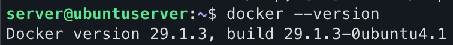
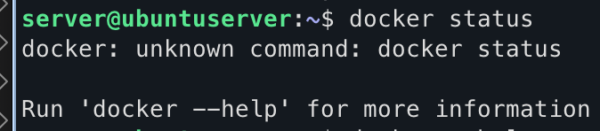
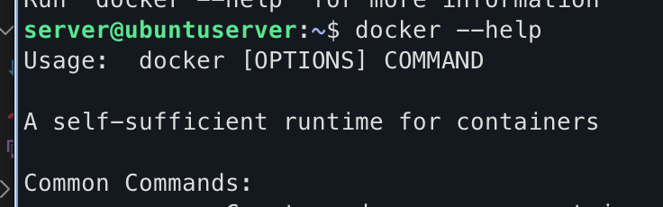
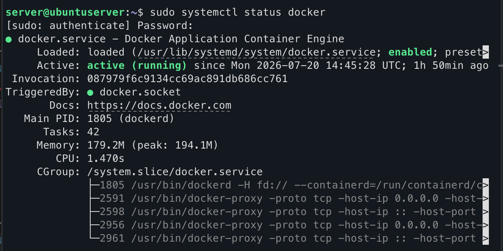
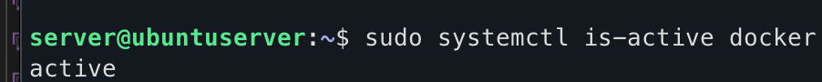
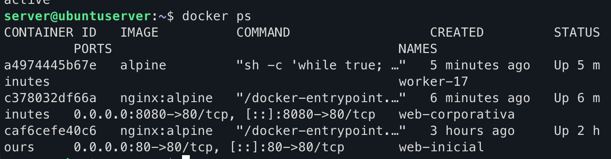
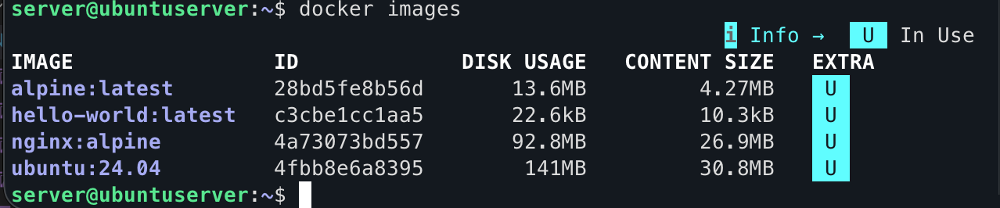

docker ps tmn deja ver contenedores activos

y docker ps -a deja ver tmb los inactivos
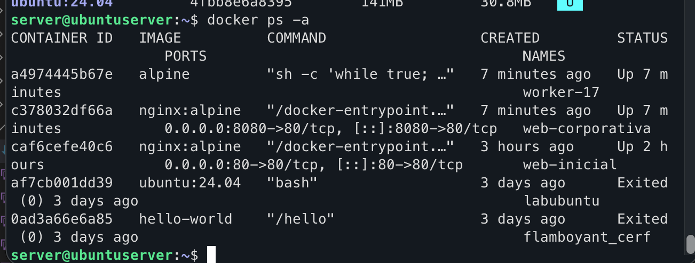

Completa la tabla:
server@ubuntuserver:~$ docker ps -a
CONTAINER ID   IMAGE          COMMAND                  CREATED         STATUS                  PORTS                                     NAMES
a4974445b67e   alpine         "sh -c 'while true; …"   7 minutes ago   Up 7 minutes                                                      worker-17
c378032df66a   nginx:alpine   "/docker-entrypoint.…"   7 minutes ago   Up 7 minutes            0.0.0.0:8080->80/tcp, [::]:8080->80/tcp   web-corporativa
caf6cefe40c6   nginx:alpine   "/docker-entrypoint.…"   3 hours ago     Up 2 hours              0.0.0.0:80->80/tcp, [::]:80->80/tcp       web-inicial
af7cb001dd39   ubuntu:24.04   "bash"                   3 days ago      Exited (0) 3 days ago                                             labubuntu
0ad3a66e6a85   hello-world    "/hello"                 3 days ago      Exited (0) 3 days ago                                             flamboyant_cerf
server@ubuntuserver:~$

server@ubuntuserver:~$ docker ps
CONTAINER ID   IMAGE          COMMAND                  CREATED         STATUS         PORTS                                     NAMES
a4974445b67e   alpine         "sh -c 'while true; …"   5 minutes ago   Up 5 minutes                                             worker-17
c378032df66a   nginx:alpine   "/docker-entrypoint.…"   6 minutes ago   Up 6 minutes   0.0.0.0:8080->80/tcp, [::]:8080->80/tcp   web-corporativa
caf6cefe40c6   nginx:alpine   "/docker-entrypoint.…"   3 hours ago     Up 2 hours     0.0.0.0:80->80/tcp, [::]:80->80/tcp       web-inicial
server@ubuntuserver:~$ docker images
                                                         i Info →   U  In Use
IMAGE                ID             DISK USAGE   CONTENT SIZE   EXTRA
alpine:latest        28bd5fe8b56d       13.6MB         4.27MB    U
hello-world:latest   c3cbe1cc1aa5       22.6kB         10.3kB    U
nginx:alpine         4a73073bd557       92.8MB         26.9MB    U
ubuntu:24.04         4fbb8e6a8395        141MB         30.8MB    U
server@ubuntuserver:~$ docker ps -a

¿Responde el servidor web?
c378032df66a   nginx:alpine   "/docker-entrypoint.…"   10 minutes ago   Up 10 minutes   0.0.0.0:8080->80/tcp, [::]:8080->80/tcp   web-corporativa

curl pra ver si responde el servidor web
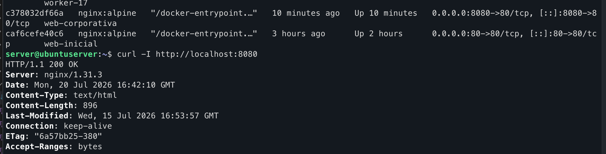

¿Qué código HTTP devuelve?
como pone la imagen devuelve HTTP/1.1 200 OK

¿Qué contenedor utiliza más CPU?
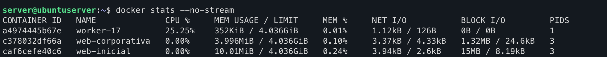
worker 17 lo cual implica q algog pasa ahi pq es demasiado alta y no es la esperada por la empresa
a4974445b67e   worker-17         25.25%    352KiB / 4.036GiB     0.01%     1.12kB / 126B     0B / 0B           1

¿Coincide con el contenedor no autorizado?
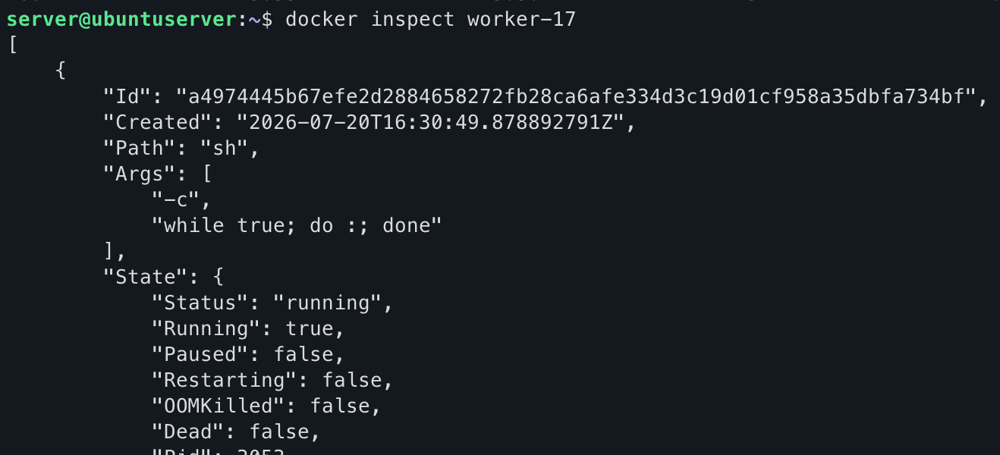
si, pq la empresa dice q solo deberia existir web-corporativa

¿Podemos afirmar únicamente por un consumo elevado de CPU que un contenedor es malicioso? Justifica brevemente la respuesta.

En este caso, worker-17 es sospechoso porque combina dos indicadores: un consumo de CPU anómalo (25,25%) y la existencia de un contenedor no autorizado respecto a la política de la empresa (solo debería existir web-corporativa). Sin embargo, harían falta evidencias adicionales antes de clasificarlo definitivamente como malicioso.

Fase 4 — Análisis de procesos
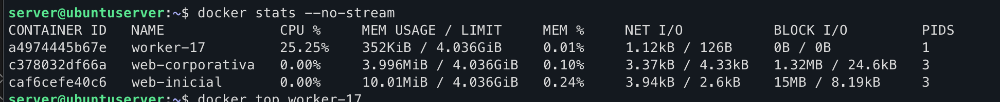
    ¿Qué diferencias observas entre los procesos de ambos contenedores?
        mucha mas CPU en worker 17, pero menos memoria y net, solo 1 PIDS y en block i/o tmb menos
        consumo elevado de cpu con un unic proceso activo, mientras que los contenedores web no muestran actividad reelvante

    ¿Qué comando está ejecutando el contenedor sospechoso?
     docker top worker-17
UID                 PID                 PPID                C                   STIME               TTY                 TIME                CMD
root                3053                3030                25                  16:30               ?                   00:04:51            sh -c while true; do :; done
server@ubuntuserver:~$ docker inspect worker-17

comando raro es sh -c while true; do :; done

Fase 5 — Inspección del contenedor

Docker proporciona mediante inspect información detallada de la configuración y el estado de los contenedores.

Obtén información detallada de worker-17

docker inspect worker-17
server@ubuntuserver:~$ docker inspect worker-17
[
    {
        "Id": "a4974445b67efe2d2884658272fb28ca6afe334d3c19d01cf958a35dbfa734bf",
        "Created": "2026-07-20T16:30:49.878892791Z",
        "Path": "sh",
        "Args": [
            "-c",
            "while true; do :; done"
        ],
        "State": {
            "Status": "running",
            "Running": true,
            "Paused": false,
            "Restarting": false,
            "OOMKilled": false,
            "Dead": false,
            "Pid": 3053,
            "ExitCode": 0,
            "Error": "",
            "StartedAt": "2026-07-20T16:30:49.904328829Z",
            "FinishedAt": "0001-01-01T00:00:00Z"
        },
        "Image": "sha256:28bd5fe8b56d1bd048e5babf5b10710ebe0bae67db86916198a6eec434943f8b",
        "ResolvConfPath": "/var/lib/docker/containers/a4974445b67efe2d2884658272fb28ca6afe334d3c19d01cf958a35dbfa734bf/resolv.conf",
        "HostnamePath": "/var/lib/docker/containers/a4974445b67efe2d2884658272fb28ca6afe334d3c19d01cf958a35dbfa734bf/hostname",
        "HostsPath": "/var/lib/docker/containers/a4974445b67efe2d2884658272fb28ca6afe334d3c19d01cf958a35dbfa734bf/hosts",
        "LogPath": "/var/lib/docker/containers/a4974445b67efe2d2884658272fb28ca6afe334d3c19d01cf958a35dbfa734bf/a4974445b67efe2d2884658272fb28ca6afe334d3c19d01cf958a35dbfa734bf-json.log",
        "Name": "/worker-17",
        "RestartCount": 0,
        "Driver": "overlayfs",
        "Platform": "linux",
        "MountLabel": "",
        "ProcessLabel": "",
        "AppArmorProfile": "docker-default",
        "ExecIDs": null,
        "HostConfig": {
            "Binds": null,
            "ContainerIDFile": "",
            "LogConfig": {
                "Type": "json-file",
                "Config": {}
            },
            "NetworkMode": "bridge",
            "PortBindings": {},
            "RestartPolicy": {
                "Name": "no",
                "MaximumRetryCount": 0
            },
            "AutoRemove": false,
            "VolumeDriver": "",
            "VolumesFrom": null,
            "ConsoleSize": [
                25,
                77
            ],
            "CapAdd": null,
            "CapDrop": null,
            "CgroupnsMode": "private",
            "Dns": null,
            "DnsOptions": [],
            "DnsSearch": [],
            "ExtraHosts": null,
            "GroupAdd": null,
            "IpcMode": "private",
            "Cgroup": "",
            "Links": null,
            "OomScoreAdj": 0,
            "PidMode": "",
            "Privileged": false,
            "PublishAllPorts": false,
            "ReadonlyRootfs": false,
            "SecurityOpt": null,
            "UTSMode": "",
            "UsernsMode": "",
            "ShmSize": 67108864,
            "Runtime": "runc",
            "Isolation": "",
            "CpuShares": 0,
            "Memory": 0,
            "NanoCpus": 250000000,
            "CgroupParent": "",
            "BlkioWeight": 0,
            "BlkioWeightDevice": [],
            "BlkioDeviceReadBps": [],
            "BlkioDeviceWriteBps": [],
            "BlkioDeviceReadIOps": [],
            "BlkioDeviceWriteIOps": [],
            "CpuPeriod": 0,
            "CpuQuota": 0,
            "CpuRealtimePeriod": 0,
            "CpuRealtimeRuntime": 0,
            "CpusetCpus": "",
            "CpusetMems": "",
            "Devices": [],
            "DeviceCgroupRules": null,
            "DeviceRequests": null,
            "MemoryReservation": 0,
            "MemorySwap": 0,
            "MemorySwappiness": null,
            "OomKillDisable": null,
            "PidsLimit": null,
            "Ulimits": [],
            "CpuCount": 0,
            "CpuPercent": 0,
            "IOMaximumIOps": 0,
            "IOMaximumBandwidth": 0,
            "MaskedPaths": [
                "/proc/acpi",
                "/proc/asound",
                "/proc/interrupts",
                "/proc/kcore",
                "/proc/keys",
                "/proc/latency_stats",
                "/proc/sched_debug",
                "/proc/scsi",
                "/proc/timer_list",
                "/proc/timer_stats",
                "/sys/devices/virtual/powercap",
                "/sys/firmware"
            ],
            "ReadonlyPaths": [
                "/proc/bus",
                "/proc/fs",
                "/proc/irq",
                "/proc/sys",
                "/proc/sysrq-trigger"
            ]
        },
        "Storage": {
            "RootFS": {
                "Snapshot": {
                    "Name": "overlayfs"
                }
            }
        },
        "Mounts": [],
        "Config": {
            "Hostname": "a4974445b67e",
            "Domainname": "",
            "User": "",
            "AttachStdin": false,
            "AttachStdout": false,
            "AttachStderr": false,
            "Tty": false,
            "OpenStdin": false,
            "StdinOnce": false,
            "Env": [
                "PATH=/usr/local/sbin:/usr/local/bin:/usr/sbin:/usr/bin:/sbin:/bin"
            ],
            "Cmd": [
                "sh",
                "-c",
                "while true; do :; done"
            ],
            "Image": "alpine",
            "Volumes": null,
            "WorkingDir": "/",
            "Entrypoint": null,
            "Labels": {}
        },
        "NetworkSettings": {
            "SandboxID": "57ddf73fe6d71d162eb10e1685e6c53b3d29acb3709538cbdbc06f6a33c31cb8",
            "SandboxKey": "/var/run/docker/netns/57ddf73fe6d7",
            "Ports": {},
            "Networks": {
                "bridge": {
                    "IPAMConfig": null,
                    "Links": null,
                    "Aliases": null,
                    "DriverOpts": null,
                    "GwPriority": 0,
                    "NetworkID": "f16e4506986d274f5fe624c374480f179ffbc20e91e60abcb252433cf0c75bb8",
                    "EndpointID": "5b06cb8ff8e950301a5703714f3e889f14031f946fdb0db49ac24fdc1a4f0642",
                    "Gateway": "172.17.0.1",
                    "IPAddress": "172.17.0.4",
                    "MacAddress": "be:c8:0f:66:42:a1",
                    "IPPrefixLen": 16,
                    "IPv6Gateway": "",
                    "GlobalIPv6Address": "",
                    "GlobalIPv6PrefixLen": 0,
                    "DNSNames": null
                }
            }
        },
        "ImageManifestDescriptor": {
            "mediaType": "application/vnd.oci.image.manifest.v1+json",
            "digest": "sha256:e7a1a92a5bfeee40966aea60f0796b0e7917cc35591542701834f03a68fa3d18",
            "size": 1025,
            "annotations": {
                "com.docker.official-images.bashbrew.arch": "arm64v8",
                "org.opencontainers.image.base.name": "scratch",
                "org.opencontainers.image.created": "2026-06-16T00:00:57Z",
                "org.opencontainers.image.revision": "398ff0c866d27e9f46f53e48184fe36c674b8897",
                "org.opencontainers.image.source": "https://github.com/alpinelinux/docker-alpine.git#398ff0c866d27e9f46f53e48184fe36c674b8897:aarch64",
                "org.opencontainers.image.url": "https://hub.docker.com/_/alpine",
                "org.opencontainers.image.version": "3.24.1"
            },
            "platform": {
                "architecture": "arm64",
                "os": "linux",
                "variant": "v8"
            }
        }
    }
]

    ¿Qué imagen utiliza?
            "Image": "sha256:28bd5fe8b56d1bd048e5babf5b10710ebe0bae67db86916198a6eec434943f8b",

    ¿Qué comando ejecuta?
    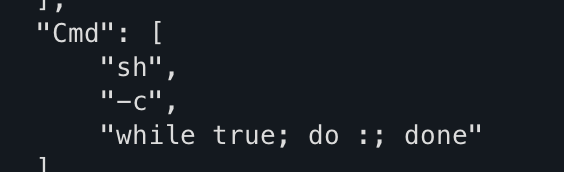
     "Cmd": [
                "sh",
                "-c",
                "while true; do :; done"

    ¿El contenedor está actualmente activo?
        "State": {
    "Status": "running",
    "Running": true,
    "Paused": false,
    "Restarting": false,
    "Dead": false
}

Fase 6 — Análisis del contenedor legítimo

Ahora analizaremos el servidor web. Consulta sus logs:

    ¿Aparecen peticiones HTTP?
    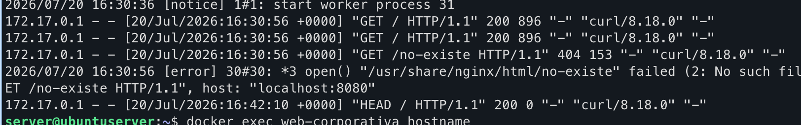
        hay que tirar de logs asi que

        docker logs web-corporativa

172.17.0.1 - - [20/Jul/2026:16:30:56 +0000] "GET / HTTP/1.1" 200 896 "-" "curl/8.18.0" "-"
172.17.0.1 - - [20/Jul/2026:16:30:56 +0000] "GET / HTTP/1.1" 200 896 "-" "curl/8.18.0" "-"
172.17.0.1 - - [20/Jul/2026:16:30:56 +0000] "GET /no-existe HTTP/1.1" 404 153 "-" "curl/8.18.0" "-"
2026/07/20 16:30:56 [error] 30#30: *3 open() "/usr/share/nginx/html/no-existe" failed (2: No such file or directory), client: 172.17.0.1, server: localhost, request: "GET /no-existe HTTP/1.1", host: "localhost:8080"
172.17.0.1 - - [20/Jul/2026:16:42:10 +0000] "HEAD / HTTP/1.1" 200 0 "-" "curl/8.18.0" "-"

    ¿Existe alguna petición que haya producido un error?
    "GET /no-existe HTTP/1.1" 404 153 "-" "curl/8.18.0"

    El servidor intenta acceder al recurso:

/usr/share/nginx/html/no-existe

pero el archivo no existe:

open() "/usr/share/nginx/html/no-existe" failed (2: No such file or directory)

Esto corresponde a un error de recurso no encontrado, no a un fallo del servidor.

    ¿Por qué pueden ser importantes los logs durante un incidente de seguridad?
    Principalmente por la trazabilidad que nos puede ayudar a monitorizar y a dar respuesta a incidentes y a hacer analisi forense para establecer mejora continua mejorar el DCP y el BCP dentro de el PDCA

Fase 7 — Acceso al contenedor legítimo

Ejecuta:
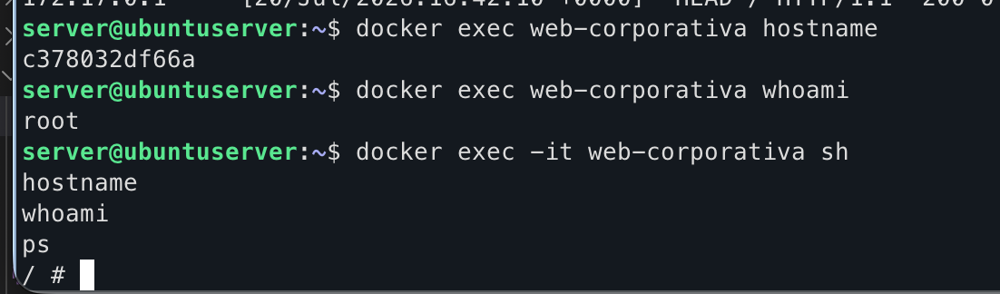

docker exec web-corporativa hostname

docker exec web-corporativa whoami

docker exec -it web-corporativa sh
hostname
whoami
ps

    ¿Se ha detenido web-corporativa al ejecutar exit?

    Explica brevemente por qué:

    Al ejecutar:

docker exec web-corporativa hostname

se obtiene el nombre del host interno del contenedor.

Con:

docker exec web-corporativa whoami

se comprueba el usuario con el que se ejecutan los procesos dentro del contenedor.

Después, al entrar de forma interactiva:

docker exec -it web-corporativa sh

y ejecutar:

hostname
whoami
ps

se observa información del entorno interno del contenedor y los procesos activos.

¿Se ha detenido web-corporativa al ejecutar exit?

No. Al ejecutar:

exit

únicamente se cierra la sesión interactiva de la shell abierta mediante docker exec.

El contenedor web-corporativa continúa funcionando.
Para detener realmente el contenedor habría que usar:

docker stop web-corporativa

Fase 8 — Contención del incidente

    La investigación ha determinado el servidor web es AUTORIZADO/ NO AUTORIZADO

web-corporativa
    │
    └── 
 
worker-17
    │
    └── 

El primer objetivo de la respuesta ante el incidente será detener la actividad sospechosa. Y luego comprobar que todo está correcto.
primero hayq salir del contenedor web-corporativa de su shell 
hacemos exit y vamos al host docker 
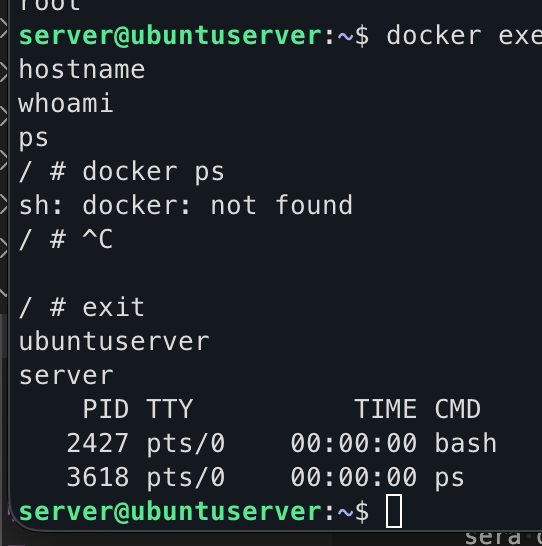

    ¿Continúa ejecutándose worker-17?
        tiramos docker ps
        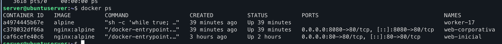
        vemos que aun sigue 
        a4974445b67e   alpine         "sh -c 'while true; …"   39 minutes ago   Up 39 minutes                                             worker-17

    para pararlo tiramos docker stop worker-17

    ¿Continúa existiendo el contenedor?
    hacemos docker ps y y ya no esta up
    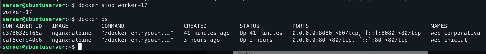
    para verificar mejor hacemos docker ps -a que sale como exited en status
    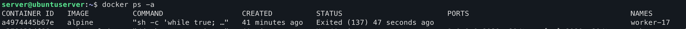

    si, sigue existiendo pero esta parado

    ¿Por qué puede ser interesante detener un contenedor antes de eliminarlo?
        Detener un contenedor antes de eliminarlo es importante porque permite:

Preservar evidencias para una investigación posterior.
Revisar información del contenedor (docker inspect).

Analizar logs:

docker logs worker-17
Examinar la configuración, imagen y procesos antes de perderlos.
Evitar destruir información útil para determinar el origen del incidente.

Fase 9 — Comprobación del servicio legítimo

Después de contener el incidente debemos comprobar que el servicio autorizado continúa funcionando.

    ¿Continúa funcionando la web corporativa?
    con el ps a hemos visto que sigue up la web-corporativa
    c378032df66a   nginx:alpine   ...   Up 41 minutes   0.0.0.0:8080->80/tcp   web-corporativa
    Esto indica que:

El contenedor sigue en estado Up.
El servicio nginx sigue ejecutándose.
El puerto 8080 continúa publicado y accesible desde el host.
    ¿Qué contenedores aparecen ahora en ejecución?

    c378032df66a   web-corporativa
caf6cefe40c6   web-inicial

El contenedor sospechoso:

a4974445b67e   worker-17   Exited (137)

ya no está en ejecución.

Fase 10 — Erradicación

Una vez recopiladas las evidencias y contenido el incidente, eliminamos el contenedor no autorizado y comprobamos

    ¿Continúa existiendo
    worker-17
    ?

    Sí, en este momento todavía existe.

La evidencia es:

docker ps -a

donde aparece:

a4974445b67e   alpine   "sh -c 'while true; …"   Exited (137)   worker-17
